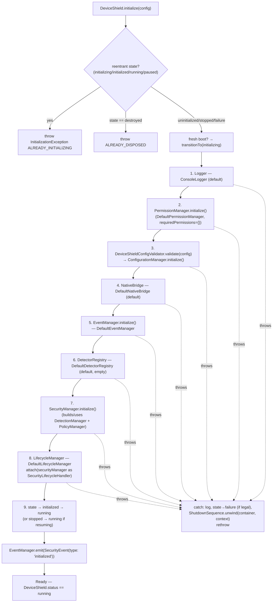
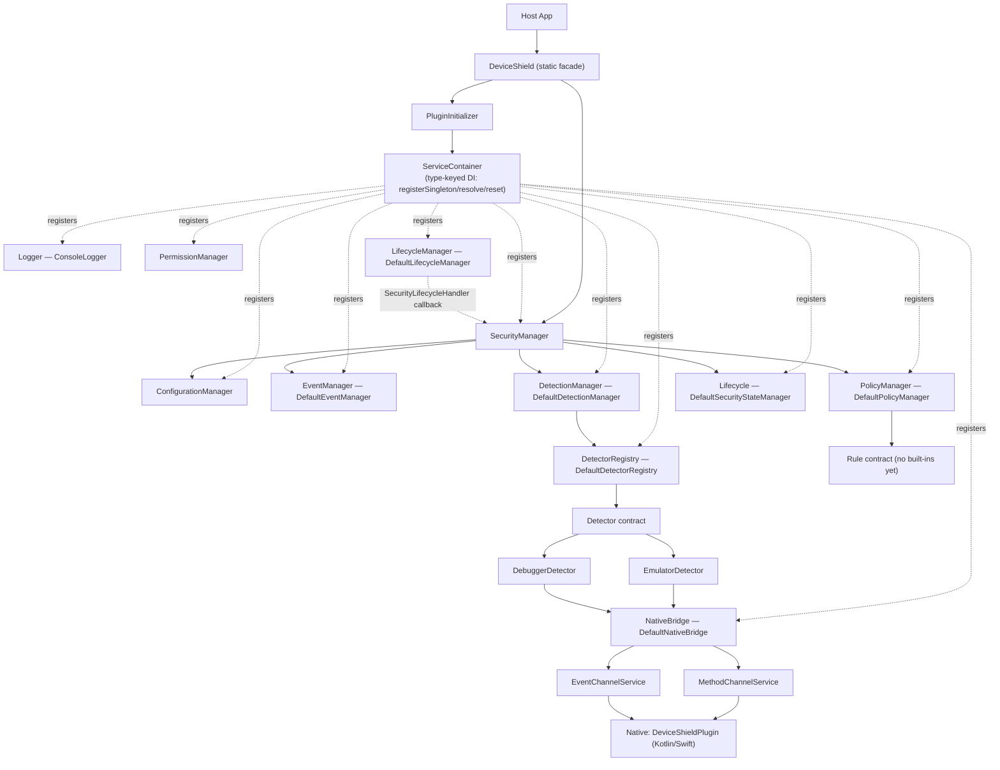
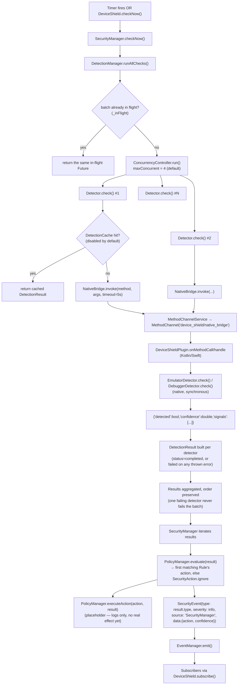
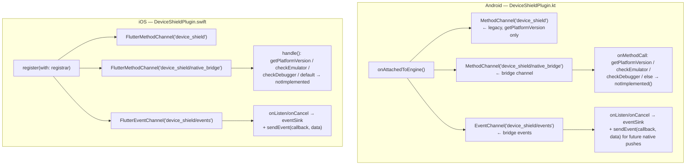
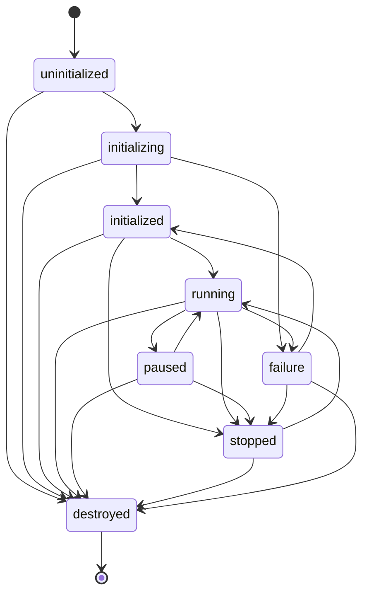
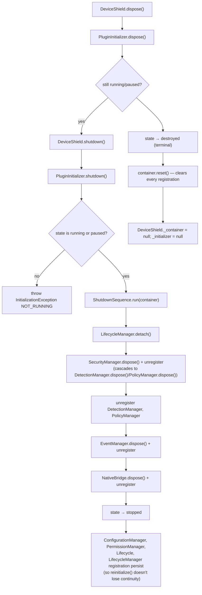

# DeviceShield — Complete Code Trace (Entry Point → Everything)

This document traces **what actually exists in the code today** (`lib/`, `android/`, `ios/`), starting from the single entry point a host app touches, and following every call outward. It complements — and occasionally corrects against — the design docs already in this repo (`ARCHITECTURE.md`, `ARCHITECTURE_CONTRACTS.md`, `ROADMAP.md`): those describe the intended design, this describes what's verified to be wired up in the source right now.

> **package name**: `device_shield` · **type**: Flutter plugin (federated: Dart API + Android/Kotlin + iOS/Swift native implementations) · **not** a git repo in this checkout.

---

## 1. The single entry point

A host app adds one import:

```dart
import 'package:device_shield/device_shield.dart';
```

That file is one line — [lib/device_shield.dart](lib/device_shield.dart:1):

```dart
export 'src/api/device_shield.dart';
```

Everything the app can call lives in **[DeviceShield](lib/src/api/device_shield.dart:29)**, a class with a mix of one legacy instance method and a set of static methods. It is the *only* class a host app is meant to import — every other class under `lib/src/` is a private implementation detail (only reachable via relative imports, not exported from the package root).

| Call | What it does | Delegates to |
|---|---|---|
| `DeviceShield().getPlatformVersion()` | Legacy Phase-1 call, kept for backward compatibility (not static — the only non-static member) | `DeviceShieldPlatform.instance.getPlatformVersion()` → native `getPlatformVersion` method handler |
| `DeviceShield.initialize({config})` | Boots the whole SDK | `PluginInitializer.initialize()` |
| `DeviceShield.status` | Reads current lifecycle state (never throws, even before init) | `Lifecycle.current` (or `uninitialized` if nothing registered yet) |
| `DeviceShield.pause()` / `.resume()` | Pause/resume monitoring | `SecurityManager.pause()/.resume()` |
| `DeviceShield.checkNow()` | Runs one check cycle on demand | `SecurityManager.checkNow()` |
| `DeviceShield.shutdown()` | Tears down, leaves SDK resumable (`stopped`) | `PluginInitializer.shutdown()` |
| `DeviceShield.reinitialize({config})` | Re-runs boot after shutdown/failure | `PluginInitializer.reinitialize()` (= `initialize()` again) |
| `DeviceShield.dispose()` | Full, terminal teardown | `PluginInitializer.dispose()`, then drops static refs |
| `DeviceShield.registerDetector(detector)` | Add a custom `Detector` at runtime | `DetectionManager.registerDetector()` |
| `DeviceShield.addRule(rule)` / `.removeRule(id)` | Add/remove a custom `Rule` | `PolicyManager.addRule()/.removeRule()` |
| `DeviceShield.registerCallback(name, cb)` / `.unregisterCallback(name)` | Listen for native-pushed events by name | `NativeBridge.registerCallback()/.unregisterCallback()` |
| `DeviceShield.subscribe(handler, {filter})` | Subscribe to the security-event stream | `EventManager.subscribe()` |

`DeviceShield` holds exactly two static fields — `_container` (a `ServiceContainer`) and `_initializer` (a `PluginInitializer`) — and owns **no logic of its own**; every method above is a one-line delegation, resolving the target service out of the container and calling straight through. This matches its documented role: "the only symbol a host app ever imports."

> **Note on the example app**: [example/lib/main.dart](example/lib/main.dart:1) still only exercises the legacy `getPlatformVersion()` call — it does not call `initialize()`/`checkNow()`/`subscribe()` etc. The static-API surface above is present in the SDK but not yet demonstrated end-to-end in the bundled example.

> **Design-doc discrepancy**: `ARCHITECTURE.md` describes a `DeviceShieldWidget` ("declarative init/dispose wrapper") as one of the 18 core components. No such class exists anywhere in `lib/` today — only the static `DeviceShield` API is implemented.

---

## 2. `initialize()` — the boot sequence

```
DeviceShield.initialize(config)
  └─ creates ServiceContainer (once)
  └─ creates PluginInitializer(container) (once)
  └─ PluginInitializer.initialize(config)
```

**[PluginInitializer](lib/src/bootstrap/plugin_initializer.dart:86)** runs a fixed 9-step sequence, resolving-or-constructing a default implementation for anything the caller hasn't pre-registered into the `ServiceContainer`. Every completed step is recorded on a `BootstrapContext` (for timing + rollback bookkeeping).



Key implementation details worth knowing:

- **Resolve-or-default pattern**: every step calls a private `_resolveOrRegisterX()` method that only constructs a default (`ConsoleLogger`, `DefaultPermissionManager`, `DefaultConfigurationManager`, `DefaultNativeBridge`, `DefaultEventManager`, `DefaultDetectorRegistry`, `DefaultDetectionManager`, `DefaultPolicyManager`, `DefaultSecurityManager`, `DefaultLifecycleManager`) if the caller/test hasn't already registered its own implementation via `ServiceContainer`.
- **Config validation is separated from storage**: [DeviceShieldConfigValidator](lib/src/config/device_shield_config_validator.dart:18) checks bounds (`periodicCheckInterval ≥ 5000ms`, `0 ≤ maxRetryAttempts ≤ 10`, `500ms ≤ retryDelay ≤ 10000ms`, `1000ms ≤ checkTimeout ≤ 30000ms`) and throws `ConfigurationException` on the first violation. Only a validated config reaches [DefaultConfigurationManager](lib/src/config/default_configuration_manager.dart:13), which does **no** validation itself — pure store/expose/update.
- **PermissionManager today is a no-op in practice**: [DefaultPermissionManager](lib/src/permission/default_permission_manager.dart:25) is constructed with an empty `requiredPermissions` set (nothing currently threads a non-empty set through `initialize()`), so its `initialize()` trivially succeeds. Requesting a *real*, non-empty permission set throws `UnimplementedError` — there's no native permission-request channel yet.
- **`SecurityManager` composition happens inside `PluginInitializer`**: constructing the default `SecurityManager` also resolves-or-registers its `DetectionManager`/`PolicyManager` dependencies first (step 7), then wires it with `EventManager`, `ConfigurationManager`, `Lifecycle`, and `Logger`.
- **Failure handling**: any exception thrown during steps 1–9 is caught, logged, the state machine is force-transitioned to `failure` (only if legally reachable from the current state), and [ShutdownSequence.unwind()](lib/src/bootstrap/shutdown_sequence.dart:67) walks the *completed* steps in reverse, best-effort disposing each one (swallowing any secondary failure so it never masks the original error) before rethrowing.

---

## 3. Everything `PluginInitializer` wires together



### Component-by-component (file, role, what it actually depends on)

| Component | File | Role |
|---|---|---|
| `DeviceShield` | [api/device_shield.dart](lib/src/api/device_shield.dart:29) | Public static facade. Owns `ServiceContainer` + `PluginInitializer` singletons. |
| `PluginInitializer` | [bootstrap/plugin_initializer.dart](lib/src/bootstrap/plugin_initializer.dart:86) | Runs the 9-step boot, and its mirror-image shutdown/dispose. |
| `ServiceContainer` | [bootstrap/service_container.dart](lib/src/bootstrap/service_container.dart:61) | Type-keyed DI: `registerSingleton<T>`/`registerLazySingleton<T>`/`registerFactory<T>`, `resolve<T>`, `isRegistered<T>`, `unregister<T>`, `reset()`. Synchronous only (no `await` inside), so no partial-mutation races within one isolate. Uses `DependencyResolver` internally to guard against circular resolution. |
| `BootstrapContext` | [bootstrap/bootstrap_context.dart](lib/src/bootstrap/bootstrap_context.dart:12) | Pure bookkeeping: records completed step names + elapsed time for one boot run. |
| `ShutdownSequence` | [bootstrap/shutdown_sequence.dart](lib/src/bootstrap/shutdown_sequence.dart:25) | `run()` = graceful full shutdown in reverse order; `unwind()` = best-effort rollback of a partial/failed boot. |
| `Logger` / `ConsoleLogger` | [core/logger.dart](lib/src/core/logger.dart) / [core/console_logger.dart](lib/src/core/console_logger.dart) | The SDK's only output path. |
| `PermissionManager` / `DefaultPermissionManager` | [permission/](lib/src/permission/default_permission_manager.dart:25) | Requests/tracks OS permissions — currently only exercised with an empty permission set. |
| `ConfigurationManager` / `DefaultConfigurationManager` | [config/default_configuration_manager.dart](lib/src/config/default_configuration_manager.dart:13) | Stores/exposes/updates `DeviceShieldConfig`; no validation. |
| `DeviceShieldConfigValidator` | [config/device_shield_config_validator.dart](lib/src/config/device_shield_config_validator.dart:18) | Validates bounds before config reaches the manager. |
| `NativeBridge` / `DefaultNativeBridge` | [bridge/default_native_bridge.dart](lib/src/bridge/default_native_bridge.dart:23) | Sole Dart→native path. Composes `MethodChannelService` + `EventChannelService`; routes named callbacks. |
| `MethodChannelService` | [bridge/method_channel_service.dart](lib/src/bridge/method_channel_service.dart:17) | Request/response calls over one `MethodChannel` (`device_shield/native_bridge`). Translates every failure mode into `NativeBridgeException`. |
| `EventChannelService` | [bridge/event_channel_service.dart](lib/src/bridge/event_channel_service.dart:17) | Forwards raw native pushes over one `EventChannel` (`device_shield/events`), unfiltered. |
| `MethodCodes` | [bridge/method_codes.dart](lib/src/bridge/method_codes.dart:10) | Constants for method names: `checkEmulator`, `checkDebugger` (only two exist so far). |
| `EventManager` / `DefaultEventManager` | [events/default_event_manager.dart](lib/src/events/default_event_manager.dart:13) | The one event bus. Broadcast `StreamController`, bounded history (default 100), pause/resume queueing, processor chain. |
| `DetectorRegistry` / `DefaultDetectorRegistry` | [registry/default_detector_registry.dart](lib/src/registry/default_detector_registry.dart:10) | Type-keyed detector storage; `getAll()` returns detectors sorted by `priority` (ties broken by registration order). |
| `Detector` (contract) | [registry/detector.dart](lib/src/registry/detector.dart:16) | `type`, `priority`, `initialize()`, `check()`, `dispose()`. Public — host apps implement this for custom detectors. |
| `DetectorFactory` | [registry/detector_factory.dart](lib/src/registry/detector_factory.dart:34) | Constructs *built-in* detectors by string type (`emulator`, `debugger`). Standalone utility — **not wired into `PluginInitializer`'s boot sequence** (no `SecurityProfile` exists yet to decide which built-ins are default-enabled). |
| `DetectionManager` / `DefaultDetectionManager` | [managers/default_detection_manager.dart](lib/src/managers/default_detection_manager.dart:48) | Runs all registered detectors through a bounded `ConcurrencyController`, aggregates `DetectionResult`s, optional `DetectionCache`. Reentrancy-guarded (`_inFlight`). |
| `ConcurrencyController` | [managers/concurrency_controller.dart](lib/src/managers/concurrency_controller.dart:20) | Generic bounded-parallel executor (default `maxConcurrent: 4`), preserves input order, per-item timeout + error isolation. |
| `DetectionCache` / `MultiLevelCache` | [managers/detection_cache.dart](lib/src/managers/detection_cache.dart:37), [managers/multi_level_cache.dart](lib/src/managers/multi_level_cache.dart) | TTL-based (default 30s) cache of the latest result per detector type; disabled unless explicitly supplied. |
| `PolicyManager` / `DefaultPolicyManager` | [managers/default_policy_manager.dart](lib/src/managers/default_policy_manager.dart:21) | Evaluates registered `Rule`s in priority order, returns first match's `SecurityAction` (defaults to `ignore` if nothing matches/registered). `executeAction` is currently a **logging placeholder only** — no `ActionHandler` registry exists yet. |
| `Rule` (contract) | [registry/rule.dart](lib/src/registry/rule.dart:17) | `id`, `matches(result)`, `action`, `priority`. Public — host apps implement this for custom rules (FR-17). No built-in rules exist. |
| `SecurityManager` / `DefaultSecurityManager` | [managers/default_security_manager.dart](lib/src/managers/default_security_manager.dart:32) | Top-level runtime orchestrator. Owns the periodic `Timer`, coordinates Detection→Policy→Event on each cycle. Implements `SecurityLifecycleHandler`. Holds **no** `NativeBridge` reference by design. |
| `Lifecycle` / `DefaultSecurityStateManager` | [state/security_state_manager.dart](lib/src/state/security_state_manager.dart:10) | The single writer of `SDKState`; enforces the frozen transition table (§6 below); broadcasts every transition. |
| `LifecycleManager` / `DefaultLifecycleManager` | [state/default_lifecycle_manager.dart](lib/src/state/default_lifecycle_manager.dart:14) | The only `WidgetsBindingObserver`. Maps Flutter app-lifecycle states to calls on whatever `SecurityLifecycleHandler` is attached (never emits events itself). |
| `SecurityLifecycleHandler` (contract) | [state/lifecycle.dart](lib/src/state/lifecycle.dart:49) | Narrow 4-method callback (`onResume`/`onInactive`/`onPause`/`onDetached`) — breaks what would otherwise be a `SecurityManager ⇄ LifecycleManager` circular reference. |
| `PlatformAdapter` (`DeviceShieldPlatform`/`MethodChannelDeviceShield`) | [platform/device_shield_platform_interface.dart](lib/src/platform/device_shield_platform_interface.dart:15), [platform/device_shield_method_channel.dart](lib/src/platform/device_shield_method_channel.dart) | **Legacy, isolated from the rest of the graph.** Only backs `getPlatformVersion()`. Not used by `NativeBridge`. |

---

## 4. Runtime execution flow — one check cycle

Triggered either by the periodic `Timer` (interval = `config.periodicCheckInterval`, default 30000ms) inside `DefaultSecurityManager._startPeriodicChecks()`, or directly via `DeviceShield.checkNow()`.



Important, verified-in-code deviations from the aspirational `ARCHITECTURE.md` flow diagram:

- **No confidence-gate today.** `ARCHITECTURE.md` §4 describes a `confidence ≥ threshold` gate before policy evaluation. The actual [DefaultSecurityManager.checkNow()](lib/src/managers/default_security_manager.dart:93) runs **every** result through `PolicyManager.evaluate()` and always emits a `SecurityEvent` for every result — there is no threshold check anywhere in this method.
- **Only two detectors exist**: `EmulatorDetector` ([lib/src/detectors/emulator_detector.dart](lib/src/detectors/emulator_detector.dart:18)) and `DebuggerDetector` ([lib/src/detectors/debugger_detector.dart](lib/src/detectors/debugger_detector.dart:14)) — and **neither is registered by default**. `DetectorFactory` can construct them by type string, but nothing in `PluginInitializer`'s boot sequence calls it; a caller (test or host app) must register them explicitly via `DetectionManager.registerDetector()` / `DeviceShield.registerDetector()`.
- **`PolicyManager` has zero built-in `Rule`s.** With none registered, `evaluate()` always falls through to `SecurityAction.ignore`, and `executeAction()` only logs — no lock-out, block, or termination behavior is implemented yet anywhere in the codebase.

---

## 5. Detector detail — the only two real security checks implemented

Both detectors follow an identical Dart-side shape: call native via `NativeBridge.invoke()`, shape the response into a `DetectionResult`, and convert *any* thrown error into `DetectionStatus.failed` rather than propagating.

### `EmulatorDetector` (`type = 'emulator'`, `priority = 0`)
- Dart: [lib/src/detectors/emulator_detector.dart](lib/src/detectors/emulator_detector.dart:18) calls `MethodCodes.checkEmulator` ("checkEmulator").
- Android: [android/.../detection/EmulatorDetector.kt](android/src/main/kotlin/com/example/device_shield/detection/EmulatorDetector.kt:14) — heuristic checks against `Build.FINGERPRINT/MODEL/MANUFACTURER/HARDWARE/PRODUCT/BRAND/DEVICE` plus known QEMU pipe files (`/dev/socket/qemud`, `/dev/qemu_pipe`). 7 possible signal categories; `confidence = signals fired / 7`, capped at 1.0.
- iOS: [ios/.../Detection/EmulatorDetector.swift](ios/device_shield/Sources/device_shield/Detection/EmulatorDetector.swift) — equivalent simulator-detection logic (not read in full above, but wired the same way through `DeviceShieldPlugin.swift`'s `case "checkEmulator"`).

### `DebuggerDetector` (`type = 'debugger'`, `priority = 0`)
- Dart: [lib/src/detectors/debugger_detector.dart](lib/src/detectors/debugger_detector.dart:14) calls `MethodCodes.checkDebugger` ("checkDebugger").
- Android: [android/.../detection/DebuggerDetector.kt](android/src/main/kotlin/com/example/device_shield/detection/DebuggerDetector.kt:15) — checks `Debug.isDebuggerConnected()`, `Debug.waitingForDebugger()`, and the app's own `ApplicationInfo.FLAG_DEBUGGABLE`. 3 signal categories; same confidence formula.
- iOS: [ios/.../Detection/DebuggerDetector.swift](ios/device_shield/Sources/device_shield/Detection/DebuggerDetector.swift) — Swift-side equivalent, wired through `DeviceShieldPlugin.swift`'s `case "checkDebugger"`.

Both native `check()` implementations separate the actual OS-level read (`check()`) from pure decision logic (`evaluate()`/an internal function) specifically so the signal-scoring logic can be unit-tested without a real device/emulator (Robolectric isn't used in this project).

---

## 6. Native plugin registration (Android + iOS)



Both platforms register **three channels total**: the original Phase-1 `device_shield` channel (only `getPlatformVersion`), plus the two Phase-7 bridge channels (`device_shield/native_bridge`, `device_shield/events`) that everything in §2–5 actually uses. Any method call not yet implemented (i.e., every detector/protection beyond emulator+debugger) returns `notImplemented()` / `FlutterMethodNotImplemented` — the bridge transport exists for future detectors, but only two are wired up today.

---

## 7. Event pipeline (`EventManager`)

[DefaultEventManager](lib/src/events/default_event_manager.dart:13) is a fully generic, dependency-free pub/sub bus (no knowledge of detectors, policies, or Flutter):

```mermaid
flowchart LR
    SRC["emit(SecurityEvent)"] --> PROC["run through registered\nEventProcessor chain, in order"]
    PROC --> HIST["appended to bounded history\n(FIFO, default max 100, oldest dropped)"]
    HIST --> PAUSE{"paused?"}
    PAUSE -->|yes| Q["queued"]
    PAUSE -->|no| BC["StreamController.add() → broadcast"]
    Q -->|resume()| BC
    BC --> SUBS["each subscribe(handler, {filter}) listener"]
    SUBS --> TRY["handler wrapped in try/catch —\na throwing subscriber never affects others or the emitter"]
```

Notable: unlike the design doc's dedup-window description, the actual implementation has **no duplicate-event detection** — every `emit()` call is appended to history and broadcast unconditionally (aside from the pause/queue behavior).

---

## 8. SDK lifecycle (state machine)

[DefaultSecurityStateManager](lib/src/state/security_state_manager.dart:10) is the **only** writer of `SDKState` anywhere in the codebase, enforcing this exact transition table (`transitionTo()` throws `StateError` on any illegal request):



`stopped` = resumable (via `initialize()`/`reinitialize()`). `destroyed` = terminal, no transition out.

---

## 9. Shutdown / dispose flow



---

## 10. Directory map (what lives where)

```
lib/
  device_shield.dart              ← the export barrel (entry point)
  src/
    api/device_shield.dart        ← public static facade (§1)
    bootstrap/                     ← PluginInitializer, ServiceContainer, ShutdownSequence, BootstrapContext, DependencyResolver
    bridge/                        ← NativeBridge, MethodChannelService, EventChannelService, MethodCodes
    config/                        ← ConfigurationManager + validator
    core/                          ← Logger + ConsoleLogger
    detectors/                     ← EmulatorDetector, DebuggerDetector (Dart side)
    events/                        ← EventManager
    managers/                      ← SecurityManager, DetectionManager, PolicyManager, ConcurrencyController, DetectionCache, MultiLevelCache
    models/                        ← DeviceShieldConfig, DetectionResult, SecurityEvent, SecurityAction, SDKState, SecurityProfile, exceptions
    permission/                    ← PermissionManager
    platform/                      ← legacy DeviceShieldPlatform / MethodChannelDeviceShield (getPlatformVersion only)
    registry/                      ← Detector/Rule contracts, DetectorRegistry, DetectorFactory
    state/                         ← Lifecycle (state machine), LifecycleManager (WidgetsBindingObserver)
android/src/main/kotlin/.../
  DeviceShieldPlugin.kt           ← channel registration + method routing
  detection/EmulatorDetector.kt
  detection/DebuggerDetector.kt
ios/device_shield/Sources/device_shield/
  DeviceShieldPlugin.swift        ← channel registration + method routing
  Detection/EmulatorDetector.swift
  Detection/DebuggerDetector.swift
example/lib/main.dart              ← demo app (legacy getPlatformVersion only, doesn't exercise the new API)
test/                              ← unit tests, organized to mirror lib/src/ (bootstrap/, bridge/, config/, managers/, state/, registry/, api/, detectors/, events/, permission/)
```

---

## 11. Summary — what's real vs. what's still a placeholder

**Fully wired, verified end-to-end (Dart ↔ native):**
- Boot/shutdown/reinitialize/dispose lifecycle and its state machine.
- Dependency-injection container and resolve-or-default composition.
- `NativeBridge` transport (method channel + event channel) with proper exception translation.
- Two detectors (`emulator`, `debugger`), Android + iOS, with a bounded-concurrency detection loop and optional TTL cache.
- Generic event bus with pause/queue/subscribe/history.
- Custom detector/rule/callback registration extension points.

**Present as scaffolding but functionally inert today:**
- `PolicyManager` — no built-in `Rule`s exist; `executeAction()` only logs.
- `PermissionManager` — only exercised with an empty permission set; real permission requests throw `UnimplementedError`.
- `DetectorFactory` — capable of constructing the two built-ins by name, but not invoked anywhere in the boot sequence (no `SecurityProfile`-driven default-enable list yet).
- Confidence-gating before policy evaluation, described in `ARCHITECTURE.md`, is **not implemented** in `DefaultSecurityManager.checkNow()`.
- `DeviceShieldWidget`, mentioned in `ARCHITECTURE.md`'s component table, does not exist in code.
