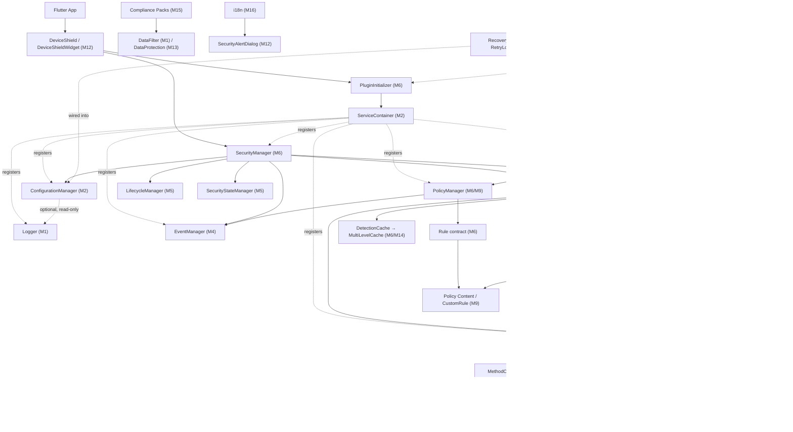

# DeviceShield SDK — Milestone Implementation Plan

**Source documents:** `ARCHITECTURE.md`, `ARCHITECTURE_CONTRACTS.md`, `ROADMAP.md`, `CURRENT_STATE.md`
**Scope of this plan:** every milestone (M0–M22) defined in `ROADMAP.md`, in the exact dependency order that document specifies, cross-referenced against the frozen component contracts in `ARCHITECTURE_CONTRACTS.md` and the design in `ARCHITECTURE.md`.

> **Note on source-document currency:** `ROADMAP.md`'s own "Status" section (dated against the repository as of its last update) marks every milestone checkbox unchecked ("Build phase: not started"). This plan is built strictly from that document's content and structure, as instructed — it describes the intended build order and scope per the roadmap, not a live audit of current repository state. Any discrepancy between this plan's milestone descriptions and the actual codebase at the time of reading should be resolved by re-checking `ROADMAP.md` itself, since that is this plan's sole source of truth for sequencing and status.

---

## Table of Contents

1. [Milestone 0 – Decisions & Repo Setup](#milestone-0--decisions--repo-setup)
2. [Milestone 1 – Foundation Layer](#milestone-1--foundation-layer)
3. [Milestone 2 – Configuration & Dependency Injection](#milestone-2--configuration--dependency-injection)
4. [Milestone 3 – Native Bridge & Platform Channels](#milestone-3--native-bridge--platform-channels)
5. [Milestone 4 – Event System](#milestone-4--event-system)
6. [Milestone 5 – State Machine & SDK Lifecycle](#milestone-5--state-machine--sdk-lifecycle)
7. [Milestone 6 – PluginInitializer, SecurityManager & Detector/Rule Framework](#milestone-6--plugininitializer-securitymanager--detectorrule-framework)
8. [Milestone 7 – Priority-0 Detectors](#milestone-7--priority-0-detectors)
9. [Milestone 8 – Priority-1 Detectors](#milestone-8--priority-1-detectors)
10. [Milestone 9 – Policy Engine Content & Custom Rules](#milestone-9--policy-engine-content--custom-rules)
11. [Milestone 10 – Security Profiles](#milestone-10--security-profiles)
12. [Milestone 11 – Protections](#milestone-11--protections)
13. [Milestone 12 – Public API & UI Components](#milestone-12--public-api--ui-components)
14. [Milestone 13 – Storage, Encryption & Security Utilities](#milestone-13--storage-encryption--security-utilities)
15. [Milestone 14 – Performance & Caching](#milestone-14--performance--caching)
16. [Milestone 15 – Compliance Packs](#milestone-15--compliance-packs)
17. [Milestone 16 – Internationalization](#milestone-16--internationalization)
18. [Milestone 17 – Logging & Error-Handling Hardening](#milestone-17--logging--error-handling-hardening)
19. [Milestone 18 – Testing Across All Modules](#milestone-18--testing-across-all-modules)
20. [Milestone 19 – Documentation & Developer Experience](#milestone-19--documentation--developer-experience)
21. [Milestone 20 – Versioning & Deployment](#milestone-20--versioning--deployment)
22. [Milestone 21 – Edge Case & Resilience Hardening](#milestone-21--edge-case--resilience-hardening)
23. [Milestone 22 – v1.0 Release](#milestone-22--v10-release)
24. [Overall SDK Architecture](#overall-sdk-architecture)
25. [Complete Dependency Graph](#complete-dependency-graph)
26. [Overall Development Timeline](#overall-development-timeline)
27. [Module Ownership](#module-ownership)
28. [Testing Roadmap](#testing-roadmap)
29. [Final SDK Deliverables](#final-sdk-deliverables)
30. [Architecture Summary](#architecture-summary)

---

## Milestone 0 – Decisions & Repo Setup

### Objective
Lock every structural, naming, and scoping decision that every later milestone depends on, and restructure the repository from its default `flutter create --template=plugin` scaffold into the layout the SDK's architecture requires.

### Why this milestone exists
`ROADMAP.md` marks this milestone **blocking**: "Nothing below builds correctly until these are settled." Folder structure, channel names, and platform floors are referenced by name throughout every subsequent milestone (M1's foundation layer imports from `lib/src/*`; M3's channel names are consumed by every detector from M7 onward). Deciding them late would force a rework across every already-built module.

### Scope
**Included:**
- Adopting the layer-first `lib/src/{core,manager,bridge,detectors,protections,events,models,config,permission,utils}` structure, retiring the legacy per-feature `lib/features/*/{data,domain,infrastructure}` scaffold.
- Finalizing channel naming.
- Confirming real platform floors (iOS / Android minimum versions).
- Native package skeletons for both platforms.
- Test directory layout (`test/unit`, `test/integration`, `test/native`).
- Replacing placeholder identifiers (`com.example.device_shield`, podspec author/homepage).
- Scoping a v0.1 MVP subset (recommended: P0 functional requirements only).

**Not included:** any actual detection/protection/policy logic, any native implementation code beyond empty package skeletons, any public API surface.

### Architecture Components
No runtime components are introduced in this milestone — it is entirely structural/decision work. It does, however, fix the two identifiers every later component's channel-level component depends on:

| Decision | Value | Consumed By |
|---|---|---|
| MethodChannel name | `device_shield/native_bridge` | M3 `NativeBridge`, every M7/M8 detector, M11 protections |
| EventChannel name | `device_shield/events` | M3 `NativeBridge`, M4 `EventManager` integration |
| Legacy channel | `device_shield` (Phase 1 `getPlatformVersion`, kept unchanged) | Backward-compatibility path only |

### Implementation Tasks
- [ ] Create `lib/src/{core,manager,bridge,detectors,protections,events,models,config,permission,utils}` directories.
- [ ] Migrate/delete the 17 empty `lib/features/*` scaffolds created by `setup.sh`.
- [ ] Decide and document the MethodChannel/EventChannel names (done: see table above).
- [ ] Confirm iOS deployment target (SRS specifies 18.0; current build config targets 13.0 — resolve the mismatch explicitly, one direction or the other, and update `ios/device_shield.podspec` + `ios/device_shield/Package.swift`).
- [ ] Confirm Android `minSdk` (SRS specifies API 21; current build config targets 24 — resolve explicitly and update `android/build.gradle.kts`).
- [ ] Create native package skeletons: `android/.../detection/`, `protection/`, `bridge/`, `utils/` and `ios/Classes/detection/`, `protection/`, `bridge/`, `utils/`.
- [ ] Create `test/unit/`, `test/integration/`, `test/native/` directories.
- [ ] Replace `com.example.device_shield` with the real Android package identifier throughout `android/`.
- [ ] Replace podspec placeholder `homepage`/`author` fields with real values.
- [ ] Write and circulate a short MVP-scope decision document naming exactly which P0 FRs ship in v0.1 (recommended: root, jailbreak, emulator, debugger, hook, integrity — deferring P1 to a later release).

### Files Expected
| File | Why it exists |
|---|---|
| `lib/src/` (directory tree) | The layer-first home for every module in every later milestone |
| `android/src/main/kotlin/.../detection/`, `protection/`, `bridge/`, `utils/` | Native package skeleton mirroring the Dart-side layering, ready for M3/M7/M8/M11 |
| `ios/Classes/detection/`, `protection/`, `bridge/`, `utils/` | Same, for iOS |
| `test/unit/`, `test/integration/`, `test/native/` | The test layout every later milestone's "Testing Plan" section assumes |
| `pubspec.yaml` (edited) | Real name/homepage/repository, no longer template placeholders |

### Dependency Flow
This milestone has no upstream dependency (it is the root of the plan) and is a hard blocker for every other milestone — M1 through M22 all assume the folder structure, channel names, and platform floors decided here.

### Design Patterns
None — this is a structural/decision milestone, not an implementation one.

### Testing Plan
No functional tests are written in this milestone. The only verification is structural: confirm the new directory tree builds (`flutter pub get` succeeds), and confirm both native skeletons compile as empty packages (`./gradlew assembleDebug` for Android, `pod lib lint` for iOS, or equivalent).

### Deliverables
- Restructured repository matching the layer-first layout.
- A signed-off decision record covering: folder structure, channel names, platform floors, and MVP scope.
- Both native package skeletons in place.

### Acceptance Criteria
- ✓ Repository builds with the new folder structure (`flutter pub get`, `flutter analyze` both succeed with zero source files yet, i.e. no broken imports).
- ✓ Both native skeletons compile.
- ✓ Team has signed off, in writing, on folder structure + channel names + platform floors + MVP scope.
- ✓ No `lib/features/*` scaffold remains.

### Risks
- **Decision risk:** platform-floor mismatches (13.0 vs 18.0 iOS; 24 vs 21 Android) left unresolved will silently propagate into every native module built afterward, becoming expensive to change once M7/M8/M11 depend on a specific floor.
- **Scope risk:** deferring the MVP-scope decision risks M7–M11 building more (or less) than what v0.1 actually needs.
- **Low technical risk** otherwise — this milestone touches no runtime logic.

### Future Milestones Depending On This
Every milestone from M1 through M22 depends on the folder structure and naming decided here; M3 specifically depends on the channel names; M7/M8/M11 depend on the native package skeletons.

---

## Milestone 1 – Foundation Layer

### Objective
Establish the SDK's zero-dependency foundation: the shared enums, immutable models, exception hierarchy, logger, and sensitive-data filter that every other layer imports but that import nothing SDK-specific themselves.

### Why this milestone exists
`ARCHITECTURE_CONTRACTS.md` treats `Logger` as "Every other component"'s dependent — nearly every later component (managers, bridge, registries) takes a `Logger` through its constructor. Likewise, `DetectionResult`, `SecurityEvent`, and the exception hierarchy are referenced by contract in Groups C, D, E, F, and G of `ARCHITECTURE_CONTRACTS.md` before any of those groups' components exist. Building this milestone first means every later milestone has a stable, already-tested vocabulary to build against instead of inventing types ad hoc.

### Scope
**Included:** enum layer, model layer (value objects only, no business logic), exception hierarchy, `Logger` (level-gated, safe-default boot, sink-extensible), `DataFilter` (sensitive-field redaction).

**Not included:** anything that reads configuration (that's M2), anything that touches a platform channel (M3), any manager or orchestration logic (M5/M6).

### Architecture Components

| Component | Purpose | Responsibility | Dependencies | Owner | Consumers |
|---|---|---|---|---|---|
| Enum layer (`DetectionType`, `PolicyAction`, `SecurityStatus`, `SecurityEventType`, `SecuritySeverity`, `PinningMode`, `HookFramework`, `DetectionStatus`, `DataSubjectRequestType`) | Closed vocabularies shared across the SDK | Pure data, no behavior | None | N/A (static) | Every later milestone |
| `DetectionResult`, `SecurityEvent`, `NativeResult` | Immutable value types carrying data between layers | Value equality, serialization (`toJson`/`fromJson`) | Enum layer only | N/A | `Detector`, `EventManager`, `PolicyManager`, `NativeBridge` |
| `DeviceShieldException` + subtypes (`ConfigurationException`, `PermissionException`, `InitializationException`, `DetectionException`, `PolicyException`, `NativeBridgeException`) | Typed failure signaling | Carry `code`/`message`/`details`/`stackTrace`; identity equality (not value equality) by design | None | N/A | Every manager's failure-behavior column in `ARCHITECTURE_CONTRACTS.md` Part 1 |
| `Logger` | The SDK's only sanctioned output path (ARCHITECTURE_CONTRACTS.md Group C) | Level-gated debug/info/warning/error/exception logging; sensitive-field redaction; crash-report forwarding; must never throw | None hard; soft one-time read of `ConfigurationManager` once available | `PluginInitializer`, step 1 | Every other component |
| `DataFilter` | Redacts sensitive fields (password, token, key, secret, authorization, credit_card, ssn, pin) | Shared utility, no state | None | N/A | `Logger` (§17.3) now; Compliance packs (§23) later (M15) |

### Implementation Tasks
- [ ] Define every enum listed above as a plain Dart `enum`.
- [ ] Implement `DetectionResult` as an immutable class: constructor, `toJson`/`fromJson`, value-equality `==`/`hashCode`, `toString`.
- [ ] Implement `SecurityEvent` the same way, including a `data` free-form payload field (the mechanism that keeps the event-type enum closed while still supporting arbitrary payloads — see `ARCHITECTURE.md` §8 Extension Points).
- [ ] Implement `NativeResult` as an immutable value type for native-bridge round-trips.
- [ ] Implement `DeviceShieldException` base class (`code`, `message`, `details`, `stackTrace`; deliberately identity-equality, not value-equality; no `toJson`/`fromJson` — exceptions are surfaced, never persisted).
- [ ] Implement each named exception subtype, each carrying only the fields its own failure mode needs (e.g. `PermissionException.missingPermissions`, `NativeBridgeException.method`/`nativeError`).
- [ ] Implement `Logger` as an abstract contract plus a first concrete implementation (a console/default sink) that boots at a safe default level before any configuration exists.
- [ ] Implement the `LogSink` extension-point interface (`ARCHITECTURE_CONTRACTS.md`'s named extension point for Logger) and wire `addSink`/`removeSink`.
- [ ] Implement `DataFilter` as a pure function/utility over the fixed sensitive-field name list.
- [ ] Write unit tests for enum serialization (`.name`/`.values.byName` round-trips).
- [ ] Write unit tests for every model's `toJson`/`fromJson` round-trip and equality semantics.
- [ ] Write unit tests for every exception's `toString()` output.
- [ ] Write unit tests proving `Logger` never throws even when an internal sink write fails (bounded retry, then swallow).
- [ ] Write unit tests for `DataFilter` against every named sensitive field, plus a case-insensitivity/nested-map check.
- [ ] Add dartdoc comments to every public member (this layer is imported everywhere, so its documentation quality sets the tone for the whole SDK).

### Files Expected
| File | Why it exists |
|---|---|
| `lib/src/models/detection_result.dart` | Detector→Manager→Policy result value type |
| `lib/src/models/security_event.dart` | The one event shape the entire Event Pipeline (`ARCHITECTURE.md` §5) carries |
| `lib/src/models/native_result.dart` | Native round-trip value type used by `NativeBridge` (M3) |
| `lib/src/models/sdk_state.dart` | The `SecurityStatus` enum backing the state machine (M5) |
| `lib/src/models/security_action.dart` | The `PolicyAction` enum backing the Policy Engine (M6/M9) |
| `lib/src/models/device_shield_exception.dart` | The exception hierarchy every manager's failure-behavior depends on |
| `lib/src/core/logger.dart` | The `Logger` contract |
| `lib/src/core/console_logger.dart` (or equivalent default sink) | The concrete boot-safe default implementation |
| `lib/src/utilities/data_filter.dart` | Sensitive-field redaction, shared by Logging and later Compliance |

### Dependency Flow
```
(no SDK dependencies)
        │
        ▼
  Foundation Layer (M1)
        │
        ├──▶ M2 Configuration & DI
        ├──▶ M3 Native Bridge
        ├──▶ M4 Event System
        ├──▶ M5 State Machine
        └──▶ M6 Managers/Detector-Rule Framework
```
Every arrow below M1 in `ARCHITECTURE.md`'s dependency graph ultimately terminates, directly or transitively, in a Foundation Layer type.

### Design Patterns
- **Value Object** pattern for every model (immutability + value equality — enables safe sharing across the concurrent detector pool introduced in M6/M14 without defensive copying).
- **Strategy** (narrowly) for `LogSink` — a registrable strategy for where a log line ultimately goes, without `Logger` itself knowing the destination.
- No Dependency Injection yet at this layer — DI is introduced in M2; this layer is deliberately DI-free since it has nothing to inject.

### SOLID Principles Applied
- **Single Responsibility:** each model does exactly one thing (carry data); `Logger` does exactly one thing (emit log lines); `DataFilter` does exactly one thing (redact).
- **Open/Closed:** `LogSink` lets logging destinations be extended without modifying `Logger` itself.
- **Interface Segregation:** the exception hierarchy exposes only the fields each specific failure mode needs, not a fat shared shape.

### Testing Plan
- **Unit Tests:** every enum's serialization, every model's equality/serialization, every exception's `toString()`, `Logger`'s level-gating and never-throws guarantee, `DataFilter`'s exact field-name coverage.
- **Integration Tests:** none yet (nothing to integrate with).
- **Platform Tests:** none (pure Dart layer).
- **Edge Cases:** empty/null optional fields in models; deeply nested maps in `DataFilter`; logging when no sink is registered at all.
- **Failure Cases:** a `LogSink.write` implementation that throws — `Logger` must swallow it, not propagate.
- **Mocking Strategy:** none needed — this layer has no dependencies to mock.
- **Coverage Expectation:** per `ROADMAP.md`'s M18 targets, Core sits at 90% — this milestone is where that number starts accumulating.

### Deliverables
- Fully implemented, tested enum/model/exception/logger/data-filter layer with zero external SDK dependencies.
- Unit test suite covering every public member.

### Acceptance Criteria
- ✓ `flutter analyze` passes with zero issues.
- ✓ `flutter test` passes for every file in this milestone.
- ✓ Zero imports from any `lib/src/{manager,bridge,registry,config}` directory (enforces "zero external dependencies beyond Dart/Flutter SDK").
- ✓ Every public class/member has a dartdoc comment.

### Risks
- **Design risk:** under-specifying a model now (e.g. missing a field `DetectionResult` needs once real detectors exist in M7) forces a breaking change later — mitigate by cross-checking every field against `ARCHITECTURE_CONTRACTS.md`'s per-component "Dependencies" column before finalizing.
- **Maintenance risk:** the exception hierarchy is easy to over-extend; `ARCHITECTURE_CONTRACTS.md` explicitly scopes it to "generic, non-detector-specific categories" — resist adding detector-specific exception types here (they belong with their detector, in M7/M8).

### Future Milestones Depending On This
All of M2–M22 depend on this milestone; most directly, M2 (Configuration models), M3 (`NativeBridgeException`, `NativeResult`), M4 (`SecurityEvent`), M5 (`SecurityStatus`), M6 (`DetectionResult`, `PolicyAction`, every exception type).

---

## Milestone 2 – Configuration & Dependency Injection

### Objective
Build the SDK's single source of configuration truth (`DeviceShieldConfig` + `ConfigurationManager`) and the type-keyed dependency-injection container (`ServiceContainer`) that every later milestone's construction order is enforced through.

### Why this milestone exists
`ARCHITECTURE_CONTRACTS.md`'s Architecture Correction (Phase 4) explicitly separates validation from storage: `DeviceShieldConfigValidator` validates *before* `ConfigurationManager` stores. This milestone must exist before M3 (native bridge construction reads config), before M5 (state machine's boot sequence numbers `ConfigurationManager` as step 3), and before M6 (`PluginInitializer` requires a `ServiceContainer` to be passed in). Without a working DI container, no later milestone has a documented place to register the services it constructs.

### Scope
**Included:** `DeviceShieldConfig` + sub-config shape (generic fields only — no detector/protection sub-configs yet, per the model's own documented deferral), `DeviceShieldConfigValidator`, `DeviceShieldConfigBuilder`, `ConfigurationPersistence`, `ConfigurationManager`, `ServiceContainer`.

**Not included:** any detection/protection-specific configuration (added additively once M7/M8/M11 exist); any actual native reads (M3); any manager logic (M5/M6).

### Architecture Components

| Component | Purpose | Responsibility | Dependencies | Owner | Consumers |
|---|---|---|---|---|---|
| `DeviceShieldConfig` | SDK-wide configuration value object | Holds `debugLogging`, `runOnUIThread`, `periodicCheckInterval`, `maxRetryAttempts`, `retryDelay`, `checkTimeout`; `copyWith`/`toJson`/`fromJson` | Foundation Layer only | N/A (immutable value) | `ConfigurationManager`, every manager that reads `.current` |
| `DeviceShieldConfigValidator` | Validates a config *before* it reaches storage | Enforces §7.4's interval/retry/timeout bounds | `DeviceShieldConfig` | Called by `PluginInitializer` (M6), not `ConfigurationManager` itself | `PluginInitializer` |
| `DeviceShieldConfigBuilder` | Fluent construction API (§7.2) | Builder pattern over `DeviceShieldConfig` | `DeviceShieldConfig` | N/A | Host app callers, tests |
| `ConfigurationPersistence` | SharedPreferences-backed save/load (§7.6) | Serialize/deserialize the active config across app restarts | `DeviceShieldConfig`, `shared_preferences` package | `ConfigurationManager` | `ConfigurationManager` only |
| `ConfigurationManager` | Sole owner of the validated, immutable active configuration | Holds current value; applies runtime updates (`updateConfig`/`updateDetectionConfig`/`updateProtectionConfig`); notifies dependents of changes; performs **no validation of its own** | `DeviceShieldConfig` model, Validator (upstream only), optional Persistence | `PluginInitializer`, step 3 | Every manager (read `.current` at point of use) |
| `ServiceContainer` | Type-keyed DI lookup | `register<T>()`, `get<T>()`/`resolve<T>()`, `isRegistered<T>()`, `clear()`/`reset()` | None (foundation) | Application infrastructure — independent lifecycle, **not owned by `PluginInitializer`** | Every service from M3 onward |

### Implementation Tasks
- [ ] Implement `DeviceShieldConfig` as an immutable value class with the six generic fields, `copyWith`, `toJson`/`fromJson`, value equality.
- [ ] Implement `DeviceShieldConfigValidator.validate(config)` enforcing every bound in §7.4 (interval bounds, retry bounds, timeout bounds), throwing `ConfigurationException` on violation.
- [ ] Implement `DeviceShieldConfigBuilder` with fluent setter methods mirroring every `DeviceShieldConfig` field, terminating in a `.build()` call that itself does *not* validate (validation stays the validator's job, not the builder's).
- [ ] Implement `ConfigurationPersistence` wrapping `shared_preferences`: `save(config)`/`load()`, namespaced keys.
- [ ] Implement `ConfigurationManager` as an abstract contract + default implementation: constructor takes an already-validated `DeviceShieldConfig`; `current` getter; `updateConfig`/`updateDetectionConfig`/`updateProtectionConfig`; on an invalid runtime update, retain the previous config and throw rather than corrupting state.
- [ ] Implement `ServiceContainer`: `register<T>(T instance)`, `registerSingleton<T>()`, `registerLazySingleton<T>(T Function() factory)`, `resolve<T>()`/`get<T>()` (throws if unregistered), `isRegistered<T>()`, `unregister<T>()`, `clear()`/`reset()`.
- [ ] Implement `DependencyResolver` guarding `ServiceContainer.resolve` against circular factory resolution (throws `InitializationException` with code `CIRCULAR_DEPENDENCY`).
- [ ] Write unit tests for every validation bound (interval/retry/timeout — both boundary-valid and boundary-invalid values).
- [ ] Write unit tests for `ConfigurationManager`'s "bad update never corrupts current state" guarantee.
- [ ] Write unit tests for `ServiceContainer`'s full register → resolve → clear round trip, including the lazy-singleton case and the circular-dependency guard.
- [ ] Write unit tests for `ConfigurationPersistence` save/load round-trip (mocked `shared_preferences`).

### Files Expected
| File | Why it exists |
|---|---|
| `lib/src/models/device_shield_config.dart` | The config value object every manager reads |
| `lib/src/config/device_shield_config_validator.dart` | Enforces §7.4 before storage — kept separate from `ConfigurationManager` per the frozen architecture correction |
| `lib/src/config/device_shield_config_builder.dart` | Fluent construction API for host apps |
| `lib/src/config/configuration_persistence.dart` | SharedPreferences-backed durability across restarts |
| `lib/src/config/configuration_manager.dart` | The contract |
| `lib/src/config/default_configuration_manager.dart` | The concrete, store-only implementation |
| `lib/src/bootstrap/service_container.dart` | The DI container every later milestone registers into |
| `lib/src/bootstrap/dependency_resolver.dart` | Circular-dependency guard for `ServiceContainer` |

### Dependency Flow
```
Foundation Layer (M1)
        │
        ▼
Configuration & DI (M2)
        │
        ├──▶ M3 Native Bridge (ServiceContainer registers NativeBridge)
        ├──▶ M4 Event System (ServiceContainer registers EventManager)
        ├──▶ M5 State Machine (ServiceContainer registers Lifecycle)
        └──▶ M6 PluginInitializer (consumes ServiceContainer's register/resolve operations only — never owns its lifecycle)
```

### Design Patterns
- **Dependency Injection** (`ServiceContainer`) — decouples construction from use; every later milestone's services are registered here rather than constructed inline by their consumers.
- **Builder** (`DeviceShieldConfigBuilder`) — fluent, readable config construction without a telescoping constructor.
- **Validator/Chain-of-Responsibility-adjacent** (`DeviceShieldConfigValidator`) — a single-purpose validation stage inserted between construction and storage.
- **Repository-adjacent** (`ConfigurationPersistence`) — abstracts the underlying storage mechanism (SharedPreferences) from `ConfigurationManager`'s own logic.

### SOLID Principles Applied
- **Single Responsibility:** validation, storage, persistence, and fluent construction are four separate classes, not one.
- **Dependency Inversion:** every manager depends on the `ConfigurationManager` contract, never a concrete storage mechanism.
- **Open/Closed:** `ServiceContainer`'s type-keyed registration lets new services be added without modifying the container itself.

### Testing Plan
- **Unit Tests:** validator bounds (valid/invalid/boundary), `ConfigurationManager` update semantics, `ServiceContainer` register/resolve/clear, circular-dependency detection.
- **Integration Tests:** `ConfigurationPersistence` round-trip against a real (or fake) `shared_preferences` instance.
- **Platform Tests:** none yet.
- **Edge Cases:** updating config with a partially-invalid sub-field; resolving a type that was registered then explicitly unregistered; nested lazy-singleton factories that resolve each other.
- **Failure Cases:** `resolve<T>()` on an unregistered type must throw a clear, typed error, not a generic null-check failure.
- **Mocking Strategy:** `shared_preferences` mocked via its own test package; `ServiceContainer` tested directly (no mocks needed — it has no dependencies).
- **Coverage Expectation:** contributes to the Core 90% target from M18.

### Deliverables
- Fully validated, persisted configuration pipeline.
- A working, tested DI container ready to receive every service constructed from M3 onward.

### Acceptance Criteria
- ✓ `flutter analyze` / `flutter test` both pass.
- ✓ Config validation covers every rule in §7.4.
- ✓ `ServiceContainer` round-trip tested (register → get → clear).
- ✓ An invalid runtime config update is proven, by test, to leave the previous config intact.

### Risks
- **Coupling risk:** if `ConfigurationManager` is ever tempted to validate its own updates (instead of relying on the validator), the frozen architecture correction is violated — guard this with an explicit test asserting `ConfigurationManager` alone never rejects a syntactically well-formed value.
- **Persistence risk:** SharedPreferences failures (disk full, corrupted value) must degrade to defaults, not crash boot — this specific scenario is formally handled in M21, but the persistence layer built here should not preclude that later fix.

### Future Milestones Depending On This
M3 (NativeBridge registration), M4 (EventManager registration), M5 (Lifecycle registration), M6 (`PluginInitializer` consumes `ServiceContainer`), M9 (Security Profiles read/write detection/protection sub-configs added additively on top of this model).

---

## Milestone 3 – Native Bridge & Platform Channels

### Objective
Build the sole path any Dart code takes to reach native (Kotlin/Swift) code: the Dart-side `NativeBridge`/`MethodChannelService`/`EventChannelService` trio, and the matching native-side plugin registration on both platforms.

### Why this milestone exists
`ARCHITECTURE_CONTRACTS.md` Group F freezes `NativeBridge` as "the sole path any Dart code takes to reach native code" and explicitly forbids any detector from holding its own channel reference. Every detector built in M7/M8 and every protection built in M11 depends on this milestone existing first — there is no other sanctioned way for Dart to reach the platform layer.

### Scope
**Included:** Dart-side `PlatformChannel`/`NativeBridge` abstraction (typed `invoke<T>()`, timeout, `PlatformException` → `NativeBridgeException` translation, `EventChannel`→`Stream<SecurityEvent>` wrapping); Android `DeviceShieldPlugin` (`MethodCallHandler` + `EventChannel.StreamHandler`); iOS `DeviceShieldPlugin` (`FlutterStreamHandler`); a `method_codes.dart` single source of truth for method-name constants; required Android permissions and iOS `Info.plist` entries.

**Not included:** any detector- or protection-specific method handlers (those register against this bridge starting M7); the callback-routing *content* interpretation (native pushes are forwarded generically — see `ARCHITECTURE_CONTRACTS.md`'s Phase 7 Resolution 2 — a later integration point, not this milestone, is what wires a registered callback to `EventManager.emit()`).

### Architecture Components

| Component | Purpose | Responsibility | Dependencies | Owner | Consumers |
|---|---|---|---|---|---|
| `NativeBridge` | The sole Dart→native path | `invoke()` (timeout-bound request/response), `invokeAsync()`, `registerCallback()`/`unregisterCallback()`, `dispose()` | `MethodChannelService`, `EventChannelService` | `PluginInitializer`, step 4 | `DetectionManager`, future `Protection` implementations |
| `MethodChannelService` | Request/response native calls | Wraps `MethodChannel.invokeMethod` with timeout + typed error translation | Flutter `MethodChannel`, channel name | `NativeBridge` exclusively | `NativeBridge` exclusively |
| `EventChannelService` | Native-originated pushes | Wraps `EventChannel.receiveBroadcastStream`; forwards raw events generically, zero interpretation | Flutter `EventChannel` | `NativeBridge` exclusively | `NativeBridge` exclusively |
| Android `DeviceShieldPlugin` | Registers both bridge channels + legacy channel | `MethodCallHandler`, `EventChannel.StreamHandler`; `notImplemented()` for anything not yet handled | Flutter embedding APIs only | Android plugin registry | Dart-side `MethodChannelService`/`EventChannelService` |
| iOS `DeviceShieldPlugin` | Same, for iOS | `FlutterStreamHandler`; `FlutterMethodNotImplemented` for anything not yet handled | Flutter embedding APIs only | iOS plugin registry | Dart-side `MethodChannelService`/`EventChannelService` |

### Implementation Tasks
- [ ] Implement `MethodChannelService`: constructor takes a channel name or a pre-built `MethodChannel`; `invoke<T>({method, arguments, timeout})` translating `TimeoutException`→`BRIDGE_TIMEOUT`, `MissingPluginException`→`BRIDGE_UNAVAILABLE`, `PlatformException`→forwarded code/message/details, wrong response type→`BRIDGE_MALFORMED_RESPONSE`; `invokeAsync` fire-and-forget, swallowing failures.
- [ ] Implement `EventChannelService`: constructor takes a channel name or pre-built `EventChannel`; `listen(onEvent, {onError})` replacing any previous subscription; `dispose()` cancels cleanly, safe to call without ever having listened.
- [ ] Implement `NativeBridge` (contract + `DefaultNativeBridge`): composes both services; `registerCallback`/`unregisterCallback` keyed by name; routes native events shaped `{'callback': name, 'data': ...}` to the matching registered callback, silently dropping anything malformed or unregistered; `dispose()` closes both channel services and clears every callback.
- [ ] Define `kNativeBridgeMethodChannel`/`kNativeBridgeEventChannel` constants (`device_shield/native_bridge`, `device_shield/events`) per M0's decision.
- [ ] Implement `bridge/method_codes.dart` (Dart) and a matching native constants file — single source of truth for method-name strings, avoiding raw string literals once 15+ detectors share the channel.
- [ ] Implement Android `DeviceShieldPlugin.kt`: register the legacy `device_shield` channel (unchanged, `getPlatformVersion`) plus the two new bridge channels in `onAttachedToEngine`; `onMethodCall` dispatches `getPlatformVersion` and returns `notImplemented()` for everything else; `onListen`/`onCancel` manage the event sink; `onDetachedFromEngine` tears down all three handlers.
- [ ] Implement iOS `DeviceShieldPlugin.swift`: mirror the Android shape exactly — `register(with:)` wires all three channels; `handle(_:result:)` dispatches `getPlatformVersion` and returns `FlutterMethodNotImplemented` otherwise; `onListen`/`onCancel` manage the event sink; `detachFromEngine(for:)` tears down.
- [ ] Add native helper methods on both platforms to emit an event through the sink shaped `{"callback": name, "data": payload}` — the outbound half of the callback-routing contract (transport only, no content interpretation).
- [ ] Declare required Android permissions (`INTERNET`, `ACCESS_NETWORK_STATE`, `READ_PHONE_STATE`, `SYSTEM_ALERT_WINDOW`, `FOREGROUND_SERVICE`) in `AndroidManifest.xml`.
- [ ] Declare required iOS `Info.plist` entries per §15.2.
- [ ] Write a throwaway round-trip test method on both platforms proving one method call and one event-channel push work end-to-end, before any detector is built on top.
- [ ] Write Dart-side unit tests for `MethodChannelService`, `EventChannelService`, and `DefaultNativeBridge` using Flutter's mock binary messenger.
- [ ] Write native unit tests (Kotlin + Swift) for channel registration, dispatch, and cleanup.

### Files Expected
| File | Why it exists |
|---|---|
| `lib/src/bridge/method_channel_service.dart` | Request/response transport, owned exclusively by `NativeBridge` |
| `lib/src/bridge/event_channel_service.dart` | Native-push transport, owned exclusively by `NativeBridge` |
| `lib/src/bridge/native_bridge.dart` | The contract |
| `lib/src/bridge/default_native_bridge.dart` | The concrete composition of both services + callback routing |
| `lib/src/bridge/method_codes.dart` | Single source of truth for method-name constants |
| `android/src/main/kotlin/.../DeviceShieldPlugin.kt` | Android channel registration + dispatch |
| `ios/device_shield/Sources/device_shield/DeviceShieldPlugin.swift` | iOS channel registration + dispatch |
| `android/src/main/AndroidManifest.xml` (edited) | Required permissions |
| `ios/device_shield/Sources/device_shield/Info.plist` entries | Required iOS declarations |

### Dependency Flow
```
Foundation Layer (M1) ──▶ Configuration & DI (M2)
                              │
                              ▼
                    Native Bridge & Platform Channels (M3)
                              │
              ┌───────────────┼────────────────┐
              ▼               ▼                ▼
        M4 Event System   M6 DetectionManager   M11 Protections
```
`NativeBridge → {MethodChannelService, EventChannelService} → Native Layer` is, per `ARCHITECTURE.md` §2, the only path any Dart code takes to reach Kotlin/Swift — every detector (M7/M8) and protection (M11) built afterward routes through this milestone, never around it.

### Design Patterns
- **Facade** (`NativeBridge`) — presents one simple `invoke`/`invokeAsync`/`registerCallback` surface over two lower-level channel services.
- **Adapter** (`MethodChannelService`/`EventChannelService`) — adapts Flutter's raw channel APIs and their exception types into the SDK's own typed exception hierarchy.
- **Observer** (`EventChannelService.listen` / native `EventSink`) — the native-push half of the bridge is inherently an observer relationship.
- **Extension point via Dependency Injection:** `NativeBridge` itself is swappable via `ServiceContainer` — a hypothetical future platform (e.g. web) registers a different `NativeBridge` implementation rather than requiring a parallel "platform adapter" abstraction (this supersedes the older, now-legacy `PlatformAdapter`/`DeviceShieldPlatform` pattern — see `ARCHITECTURE.md`'s Phase 7 correction note).

### SOLID Principles Applied
- **Single Responsibility:** `MethodChannelService` only does request/response; `EventChannelService` only does native pushes; `NativeBridge` only composes and routes.
- **Liskov Substitution:** any `NativeBridge` implementation is substitutable — `DetectionManager` depends on the contract, never the concrete class.
- **Interface Segregation:** the `NativeBridge` contract is four narrow methods, not a fat multi-purpose interface.

### Testing Plan
- **Unit Tests:** every `MethodChannelService` failure-mode translation; `EventChannelService` listen/dispose/re-listen; `DefaultNativeBridge` callback routing (registered/unregistered/malformed events), dispose semantics.
- **Integration Tests:** one real round-trip method call and one real event-channel push, on both platforms, before any detector exists.
- **Platform Tests:** native unit tests on both Kotlin and Swift for channel registration and dispatch.
- **Edge Cases:** a native event shaped as something other than a `Map`; a registered callback name that never receives an event; disposing a bridge that was never listened to.
- **Failure Cases:** native call timeout; no native handler registered for a method (`MissingPluginException`); a native-thrown `PlatformException`; a malformed (wrong-type) response.
- **Mocking Strategy:** Flutter's `TestDefaultBinaryMessengerBinding`/mock method-call handlers and mock stream handlers for Dart-side tests; Mockito (Kotlin) and hand-rolled fakes (Swift, since `FlutterMethodCall`/`FlutterEventSink` are plain constructible types) for native tests.
- **Coverage Expectation:** Native Bridge sits at an 80% target per M18.

### Deliverables
- A fully working, tested, bidirectional bridge with zero detector-specific logic, ready for every native module built afterward.

### Acceptance Criteria
- ✓ One round-trip method call and one event-channel push work end-to-end on both platforms.
- ✓ Every failure mode (timeout, unavailable, platform exception, malformed response) maps to a `NativeBridgeException` with the correct code.
- ✓ Android and iOS plugin implementations are functionally identical (same channel names, same dispatch behavior, same cleanup semantics).
- ✓ `flutter analyze`/`flutter test` pass; native unit tests pass on both platforms.

### Risks
- **Platform-parity risk:** Android and iOS channel APIs differ enough (`EventChannel.StreamHandler` vs `FlutterStreamHandler`, `MethodChannel` vs `FlutterMethodChannel`) that behavioral drift between the two implementations is the single biggest risk in this milestone — mitigate with test-for-test parity between the two native test suites.
- **Method-name risk:** without `method_codes.dart` as a single source of truth from the start, 15+ detectors sharing one channel (M7/M8) will accumulate raw string literals that are easy to typo and hard to refactor.
- **Threading risk:** native-side event pushes must occur on the platform thread; this milestone documents that requirement but does not enforce it, deferring actual detector-side thread management to M7/M8.

### Future Milestones Depending On This
M4 (Event System's native-pushed events reach `EventManager` through this bridge), M6 (`DetectionManager` depends on `NativeBridge`), M7/M8 (every detector's native call), M11 (every protection's native call).

---

## Milestone 4 – Event System

### Objective
Build the single event bus every `SecurityEvent`, from any source, passes through: filtering, deduplication, bounded history, pause/resume queuing, and per-subscriber fault isolation.

### Why this milestone exists
`ARCHITECTURE_CONTRACTS.md` Group D names `EventManager` as a dependent of both `SecurityManager` and `PolicyManager`, and a structural leaf with "Dependencies: None" of its own — it must exist before M6 builds `SecurityManager`'s `_processDetectionResults` pipeline, since that pipeline's final step is `EventManager.emit()`.

### Scope
**Included:** `SecurityEventFilter`, `EventProcessor` interface + a first concrete processor (dedup), `EventManager` (`emit`/`subscribe`/`getRecentEvents`/`clearHistory`/pause-resume), bounded in-memory history.

**Not included:** any wiring from `NativeBridge.registerCallback` to `EventManager.emit()` for native-pushed events — per Resolution 2 in `ARCHITECTURE_CONTRACTS.md`, that integration lives in a later phase's integration code, not in `EventManager` itself.

### Architecture Components

| Component | Purpose | Responsibility | Dependencies | Owner | Consumers |
|---|---|---|---|---|---|
| `SecurityEventFilter` | Predicate over type/severity/source | Decides which subscribers receive which events | `SecurityEvent` model | N/A (value/predicate) | `EventManager.subscribe` |
| `EventProcessor` | Registrable pipeline stage | Transforms or drops an event before it reaches history/dispatch | `SecurityEvent` model | `EventManager` | `EventManager` internally |
| `EventManager` | The one event bus | `emit()` through processors; bounded history; filtered broadcast; pause/resume queuing | None structurally — a leaf service | `PluginInitializer`, step 5 | `SecurityManager`, `PolicyManager`, `EventChannelService` (indirectly, once wired) |

### Implementation Tasks
- [ ] Implement `SecurityEventFilter` as a composable predicate (type match, severity threshold, source match).
- [ ] Implement `EventProcessor` interface with a single `process(event) → SecurityEvent?` method (returning `null` drops the event before history).
- [ ] Implement a concrete dedup `EventProcessor`: drops a duplicate `(type, source)` pair within a configurable time window.
- [ ] Implement `EventManager` (contract + `DefaultEventManager`): `emit(event)` runs the processor chain, then dedup-checks, then appends to bounded FIFO history, then — if not paused — broadcasts to subscribers in FIFO arrival order (never reordered by severity).
- [ ] Implement `subscribe(handler, {filter})` returning a `StreamSubscription`-like handle; wrap every handler invocation in try/catch so one subscriber's exception is logged and never reaches other subscribers or the emitting caller.
- [ ] Implement `pause()`/`resume()`: while paused, emitted events are queued; `resume()` flushes the queue in original order.
- [ ] Implement `getRecentEvents()`/`clearHistory()` against the bounded history (`maxHistorySize`, default 100).
- [ ] Write unit tests: emit → filtered subscribe → receive; a throwing subscriber doesn't break others or the emitter; dedup drops within window but not outside it; pause queues and resume flushes in order; history eviction at the bound.

### Files Expected
| File | Why it exists |
|---|---|
| `lib/src/events/security_event_filter.dart` | Subscriber-side filtering predicate |
| `lib/src/events/event_processor.dart` | The pipeline-stage contract |
| `lib/src/events/dedup_event_processor.dart` | First concrete processor |
| `lib/src/events/event_manager.dart` | The contract |
| `lib/src/events/default_event_manager.dart` | The concrete bus implementation |

### Dependency Flow
```
Foundation Layer (M1) ──▶ Configuration & DI (M2) ──▶ Native Bridge (M3)
                                                            │
                                                            ▼
                                                  Event System (M4)
                                                            │
                                              ┌─────────────┴─────────────┐
                                              ▼                           ▼
                                     M5 State Machine            M6 SecurityManager/PolicyManager
```

### Design Patterns
- **Observer** — `subscribe`/`emit` is a textbook publish-subscribe relationship.
- **Chain of Responsibility** — the `EventProcessor` pipeline, where each stage can transform or drop an event before the next.
- **Strategy** — `SecurityEventFilter` is a pluggable matching strategy per subscriber.

### SOLID Principles Applied
- **Open/Closed:** new `EventProcessor` stages (e.g. rate limiting, later) plug in without modifying `EventManager`'s `emit()` logic.
- **Single Responsibility:** filtering, processing, and bus/broadcast are three separate concerns, not one god-class.

### Testing Plan
- **Unit Tests:** every item listed under Implementation Tasks above.
- **Integration Tests:** none yet — native-event integration is a later phase's responsibility.
- **Edge Cases:** an empty subscriber list at emit time; `clearHistory` while paused; a filter that matches nothing.
- **Failure Cases:** a subscriber handler that throws synchronously vs. one that throws inside an async callback.
- **Mocking Strategy:** no external dependencies to mock — pure Dart, tested directly.
- **Coverage Expectation:** Event System sits at an 85% target per M18.

### Deliverables
- A fully tested, dependency-free event bus ready to receive emissions from `SecurityManager`/`PolicyManager` (M6) and, eventually, native-pushed events.

### Acceptance Criteria
- ✓ Emit → filtered subscribe → receive works.
- ✓ A throwing subscriber handler doesn't break other subscribers or the emitting caller.
- ✓ `flutter analyze`/`flutter test` pass.

### Risks
- **Ordering risk:** severity must never be used as a reordering signal — a future contributor "optimizing" delivery by severity would silently break causal ordering between events; guard with an explicit FIFO-ordering test.
- **Memory risk:** an unbounded history would leak indefinitely — `maxHistorySize` must be enforced from day one, not retrofitted.

### Future Milestones Depending On This
M5 (state transitions may emit events once wired through `SecurityManager`), M6 (`SecurityManager`'s pipeline ends in `EventManager.emit()`; `PolicyManager` depends on it directly), M12 (`DeviceShield.events` is the public read-only view over this component).

---

## Milestone 5 – State Machine & SDK Lifecycle

### Objective
Build the SDK's single state-transition authority (`SecurityStateManager`) and the component that maps Flutter's own app lifecycle into SDK behavior (`LifecycleManager`).

### Why this milestone exists
`ARCHITECTURE_CONTRACTS.md` Part 4's Circular Dependency Verification resolved a real cycle here: `LifecycleManager` must never hold a direct reference to `SecurityManager`, only a narrow `SecurityLifecycleHandler` callback contract. This milestone must exist and be frozen *before* M6 constructs `SecurityManager`, since M6's `SecurityManager` is the class that will *implement* that callback contract — the shape has to exist first.

### Scope
**Included:** `SecurityStateManager` (the full 8-state table from §9.2 and the transition-guard rules), `LifecycleManager` (`WidgetsBindingObserver`, mapped to resume/inactive/pause/detached behavior via the narrow callback contract).

**Not included:** `SecurityManager` itself (M6); any actual "background protections" behavior (no protections exist until M11 — `onInactive`/`onPause` are no-ops until then).

### Architecture Components

| Component | Purpose | Responsibility | Dependencies | Owner | Consumers |
|---|---|---|---|---|---|
| `SecurityStateManager` | Single source of truth for SDK status | Hold current `SecurityStatus`; validate + perform every transition; broadcast changes | `SecurityStatus` enum, transition-guard rules | `PluginInitializer` (created before anything that could fail) | `SecurityManager` (owner), `LifecycleManager` (reads), `RecoveryStrategy` (observes `failure`) |
| `LifecycleManager` | The only component listening to Flutter's own app lifecycle | Translates `AppLifecycleState` into resume/inactive/pause/detached behavior via `SecurityLifecycleHandler` | A narrow callback contract (not `SecurityManager` directly), `WidgetsBinding` | `SecurityManager`, once boot completes (M6) | None — nothing calls into it except Flutter's own binding |
| `SecurityLifecycleHandler` (contract) | The inversion point resolving the `SecurityManager`↔`LifecycleManager` cycle | Four callbacks: resume, inactive, pause, detached | None | N/A (interface) | Implemented by `SecurityManager` (M6) |

### Implementation Tasks
- [ ] Define the `SecurityStatus` enum's full 8-state set (`uninitialized`, `initializing`, `initialized`, `running`, `paused`, `stopped`, `failure`, `destroyed`).
- [ ] Implement `SecurityStateManager`: `current` getter, `transitionTo(next)` enforcing every edge in the state diagram, throwing `StateError` synchronously for any transition not in the table, broadcasting every successful change via a `StreamController`.
- [ ] Implement `SecurityLifecycleHandler` as a 4-method abstract interface (`onResume`, `onInactive`, `onPause`, `onDetached`) — deliberately not referencing `SecurityManager` by name.
- [ ] Implement `LifecycleManager`: `attach(handler)`/`detach()` against `WidgetsBinding.instance`; maps `AppLifecycleState.resumed`→`onResume`, `.inactive`→`onInactive`, `.paused`→`onPause`, `.detached`→`onDetached`; wraps every callback invocation in try/catch (a lifecycle-callback exception must never crash Flutter's own dispatch).
- [ ] Explicitly verify — by test — that `LifecycleManager` never constructs or emits a `SecurityEvent` and never references `EventManager` (a documented, previously-corrected constraint).
- [ ] Write unit tests: every transition in §9.2's table is reachable; every transition *not* in the table throws `StateError`; a throwing lifecycle callback doesn't propagate.

### Files Expected
| File | Why it exists |
|---|---|
| `lib/src/models/sdk_state.dart` (extended from M1's placeholder) | The full `SecurityStatus` enum and transition-guard rules |
| `lib/src/state/security_state_manager.dart` | The contract |
| `lib/src/state/default_security_state_manager.dart` | The concrete transition-guarded implementation |
| `lib/src/state/lifecycle.dart` | `SecurityLifecycleHandler` + `LifecycleManager` contracts |
| `lib/src/state/default_lifecycle_manager.dart` | The concrete `WidgetsBindingObserver` implementation |

### Dependency Flow
```
Foundation Layer (M1) ──▶ Configuration & DI (M2)
                              │
                              ▼
                    State Machine & Lifecycle (M5)
                              │
                              ▼
        M6 SecurityManager (implements SecurityLifecycleHandler,
                             owns LifecycleManager, owns SecurityStateManager)
```

### Design Patterns
- **State** — `SecurityStateManager` is a textbook explicit state machine with a guarded transition table.
- **Observer** — `WidgetsBindingObserver` is Flutter's own observer contract; `LifecycleManager` implements it symmetrically to how it exposes `SecurityLifecycleHandler` outward (narrow contracts on both sides, no concrete-class references either direction).
- **Dependency Inversion** — the `SecurityLifecycleHandler` callback contract is the textbook fix for the `SecurityManager`↔`LifecycleManager` cycle: both sides depend on an abstraction, neither depends on the other's concrete type.

### SOLID Principles Applied
- **Dependency Inversion Principle**, explicitly: this milestone exists specifically to correct a violation of it (the resolved circular dependency).
- **Interface Segregation:** `SecurityLifecycleHandler` is exactly four narrow methods, nothing more.

### Testing Plan
- **Unit Tests:** every legal transition; every illegal transition (asserting `StateError`); `LifecycleManager` callback dispatch for all four `AppLifecycleState` values; a throwing callback swallowed and logged.
- **Integration Tests:** none yet (integrates with `SecurityManager` in M6).
- **Edge Cases:** attaching a second handler without detaching the first; detaching a handler that was never attached.
- **Failure Cases:** an illegal transition request must throw synchronously without corrupting the manager's own current state.
- **Mocking Strategy:** `WidgetsBinding` interactions tested via Flutter's `TestWidgetsFlutterBinding`; `SecurityLifecycleHandler` mocked with a simple test double recording calls.
- **Coverage Expectation:** contributes to the Core 90% target from M18.

### Deliverables
- A fully tested, cycle-free state machine and lifecycle observer, ready for `SecurityManager` to implement/own in M6.

### Acceptance Criteria
- ✓ Every transition in §9.2's table is reachable and tested.
- ✓ Every transition *not* in the table throws `StateError`.
- ✓ `LifecycleManager` holds no direct reference to `SecurityManager` (verified by test/inspection, not just documentation).

### Risks
- **Regression risk:** the exact cycle this milestone resolves (`LifecycleManager` calling back into `SecurityManager` directly) is easy to accidentally reintroduce later if a future contributor "simplifies" the callback contract into a direct reference — protect with an explicit architectural test or lint rule if feasible.
- **Silent-failure risk:** since lifecycle callback exceptions are deliberately swallowed (to protect Flutter's own dispatch), a bug inside `onPause`/`onResume` could go unnoticed without disciplined logging — ensure every swallowed exception is still logged via `Logger` (M1).

### Future Milestones Depending On This
M6 (`SecurityManager` implements `SecurityLifecycleHandler` and owns both `LifecycleManager` and `SecurityStateManager`), M21 (edge-case tests re-verify state transitions under real concurrency).

---

## Milestone 6 – PluginInitializer, SecurityManager & Detector/Rule Framework

### Objective
Build the fixed 8-step boot sequence, the runtime orchestrator (`SecurityManager`), and the entire Detector/Rule extension-point framework — with **zero concrete detectors registered** — proving the whole framework holds before a single feature is built on top of it.

### Why this milestone exists
`ROADMAP.md` calls this "the most important milestone to get right; everything from here on just plugs into it." `ARCHITECTURE_CONTRACTS.md` Part 3's Initialization Matrix is a frozen, numbered sequence (steps 0–10) that this milestone is the literal implementation of. Every detector (M7/M8), every rule (M9), every profile (M10), and every protection (M11) is meaningless without a `DetectionManager`/`PolicyManager`/`SecurityManager` already running to register into.

### Scope
**Included:** `PluginInitializer` (8-step boot, idempotency guard, failure teardown), `ShutdownSequence` (reverse-order teardown), `SecurityManager`, `Detector` interface, `DetectorRegistry` + `DetectorFactory`, `Rule` interface + `PolicyManager` **framework only** (no default rules yet), `DetectionManager`, `DetectionCache`.

**Not included:** any concrete `Detector` implementation (M7/M8), any default `Rule` content or action handlers (M9), any `SecurityProfile` (M10).

### Architecture Components

| Component | Purpose | Responsibility | Dependencies | Owner | Consumers |
|---|---|---|---|---|---|
| `PluginInitializer` | The only code path that constructs and wires every service, in fixed order | Validate config; construct + register each service in order; start monitoring; emit `initialized`; unwind to `failure` on any step's exception | `ServiceContainer` + every service it constructs | `DeviceShield.initialize()` (transient — exists only for one call) | None — nothing holds a reference after boot |
| `SecurityManager` | Runtime orchestrator — the one object every public call actually reaches | Own references to `DetectionManager`, `PolicyManager`, `EventManager` + Configuration/Permission/Logger; drive the periodic check timer; run the confidence-gate → Policy → Event pipeline | `DetectionManager`, `PolicyManager`, `EventManager`, `NativeBridge`, `ConfigurationManager`, `PermissionManager`, `Logger`, `SecurityStateManager` | `PluginInitializer`, final boot step | `DeviceShield`, `LifecycleManager` (via the inverted callback contract) |
| `Detector` (contract) | Interface every detection module implements | `initialize()`, `check()` → `DetectionResult`, `dispose()`, exposes `type` + `priority` | `DetectionResult` model, `NativeBridge` | N/A — concrete instances Factory-created (built-in) or host-app-provided (custom) | `DetectorRegistry`, `DetectorFactory`, `DetectionManager` |
| `DetectorRegistry` | Decouples "what detectors exist" from "how `DetectionManager` runs them" | `register()`, priority-ordered `getOrderedDetectors()`/`getAll()`, `isEnabled()`/`contains()` | `Detector` contract only | `DetectionManager`, during its own construction | `DetectionManager` exclusively |
| `Rule` (contract) | Interface every policy rule implements | `matches(result)` → bool; exposes `action` + `priority` | `DetectionResult`, `PolicyAction` enum | N/A — profile-provided defaults (M10) or host-app `CustomRule`s (M9) | `PolicyManager` |
| `PolicyManager` (framework only) | Turns a `DetectionResult` into a `PolicyAction` | Hold prioritized `Rule` list; `evaluate()`; `executeAction()` dispatch table (empty until M9); risk scoring (stubbed) | `Rule` contract, `ActionHandler` registry, `EventManager` | `PluginInitializer`, step 7 | `SecurityManager` |
| `DetectionManager` | Framework for running registered detectors and aggregating results | Hold `DetectorRegistry`; run enabled detectors (bounded-parallel — full concurrency model lands in M14, framework-only here); per-detector timeout; cache management | `DetectorRegistry`, `Detector` contract, `NativeBridge`, `DetectionCache` | `PluginInitializer`, step 6 | `SecurityManager` |
| `DetectionCache` | TTL-based short-lived result cache | Backing store for repeat-check avoidance within a TTL window | None detector-specific | `DetectionManager` | `DetectionManager` internally |
| `ShutdownSequence` | Reverse-order teardown | Executes `ARCHITECTURE_CONTRACTS.md` Part 3's numbered shutdown table | Every service `PluginInitializer` constructed | `PluginInitializer.shutdown()` | N/A |

### Implementation Tasks
- [ ] Implement `PluginInitializer.initialize(config)`: idempotency guard (throws/returns existing future if already initializing/initialized/running/paused; throws if `destroyed`); state `uninitialized→initializing`; validate config (via M2's validator); construct/register Logger → PermissionManager → ConfigurationManager → NativeBridge → EventManager → DetectorRegistry → SecurityManager → LifecycleManager, in that exact numbered order; on any step's exception, unwind already-registered services and transition to `failure`; on success, transition to `running` and emit an `initialized` `SecurityEvent`.
- [ ] Implement the `stopped`/`failure` restart hops exactly as frozen: `stopped → running` directly (skipping `initializing`); `failure → initialized → running`.
- [ ] Implement `PluginInitializer.shutdown()`: reverse-order teardown per the frozen table (`LifecycleManager` detach → `SecurityManager` pause/dispose → `DetectionManager` dispose (detectors, then registry, then itself) → `EventManager` dispose → `NativeBridge` dispose → `Logger` flush → `ServiceContainer.clear()`), landing in `stopped`.
- [ ] Implement `PluginInitializer.dispose()`/full teardown landing in the terminal `destroyed` state.
- [ ] Implement `SecurityManager` (contract + `DefaultSecurityManager`): owns the periodic-check `Timer`; `checkNow()` runs `DetectionManager.runAllChecks()` then, per result, `PolicyManager.evaluate()` → `executeAction()` (parallel output) and `EventManager.emit()` (parallel output — a slow action handler must never delay event delivery); implements `SecurityLifecycleHandler` from M5; `pause()`/`resume()` transition `running⇄paused` themselves; `shutdown()` stops its own timer only (the `→stopped` transition belongs to `PluginInitializer`).
- [ ] Implement the confidence gate: a `DetectionResult` below the configured confidence threshold is cached but never reaches Policy/Event (per `ARCHITECTURE.md` §4).
- [ ] Implement `Detector` interface exactly as frozen (`type`, `priority`, `initialize()`, `check()`, `dispose()`); document the convention that expected failures return `DetectionStatus.failed` rather than throwing.
- [ ] Implement `DetectorRegistry` (contract + `DefaultDetectorRegistry`): `register()` (throwing on duplicate `type` — duplicate-registration prevention), `unregister()`, `getAll()`/priority-ordered view (registration order as tiebreak, since `List.sort` isn't documented stable), `getById()`, `contains()`, `clear()`.
- [ ] Implement `DetectorFactory`: a `switch` over `DetectionType` constructing built-in detectors (empty/stubbed until M7/M8 populate it).
- [ ] Implement `Rule` interface exactly as frozen (`matches(result)`, `action`, `priority`); document that a throwing `matches()` is treated as "no match."
- [ ] Implement `PolicyManager` framework: prioritized rule list (empty until M9), `evaluate()` iterating rules in priority order, `executeAction()` dispatch table (unpopulated until M9), risk-score calculation stub.
- [ ] Implement `DetectionManager` (contract + `DefaultDetectionManager`): `runAllChecks()` (bounded-parallel — see M14 for the full concurrency model; a working framework-level implementation is required here, even if not yet benchmarked), `runCheck(type)`, `registerDetector()`, the `_isChecking`/in-flight reentrancy guard, per-detector timeout, a single detector's exception excluded from the batch without failing it.
- [ ] Implement `DetectionCache` (TTL-based) and wire it optionally into `DetectionManager`.
- [ ] Write unit tests proving the entire boot → running → shutdown cycle succeeds with zero registered detectors.
- [ ] Write unit tests for the idempotency guard (concurrent/duplicate `initialize()` calls).
- [ ] Write unit tests for failure-path teardown (a step N exception must unwind steps 1..N-1 only).
- [ ] Write unit tests for `SecurityManager`'s confidence gate, parallel action/event dispatch, and the `SecurityLifecycleHandler` implementation.
- [ ] Write unit tests for `DetectorRegistry` priority ordering and duplicate-registration rejection.
- [ ] Write unit tests for `PolicyManager`'s framework-only evaluate loop (with test-only `Rule`/`Detector` doubles, since no real ones exist yet).

### Files Expected
| File | Why it exists |
|---|---|
| `lib/src/bootstrap/plugin_initializer.dart` | The fixed 8-step boot sequence |
| `lib/src/bootstrap/bootstrap_context.dart` | Tracks completed boot steps for failure-path unwind |
| `lib/src/managers/security_manager.dart` | The contract |
| `lib/src/managers/default_security_manager.dart` | The concrete orchestrator |
| `lib/src/managers/detection_manager.dart` | The contract |
| `lib/src/managers/default_detection_manager.dart` | The concrete, coordination-only implementation |
| `lib/src/managers/detection_cache.dart` | TTL-based result cache |
| `lib/src/managers/policy_manager.dart` | The contract |
| `lib/src/managers/default_policy_manager.dart` | The concrete, framework-only implementation |
| `lib/src/registry/detector.dart` | The `Detector` contract |
| `lib/src/registry/detector_registry.dart` | The contract |
| `lib/src/registry/default_detector_registry.dart` | The concrete priority-ordered registry |
| `lib/src/registry/detector_factory.dart` | Built-in detector construction (stubbed) |
| `lib/src/registry/rule.dart` | The `Rule` contract |

### Dependency Flow
```
M1 Foundation → M2 Config/DI → M3 Native Bridge → M4 Event System → M5 State Machine
                                                                          │
                                                                          ▼
                    M6 PluginInitializer + SecurityManager + Detector/Rule Framework
                                                                          │
                              ┌───────────────────────────────────────────┼───────────────────────────────┐
                              ▼                                           ▼                               ▼
                    M7 P0 Detectors                              M9 Policy Content                 M11 Protections
                              │                                           │
                              ▼                                           ▼
                    M8 P1 Detectors                             M10 Security Profiles
```

### Design Patterns
- **Facade** — `SecurityManager` is the one object every public call reaches, hiding `DetectionManager`/`PolicyManager`/`EventManager` behind it.
- **Registry** — `DetectorRegistry`, the FR-18 extension mechanism: `DetectionManager` depends on the registry and the `Detector` contract, never a concrete detector type.
- **Factory** — `DetectorFactory`, a `switch` over `DetectionType` producing the correct built-in `Detector` without callers needing to know concrete classes.
- **Strategy** — `Rule.matches()`/`Detector.check()` are both pluggable strategies behind fixed contracts.
- **Observer** (reused from M4/M5) — `SecurityManager` both emits into `EventManager` and implements `SecurityLifecycleHandler`.
- **Dependency Injection** (reused from M2) — every manager here is constructed via `ServiceContainer`, never manually wired inline.

### SOLID Principles Applied
- **Single Responsibility:** `DetectionManager` runs detectors, `PolicyManager` decides actions, `EventManager` distributes events — no manager does another's job (explicitly verified in `ARCHITECTURE_CONTRACTS.md` Part 4's SOLID re-verification).
- **Open/Closed:** `DetectorRegistry` (new detectors) and `Rule`/`PolicyManager` (new rules) are both extension points requiring zero modification to the manager that hosts them.
- **Liskov Substitution:** any `Detector` implementation is substitutable — the contract's return type (`DetectionResult`) is fixed regardless of implementation.
- **Dependency Inversion:** `DetectionManager` depends on `Detector` (interface), never a concrete detector; `PolicyManager` depends on `Rule` (interface), never a concrete rule.

### Testing Plan
- **Unit Tests:** every item under Implementation Tasks; specifically, the full boot→running→shutdown cycle with zero detectors, which is this milestone's core exit criterion.
- **Integration Tests:** `PluginInitializer` wired against real (not mocked) M1–M5 components, proving the numbered boot sequence holds end-to-end.
- **Platform Tests:** none new (native side unchanged from M3).
- **Edge Cases:** concurrent `initialize()` calls; `shutdown()` called twice; `reinitialize()` after a `failure` state; registering a detector with a duplicate `type`.
- **Failure Cases:** a boot step throwing must roll back cleanly to `failure` without a half-populated `ServiceContainer`; an unhandled error inside `checkNow()`'s per-cycle work must be caught, logged, and must not kill the periodic timer.
- **Mocking Strategy:** test-only `Detector`/`Rule` doubles (since no real ones exist until M7/M9); `ServiceContainer` used directly (no mock needed, per M2).
- **Coverage Expectation:** Detection Manager 85%, Policy Engine 85%, Core 90% (per M18's targets) — this milestone is where those numbers become meaningfully testable for the first time.

### Deliverables
- A fully working boot→running→shutdown cycle, provably correct with zero concrete detectors registered.
- A complete, tested `Detector`/`Rule` extension-point framework ready for M7–M11 to plug into.

### Acceptance Criteria
- ✓ The whole boot → running → shutdown cycle works with **zero concrete detectors registered** — the single most important exit criterion in the entire roadmap.
- ✓ `flutter analyze`/`flutter test` pass.
- ✓ No circular dependencies (verified against `ARCHITECTURE_CONTRACTS.md` Part 4's matrix, re-checked with this milestone's actual code).
- ✓ Duplicate detector registration throws, never silently overwrites.
- ✓ A single detector/rule's failure never fails the whole batch/evaluation.

### Risks
- **Foundational risk:** any design mistake here is the most expensive mistake possible in the whole project, since M7 through M22 all build directly on top of it — this is exactly why the roadmap insists on proving the framework with zero detectors before adding a single one.
- **Reentrancy risk:** the periodic timer and an on-demand `checkNow()` call can race; the `_isChecking` guard exists specifically to prevent overlapping batches, and this must be tested under real (not just simulated) concurrency, which M21 revisits.
- **Framework-vs-content risk:** it is tempting to start writing real rule content or a real detector while "just testing the framework" — resist this; M9/M7 exist specifically so this milestone's tests never depend on detection-technique-specific behavior.

### Future Milestones Depending On This
Every milestone from M7 through M22 depends on this one; M7/M8 (Detector implementations), M9 (Rule content), M10 (Security Profiles), M11 (Protections, parallel-eligible once M3+M2 exist but conceptually completes the same manager-level pattern), M12 (Public API wraps this exact composition).

---

## Milestone 7 – Priority-0 Detectors

### Objective
Implement the six P0 functional requirements — Root Detection, Jailbreak Detection, Emulator Detection, Debugger Detection, Runtime Hook Detection, and App Integrity — each as one `Detector` implementation plus its native counterpart(s), registered through the M6 framework.

### Why this milestone exists
These are the FRs that define the SDK's core value proposition (root/jailbreak/emulator/debugger/hook/integrity are the baseline checks nearly every mobile security SDK is expected to provide). `ROADMAP.md` recommends scoping v0.1's MVP to exactly this set. It depends entirely on M6 existing first — each detector is "just another `Detector` implementation," per `ARCHITECTURE.md` §8's Extension Points table, requiring no manager-level changes.

### Scope
**Included:** Root Detection (Android, FR-01, §5.1: su binary, superuser apps, writable system, BusyBox, Magisk, hiding-technique checks), Jailbreak Detection (iOS, FR-02, §5.2: Cydia/Substrate paths, writable filesystem, suspicious paths, jailbreak APIs), Emulator Detection (both platforms, FR-03, §5.3), Debugger Detection (both platforms, FR-04, §5.4), Runtime Hook Detection (both platforms, FR-07, §5.5: Frida, Xposed, Substrate, Magisk modules), App Integrity (Android Play Integrity / iOS DeviceCheck, FR-08, §5.6).

**Not included:** P1 detectors (M8), any policy content that acts on these results (M9 — these detectors only report; whether a result triggers `warn`/`block`/etc. is Policy Engine work), any UI (M12).

### Architecture Components
Each of the six detectors follows the identical shape, so it is described once, generically, rather than six times:

| Component (× 6) | Purpose | Responsibility | Dependencies | Owner | Consumers |
|---|---|---|---|---|---|
| `<X>Detector` (Dart) | One `Detector` implementation per FR | `type`/`priority`, `initialize()`, `check()` → `DetectionResult`, `dispose()` | `NativeBridge` (via `invoke`), its own `<X>Config` | `DetectorRegistry` (registered via `DetectorFactory`) | `DetectionManager` |
| `<X>Config` | Per-detector configuration | Enable/disable, technique-specific thresholds | `DeviceShieldConfig`'s detection sub-config (added additively) | Host app / `SecurityProfile` (M10) | `<X>Detector` |
| Native `<X>` implementation (Kotlin and/or Swift, platform-appropriate) | Performs the actual technique-specific check | Returns confidence/evidence to the Dart side via `NativeBridge` | Platform APIs only | Native detection package (M0's skeleton) | `<X>Detector` via `NativeBridge.invoke` |

### Implementation Tasks
For **each** of the six detectors:
- [ ] Implement the Dart-side `Detector` class: `type` (a unique open string identifier), `priority`, `initialize()` (typically a no-op or capability probe), `check()` (invokes the matching native method via `NativeBridge`, translates the native response into a `DetectionResult` with `confidence`/`evidence`/`status`), `dispose()`.
- [ ] Implement the native-side technique checks (Kotlin for Android-only FRs; Swift for iOS-only FRs; both for cross-platform FRs), each returning a structured confidence/evidence payload, never throwing for expected failure modes.
- [ ] Implement the detector's `<X>Config` class (enable flag + technique-specific thresholds).
- [ ] Register the detector in `DetectorFactory`'s `switch` over `DetectionType`.
- [ ] Add the detector's required Android permission(s)/iOS entitlement(s), if any, to the M3-established manifest/`Info.plist`.
- [ ] Write Dart-side unit tests: `check()` correctly translates a mocked native response into a `DetectionResult`; a native failure/timeout results in `DetectionStatus.failed`, never a thrown exception.
- [ ] Write native unit tests for each technique check, against both a "clean" and a "compromised" simulated environment where feasible.
- [ ] Validate the detector runs standalone via `DetectionManager.runCheck(type)`.

Additional milestone-level tasks:
- [ ] Once at least 3 of the six detectors exist together, validate the bounded-concurrency model from `ARCHITECTURE.md` §7 (full benchmarking is M14's job; a correctness check here confirms the pool behaves as designed under a realistic detector count).
- [ ] Cross-check every detector's registered `type` string against `DetectorRegistry`'s duplicate-prevention guarantee from M6.

### Files Expected
| File pattern | Why it exists |
|---|---|
| `lib/src/detectors/root_detector.dart` | FR-01 |
| `lib/src/detectors/jailbreak_detector.dart` | FR-02 |
| `lib/src/detectors/emulator_detector.dart` | FR-03 |
| `lib/src/detectors/debugger_detector.dart` | FR-04 |
| `lib/src/detectors/runtime_hook_detector.dart` | FR-07 |
| `lib/src/detectors/app_integrity_detector.dart` | FR-08 |
| `lib/src/config/detection_modules_config.dart` (extended) | Per-detector config sub-fields, added additively to M2's config model |
| `android/.../detection/RootDetector.kt`, `EmulatorDetector.kt`, `DebuggerDetector.kt`, `HookDetector.kt`, `IntegrityDetector.kt` | Android-side technique implementations |
| `ios/Classes/detection/JailbreakDetector.swift`, `EmulatorDetector.swift`, `DebuggerDetector.swift`, `HookDetector.swift`, `IntegrityDetector.swift` | iOS-side technique implementations |

### Dependency Flow
```
M6 Detector/Rule Framework
        │
        ├──▶ RootDetector ───────────┐
        ├──▶ JailbreakDetector ──────┤
        ├──▶ EmulatorDetector ───────┼──▶ DetectorRegistry ──▶ DetectionManager.runAllChecks()
        ├──▶ DebuggerDetector ───────┤
        ├──▶ RuntimeHookDetector ────┤
        └──▶ AppIntegrityDetector ───┘
```
All six are independent of each other and independent of M8/M9/M10/M11 — they can be built in parallel by different people/platforms, as long as each registers through the same `DetectorFactory`/`DetectorRegistry` from M6.

### Design Patterns
- **Strategy** — each detector is a swappable strategy behind the fixed `Detector` contract.
- **Factory** — `DetectorFactory`'s `switch` over `DetectionType` is where each of these six becomes concretely constructible.
- **Template Method (loosely)** — every detector follows the identical `initialize()`/`check()`/`dispose()` shape even though each does something completely different internally.

### SOLID Principles Applied
- **Open/Closed:** adding these six detectors requires zero changes to `DetectionManager` or `DetectorRegistry` — the extension point (M6) absorbs all six without modification.
- **Liskov Substitution:** `DetectionManager.runAllChecks()` treats all six identically through the `Detector` contract.

### Testing Plan
- **Unit Tests:** each detector's `check()` translation logic against mocked native responses (success, failure, malformed).
- **Integration Tests:** each detector runs standalone via `runCheck(type)`; at least 3 running together via `runAllChecks()` to validate the concurrency model.
- **Platform Tests:** native unit tests per technique, on both a clean and (where feasible) a compromised simulated environment.
- **Edge Cases:** a detector native call that times out; a native response with a confidence value outside `[0,1]`; two detectors racing on the same native channel simultaneously.
- **Failure Cases:** the native method isn't registered yet on one platform for a cross-platform FR (must degrade gracefully, not crash the whole batch).
- **Mocking Strategy:** `NativeBridge` mocked at the Dart level for detector unit tests; real platform channel round-trips reserved for platform/integration tests.
- **Coverage Expectation:** Detectors sit at an 80% target per M18; **real-device validation is explicitly flagged as a separate, non-negotiable risk** — root/jailbreak/hook detection cannot be fully validated by unit tests alone (see Risks below and M18's real-device requirement).

### Deliverables
- Six fully implemented, tested P0 detectors, each independently runnable and registered through the shared framework.

### Acceptance Criteria
- ✓ Each detector runs standalone via `runCheck(type)`.
- ✓ The concurrency model is validated once at least 3 of these detectors exist together.
- ✓ `flutter analyze`/`flutter test` pass; native unit tests pass on both platforms.
- ✓ No detector holds its own `MethodChannel`/`EventChannel` reference — every native call goes through `NativeBridge`.

### Risks
- **Real-device risk (flagged, non-negotiable):** root/jailbreak/hook detectors specifically need testing on genuinely rooted/jailbroken hardware, not just mocked filesystem checks — this cannot be satisfied by unit tests alone and is carried forward explicitly into M18's exit criteria.
- **False-positive/negative risk:** detection techniques are inherently heuristic; confidence scoring must be tuned conservatively enough to avoid false-positives blocking legitimate users, a tuning risk that persists past this milestone into real-world usage.
- **Platform-drift risk:** Android and iOS techniques are inherently different (there is no "jailbreak" on Android or "root" on iOS) — parity here means *equivalent coverage*, not *identical code*.

### Future Milestones Depending On This
M9 (Policy content needs real `DetectionResult`s to evaluate against), M10 (Security Profiles reference these detectors by name), M14 (benchmarking needs the full M7+M8 set), M18 (real-device validation).

---

## Milestone 8 – Priority-1 Detectors

### Objective
Implement the two P1 functional requirements — Developer Options Detection (Android) and Mock Location Detection (both platforms) — following the exact same pattern M7 established.

### Why this milestone exists
These are lower-priority than the P0 set (hence deferrable past an MVP release per M0's scoping recommendation) but still named FRs requiring the same detector-framework treatment. Sequencing them after M7 keeps the P0/P1 priority distinction visible in the build order itself, matching the SRS's own FR numbering.

### Scope
**Included:** Developer Options Detection (Android, FR-05), Mock Location Detection (Android + iOS, FR-06).

**Not included:** anything already covered by M7; policy content (M9).

### Architecture Components
Identical shape to M7's table, scoped to these two detectors:

| Component (× 2) | Purpose | Responsibility | Dependencies | Owner | Consumers |
|---|---|---|---|---|---|
| `DeveloperOptionsDetector` | FR-05 | Android-only check via `NativeBridge` | `NativeBridge`, its own config | `DetectorRegistry` | `DetectionManager` |
| `MockLocationDetector` | FR-06 | Cross-platform check via `NativeBridge` | `NativeBridge`, its own config | `DetectorRegistry` | `DetectionManager` |

### Implementation Tasks
- [ ] Implement `DeveloperOptionsDetector` (Dart) + Android native check (`Settings.Global.DEVELOPMENT_SETTINGS_ENABLED` or equivalent).
- [ ] Implement `MockLocationDetector` (Dart) + Android native check (mock-location-provider detection) + iOS native check (location-spoofing heuristics).
- [ ] Register both in `DetectorFactory`.
- [ ] Write Dart and native unit tests for both, matching M7's exact testing shape.
- [ ] Confirm both plug into the existing framework with zero manager-level changes (this milestone's explicit exit criterion, mirroring M7's).

### Files Expected
| File | Why it exists |
|---|---|
| `lib/src/detectors/developer_options_detector.dart` | FR-05 |
| `lib/src/detectors/mock_location_detector.dart` | FR-06 |
| `android/.../detection/DeveloperOptionsDetector.kt` | Android implementation |
| `android/.../detection/MockLocationDetector.kt`, `ios/Classes/detection/MockLocationDetector.swift` | Cross-platform implementation |

### Dependency Flow
Same shape as M7 — both detectors plug directly into M6's `DetectorRegistry`/`DetectorFactory`, independent of each other and of M7's six.

### Design Patterns
Identical to M7 — Strategy + Factory, `Detector` contract substitutability.

### SOLID Principles Applied
Identical to M7 — Open/Closed and Liskov Substitution are the operative principles, proven again by these two additions requiring zero framework changes.

### Testing Plan
Same shape as M7: unit tests for translation logic, native tests per technique, standalone `runCheck` validation. Coverage target: 80% (Detectors, per M18).

### Deliverables
- Two fully implemented, tested P1 detectors, registered alongside the M7 set.

### Acceptance Criteria
- ✓ Same as M7: standalone `runCheck(type)` works; no manager-level changes were required; `flutter analyze`/`flutter test` and native tests pass.

### Risks
- Lower overall risk than M7 (lower-priority FRs, smaller surface), but the same false-positive/negative tuning risk applies to Mock Location Detection specifically, since legitimate location-testing tools can resemble spoofing tools.

### Future Milestones Depending On This
M9/M10 (these two detectors also need Policy content/Profile references, same as M7's set), M14 (part of the "full M7+M8 detector set" M14's benchmarking exit criterion names explicitly), M18 (part of the full detector suite tested end-to-end).

---

## Milestone 9 – Policy Engine Content & Custom Rules

### Objective
Fill in the `PolicyManager` framework M6 built with real content: a default rule set per detection type, real action handlers, risk-score calculation, and the public `CustomRule`/`addRule`/`removeRule` extension path (FR-17).

### Why this milestone exists
M6 deliberately left `PolicyManager` as "framework only — no default rules yet, no detectors to evaluate yet." This milestone exists because M7/M8 now provide real `DetectionResult`s to evaluate, and because FR-16/FR-17 (rule/custom-rule requirements) are meaningless without real detection content behind them.

### Scope
**Included:** default priority-ordered `SecurityPolicy` entries per detection type (thresholds, blocking flags, cooldowns), action handlers (`ignore`, `warn`, `block`, `logout`, `terminate`, `report`, and the `custom` slot), risk-score calculation (`calculateRiskScore`, weighted across results), `CustomRule` public class + `DeviceShield.addRule()`/`removeRule()`, validation (max 100 rules, no circular rule dependencies).

**Not included:** `SecurityProfile`'s five named presets (M10 — this milestone builds the *content* profiles will later select from).

### Architecture Components

| Component | Purpose | Responsibility | Dependencies | Owner | Consumers |
|---|---|---|---|---|---|
| Default rule set | Built-in `Rule` instances per `DetectionType` | Threshold/blocking/cooldown per detection type | `Rule` contract (M6), `DetectionResult` | `PolicyManager` | `PolicyManager.evaluate()` |
| `ActionHandler` registry | Executes a resolved `PolicyAction` | `ignore`/`warn`/`block`/`logout`/`terminate`/`report` + reserved `custom` slot | `PolicyAction` enum | `PolicyManager` | `PolicyManager.executeAction()` |
| Risk-score calculator | Weighted scoring across results | `calculateRiskScore(results)` | `DetectionResult` | `PolicyManager` | `PolicyManager.evaluate()` |
| `CustomRule` | Public host-app rule extension | Implements `Rule` | `Rule` contract | Host app | `PolicyManager` (via `addRule`) |

### Implementation Tasks
- [ ] Author the default `SecurityPolicy` table: one prioritized rule per built-in `DetectionType` from M7/M8, with threshold, blocking flag, and cooldown per §6.4's documented shape.
- [ ] Implement each action handler (`ignore`/`warn`/`block`/`logout`/`terminate`/`report`) as a concrete `ActionHandler`.
- [ ] Implement the reserved `PolicyAction.custom` slot and its registration mechanism (`registerActionHandler`).
- [ ] Implement `calculateRiskScore(results)` as a weighted aggregate across a batch of `DetectionResult`s.
- [ ] Implement `CustomRule` as a public class implementing `Rule`, constructible by host apps.
- [ ] Wire `DeviceShield.addRule(rule)`/`removeRule(ruleId)` through to `PolicyManager` (already stubbed as pass-through in M6/M12's public surface).
- [ ] Implement validation: reject registration past 100 total rules; detect and reject circular rule dependencies (FR-16), throwing `PolicyException`.
- [ ] Write unit tests: a `DetectionResult` from any M7/M8 detector produces the correct `PolicyAction`; a runtime-added `CustomRule` is evaluated without restarting the SDK; the 100-rule cap and circular-dependency rejection both throw correctly; a throwing `Rule.matches()` is treated as "no match" (already a M6 contract, re-verified here with real rule content).

### Files Expected
| File | Why it exists |
|---|---|
| `lib/src/registry/default_rules.dart` (or `lib/src/managers/default_security_policy.dart`) | The built-in per-`DetectionType` rule table |
| `lib/src/managers/action_handlers.dart` | The six built-in `ActionHandler`s |
| `lib/src/models/custom_rule.dart` | The public FR-17 extension class |
| `lib/src/managers/risk_score_calculator.dart` | Weighted risk-score logic |

### Dependency Flow
```
M6 Rule/PolicyManager Framework ──▶ M7/M8 Detectors (provide real DetectionResults)
                                              │
                                              ▼
                        M9 Policy Engine Content & Custom Rules
                                              │
                                              ▼
                                  M10 Security Profiles (selects among this content)
```

### Design Patterns
- **Strategy** — each `Rule`/`ActionHandler` is a swappable strategy behind a fixed contract.
- **Registry** (reused) — the reserved `custom` action slot is a small registry keyed by action type.
- **Chain of Responsibility** — prioritized rule evaluation, where the first matching rule (by priority) determines the resolved action.

### SOLID Principles Applied
- **Open/Closed:** `CustomRule` and custom `ActionHandler`s extend policy behavior without modifying `PolicyManager` itself.
- **Single Responsibility:** rule matching, action execution, and risk scoring are three distinct concerns.

### Testing Plan
- **Unit Tests:** every default rule against its matching detection type; every action handler's execution path; risk-score weighting; the 100-rule cap; circular-dependency detection.
- **Integration Tests:** a full `DetectionManager.runAllChecks()` → `PolicyManager.evaluate()` → `executeAction()`/`EventManager.emit()` round trip using real M7/M8 detectors.
- **Edge Cases:** two rules with identical priority; a `CustomRule` added, then removed, mid-session.
- **Failure Cases:** action-execution errors throw `PolicyException` with a fallback policy applied, per M6's frozen failure-behavior contract.
- **Mocking Strategy:** real M7/M8 detectors where feasible; synthetic `DetectionResult`s for edge-case rule matching.
- **Coverage Expectation:** Policy Engine at 85% per M18.

### Deliverables
- A fully populated, tested policy engine with real default content and a working custom-rule extension path.

### Acceptance Criteria
- ✓ A `DetectionResult` from any M7/M8 detector produces a correct `PolicyAction`.
- ✓ A runtime-added `CustomRule` is evaluated without restarting the SDK.
- ✓ Max 100 rules and no circular rule dependencies are both enforced and tested.

### Risks
- **Tuning risk:** default thresholds/cooldowns are inherently judgment calls; shipping them without security/product sign-off risks either over-blocking legitimate users or under-blocking real threats.
- **Extensibility risk:** the 100-rule cap and circular-dependency check must be enforced from this milestone forward, not retrofitted — a host app that hits either limit needs a clear, typed error, not a silent failure.

### Future Milestones Depending On This
M10 (Security Profiles reference this rule content), M15 (Compliance packs may add their own rules), M21 (edge-case tests re-verify multiple detectors firing simultaneously are processed in priority order).

---

## Milestone 10 – Security Profiles

### Objective
Implement `SecurityProfile` and its five named factory presets (`fintech()`, `healthcare()`, `government()`, `enterprise()`, `consumer()`), each bundling a specific, documented combination of detectors, thresholds, and policy actions.

### Why this milestone exists
FR-14 requires pre-built configuration bundles so host apps in regulated industries don't have to hand-assemble detector/policy combinations themselves. This milestone depends on M7/M8 (real detectors to reference) and M9 (real policy content to reference) both existing first — a profile is, by definition, a curated selection over content built in the two prior milestones.

### Scope
**Included:** `SecurityProfile` class (`detectionConfigs`, `policyConfigs`, `protectionConfigs`), the five named factory constructors with the exact detector/threshold/action combinations from §6.2's table.

**Not included:** `protectionConfigs`' actual protection implementations (M11 — profiles reference protections by config shape even though M11 hasn't built them yet; this is a forward-reference the profile model documents, not a hard blocking dependency, since `ProtectionConfig` is just a data shape).

### Architecture Components

| Component | Purpose | Responsibility | Dependencies | Owner | Consumers |
|---|---|---|---|---|---|
| `SecurityProfile` | Bundled configuration preset | Holds `detectionConfigs`, `policyConfigs`, `protectionConfigs` | M7/M8 detector configs, M9 policy configs, M11 protection config shapes | Host app (selects one at `initialize()`) | `PluginInitializer` (applies it during boot) |
| Five factory presets | Named, documented bundles | Exact detector/threshold/action combos per §6.2 | `SecurityProfile` | N/A (static factories) | Host app |

### Implementation Tasks
- [ ] Implement `SecurityProfile` as an immutable value class holding the three config collections.
- [ ] Implement `SecurityProfile.fintech()` per §6.2's exact documented combination.
- [ ] Implement `SecurityProfile.healthcare()` per §6.2.
- [ ] Implement `SecurityProfile.government()` per §6.2.
- [ ] Implement `SecurityProfile.enterprise()` per §6.2.
- [ ] Implement `SecurityProfile.consumer()` per §6.2 (the minimal/default profile — also the fallback profile named in `ARCHITECTURE_CONTRACTS.md` Part 3's Failure Recovery table for "any unrecognized error code").
- [ ] Wire `PluginInitializer`/`DeviceShield.initialize()` to accept an optional `SecurityProfile`, applying its configs during boot.
- [ ] Write unit tests: each profile initializes the SDK correctly with only its documented detectors enabled and its documented policy actions wired.

### Files Expected
| File | Why it exists |
|---|---|
| `lib/src/models/security_profile.dart` | The profile value class + five named factories |

### Dependency Flow
```
M7/M8 Detectors ──┐
                   ├──▶ M10 Security Profiles ──▶ DeviceShield.initialize(profile: ...)
M9 Policy Content ─┘
```

### Design Patterns
- **Factory** — each of the five named presets is a factory method producing a fully configured `SecurityProfile`.
- **Builder-adjacent** — `SecurityProfile` itself is closer to a configuration bundle than a builder, but composes cleanly with M2's `DeviceShieldConfigBuilder` for any additional overrides a host app wants layered on top.

### SOLID Principles Applied
- **Single Responsibility:** a profile only bundles configuration; it contains no detection/policy logic of its own.
- **Open/Closed:** a sixth named profile can be added later without touching the four existing ones or `PluginInitializer`.

### Testing Plan
- **Unit Tests:** each of the five profiles produces exactly its documented detector/threshold/action set.
- **Integration Tests:** `DeviceShield.initialize(profile: SecurityProfile.fintech())` boots correctly end-to-end.
- **Edge Cases:** a profile that references a protection not yet enabled at the platform level (should degrade gracefully, per M21).
- **Mocking Strategy:** none needed beyond what M6–M9 already established.
- **Coverage Expectation:** contributes to the Core 90% target.

### Deliverables
- Five fully tested, documented security profiles ready for host-app selection at `initialize()`.

### Acceptance Criteria
- ✓ Each profile initializes the SDK correctly with only its documented detectors enabled and its documented policy actions wired.

### Risks
- **Documentation-drift risk:** if §6.2's table is ever revised, all five factory presets must be updated in lockstep — a mismatch between documented and actual profile content is a silent correctness bug, not a compile error.
- **Regulatory risk:** the `fintech`/`healthcare`/`government` names imply compliance-readiness that this milestone alone does not provide — full compliance behavior is M15's job, and the profile names should not be marketed as compliant until M15 lands.

### Future Milestones Depending On This
M12 (the example app / public API surface exposes profile selection), M15 (Compliance packs likely extend or pair with specific profiles), M19 (documentation describes each profile).

---

## Milestone 11 – Protections

### Objective
Implement the five protection FRs — Screenshot Protection, Screen Recording Detection, Overlay Detection (Android), Clipboard Protection, and SSL Pinning — each toggled via its own `ProtectionConfig`, consistent with how detectors toggle via `DetectionConfig`.

### Why this milestone exists
Protections are architecturally independent of detectors and policy content — they only need M2 (Configuration) and M3 (Native Bridge) to exist, which is why `ROADMAP.md` explicitly marks this milestone parallelizable starting as early as M3, not gated behind M7–M10. It's placed here in the plan's own sequential numbering because that is where `ROADMAP.md` lists it, but teams may start it earlier in practice.

### Scope
**Included:** Screenshot Protection (FR-09, §5.7: Android `FLAG_SECURE`; iOS detection + blur-on-background widget), Screen Recording Detection (FR-10: iOS `ReplayKit` monitoring; Android recording-API detection), Overlay Detection (FR-11, Android-only: `SYSTEM_ALERT_WINDOW` monitoring), Clipboard Protection (FR-12: auto-clear timeout, copy suppression on sensitive fields), SSL Pinning (FR-13, §5.8: certificate/public-key/hash pinning, backup pins, `CertificatePinner`).

**Not included:** the `ScreenshotProtection` *widget* itself (that's M12's UI-layer job; this milestone builds the underlying detection/enforcement mechanism it wraps).

### Architecture Components

| Component | Purpose | Responsibility | Dependencies | Owner | Consumers |
|---|---|---|---|---|---|
| `ScreenshotProtection` | FR-09 | Android: sets `FLAG_SECURE`; iOS: detects screenshot events, exposes a hook for blur-on-background | `NativeBridge`, its own `ProtectionConfig` | Registered like a detector, via the same DI pattern | Host app, `ScreenshotProtection` widget (M12) |
| `ScreenRecordingDetector` | FR-10 | iOS: `ReplayKit` monitoring; Android: recording-API detection | `NativeBridge` | Same | `EventManager` (emits a recording-detected event) |
| `OverlayDetector` | FR-11 (Android only) | `SYSTEM_ALERT_WINDOW` monitoring | `NativeBridge` | Same | `EventManager` |
| `ClipboardProtection` | FR-12 | Auto-clear timeout; copy suppression on sensitive fields | `NativeBridge` (where platform clipboard APIs require it), `ConfigurationManager` (timeout value) | Same | Host app |
| `CertificatePinner` | FR-13 | Certificate/public-key/hash pinning, backup pins | `EncryptionUtils`/`KeyManager` (M13 — forward dependency, see Risks) | Same | Networking layer of the host app |

### Implementation Tasks
- [ ] Implement `ScreenshotProtection`: Android `FLAG_SECURE` toggle via `NativeBridge`; iOS screenshot-event detection via `UIApplication` notification, forwarded through the bridge's event-emission path (M3).
- [ ] Implement `ScreenRecordingDetector`: iOS `ReplayKit`/`UIScreen.isCaptured` monitoring; Android recording-API detection heuristics.
- [ ] Implement `OverlayDetector` (Android only): `SYSTEM_ALERT_WINDOW` permission/usage monitoring.
- [ ] Implement `ClipboardProtection`: configurable auto-clear timeout; a mechanism to suppress copy on fields marked sensitive.
- [ ] Implement `CertificatePinner`: certificate/public-key/hash pinning modes (`PinningMode` enum from M1), backup-pin support, integrated with the host app's networking stack via a documented hook point.
- [ ] Implement each protection's `ProtectionConfig` sub-class, toggled the same way `DetectionConfig` toggles a detector.
- [ ] Register each protection through the same DI/registration pattern established for detectors in M6/M7 (a `ProtectionRegistry`, if the shape warrants one, or direct `ServiceContainer` registration if simpler — decide during implementation, consistent with the "registry for extensibility" pattern already proven).
- [ ] Write unit tests for each protection's toggle behavior and config-driven enable/disable.
- [ ] Write native tests for `FLAG_SECURE` toggling, `ReplayKit` monitoring, and overlay detection.

### Files Expected
| File | Why it exists |
|---|---|
| `lib/src/protections/screenshot_protection.dart` | FR-09 |
| `lib/src/protections/screen_recording_detector.dart` | FR-10 |
| `lib/src/protections/overlay_detector.dart` | FR-11 |
| `lib/src/protections/clipboard_protection.dart` | FR-12 |
| `lib/src/protections/certificate_pinner.dart` | FR-13 |
| `android/.../protection/*.kt`, `ios/Classes/protection/*.swift` | Native implementations per protection |

### Dependency Flow
```
M2 Configuration & DI ──┐
                        ├──▶ M11 Protections (independent of M7–M10)
M3 Native Bridge ───────┘
```

### Design Patterns
- **Strategy** — each protection is an independent, swappable mechanism, analogous to how detectors are swappable strategies.
- **Adapter** — `CertificatePinner` adapts the host app's networking layer to a pinning policy without the SDK owning the HTTP client itself.

### SOLID Principles Applied
- **Single Responsibility:** each protection addresses exactly one FR; none is a multi-purpose "security helper" grab bag.
- **Interface Segregation:** `ProtectionConfig` per protection is narrow and specific, not a single fat config object for all five.

### Testing Plan
- **Unit Tests:** config-driven enable/disable for each protection.
- **Integration Tests:** `FLAG_SECURE` actually prevents a screenshot on a real/emulated Android device; `ReplayKit` monitoring actually fires on a real recording session.
- **Platform Tests:** native tests per protection, per platform.
- **Edge Cases:** toggling a protection on/off mid-session; `CertificatePinner` with an expired backup pin.
- **Failure Cases:** a pinning failure must fail closed (reject the connection), not silently allow it.
- **Mocking Strategy:** `NativeBridge` mocked for Dart-side unit tests; real platform APIs for integration/platform tests.
- **Coverage Expectation:** Protections sit at a 75% target per M18.

### Deliverables
- Five fully implemented, tested, independently toggleable protections.

### Acceptance Criteria
- ✓ Each protection toggles on/off via its `ProtectionConfig`, consistent with how detectors toggle via `DetectionConfig`.
- ✓ `flutter analyze`/`flutter test` pass; native tests pass on both platforms.

### Risks
- **Forward-dependency risk:** `CertificatePinner` conceptually wants `EncryptionUtils`/`KeyManager` (M13) for key/hash handling — if M11 is executed strictly before M13 (as this plan's numbering suggests), `CertificatePinner`'s crypto needs must either be stubbed minimally here and completed in M13, or M13's relevant utilities must be pulled forward. This dependency direction should be explicitly decided by the team before implementation begins.
- **Platform-asymmetry risk:** Overlay Detection is Android-only by nature (no iOS equivalent exists) — host apps must not assume symmetric protection coverage across platforms.
- **UX risk:** aggressive screenshot/recording blocking can frustrate legitimate users (e.g. customer support screen-sharing) — configurability (not just an on/off switch) matters for adoption.

### Future Milestones Depending On This
M12 (the `ScreenshotProtection` *widget* wraps this milestone's underlying mechanism), M13 (shares crypto utilities with `CertificatePinner`), M19 (documentation/example app demonstrate protections).

---

## Milestone 12 – Public API & UI Components

### Objective
Finalize the `DeviceShield` static public surface, `DeviceShieldWidget`, `SecurityAlertDialog`, and `ScreenshotProtection` widget — the layer through which a host app touches the SDK without ever reaching an internal manager directly.

### Why this milestone exists
`ARCHITECTURE_CONTRACTS.md` Group A freezes `DeviceShield` as "the only symbol a host app ever imports." This milestone depends on M6 (the manager composition it wraps), M9 (rules it exposes via `addRule`/`removeRule`), and M11 (the protection its widget wraps) all existing first — it is a facade over work already done, not new business logic.

### Scope
**Included:** `DeviceShield` static class (`initialize()`, `status`, `pause()`, `resume()`, `shutdown()`, `events`, `registerDetector()`, `profile`), finalized `SecurityEvent`/`CustomRule` public surfaces, `DeviceShieldWidget` (loading/error/child states), `SecurityAlertDialog` (severity-keyed alert UI), `ScreenshotProtection` widget (background blur overlay).

**Not included:** any new manager-level logic — this milestone is integration and exposure, not invention.

### Architecture Components

| Component | Purpose | Responsibility | Dependencies | Owner | Consumers |
|---|---|---|---|---|---|
| `DeviceShield` | Single public entry point | Delegate every call 1:1 to `SecurityManager`/`PluginInitializer`; owns no logic of its own | `PluginInitializer` (calls once), `SecurityManager` (delegates every subsequent call) | N/A (static) | Host application code |
| `DeviceShieldWidget` | Declarative init/dispose wrapper | Calls `initialize()` on mount, renders loading/error/child by status, calls `shutdown()` on unmount | `DeviceShield` | Host app's widget tree | Host application code |
| `SecurityAlertDialog` | Severity-keyed alert UI | Renders an alert dialog matching a `SecurityEvent`'s severity | `SecurityEvent` model | Host app (invoked from a subscriber) | Host application code |
| `ScreenshotProtection` (widget) | Background blur overlay | Wraps M11's `ScreenshotProtection` mechanism in a widget | `DeviceShield`, M11's protection | Host app's widget tree | Host application code |

### Implementation Tasks
- [ ] Finalize `DeviceShield.initialize({config, profile})`, `status`, `pause()`, `resume()`, `shutdown()`, `reinitialize()`, `dispose()` — all already stubbed/partially built in M6; this milestone is where every method's contract is locked and fully tested as the public surface.
- [ ] Finalize `DeviceShield.events` (the public read-only view over `EventManager.subscribe`).
- [ ] Finalize `DeviceShield.registerDetector()`/`addRule()`/`removeRule()` as pure delegation, per their already-frozen contracts.
- [ ] Implement `DeviceShieldWidget`: calls `initialize()` in `initState`, renders a loading widget while `status == initializing`, an error widget (forwarding to `widget.onError`) on failure, and `child` once `running`; calls `shutdown()` in `dispose()`.
- [ ] Implement `SecurityAlertDialog`: maps `SecuritySeverity` to visual treatment (icon/color/urgency), renders event `type`/`data`.
- [ ] Implement the `ScreenshotProtection` widget: wraps M11's mechanism, renders a blur overlay when the app backgrounds (if configured).
- [ ] Write widget tests for `DeviceShieldWidget`'s three render states.
- [ ] Write widget tests for `SecurityAlertDialog` across every `SecuritySeverity` value.
- [ ] Write the example app's core usage (a lightweight preview of M19's fuller example) to prove the public API is complete enough to build a real screen against.

### Files Expected
| File | Why it exists |
|---|---|
| `lib/src/api/device_shield.dart` | The finalized public facade |
| `lib/device_shield.dart` | The package's public export barrel |
| `lib/src/widgets/device_shield_widget.dart` | Declarative init/dispose wrapper |
| `lib/src/widgets/security_alert_dialog.dart` | Severity-keyed alert UI |
| `lib/src/widgets/screenshot_protection_widget.dart` | Background blur overlay UI |

### Dependency Flow
```
M6 SecurityManager/DetectionManager/PolicyManager
M9 Rule content
M11 Protections
        │
        ▼
M12 Public API & UI Components (pure facade + widgets over the above)
        │
        ▼
Host application code
```

### Design Patterns
- **Facade** — `DeviceShield` is the textbook facade: one simple static surface over a much larger internal composition.
- **Observer** (reused) — `DeviceShieldWidget` observes SDK status to decide what to render.

### SOLID Principles Applied
- **Single Responsibility:** `DeviceShield` delegates; it does not decide, validate, or compute anything itself.
- **Dependency Inversion:** host apps depend only on the `DeviceShield` facade, never on any manager's concrete type.

### Testing Plan
- **Unit Tests:** every `DeviceShield` static method delegates correctly to the underlying manager (already substantially covered by M6's integration tests; this milestone locks the public-surface contract explicitly).
- **Integration Tests:** the example app reaches `running` end-to-end through `DeviceShieldWidget` alone.
- **Widget Tests:** `DeviceShieldWidget`'s loading/error/child states; `SecurityAlertDialog` rendering per severity.
- **Edge Cases:** `DeviceShieldWidget` unmounted mid-initialization; `SecurityAlertDialog` given an event with an empty `data` map.
- **Failure Cases:** `initialize()` failing inside `DeviceShieldWidget` must render the error state and invoke `onError`, never throw past the widget boundary uncaught.
- **Mocking Strategy:** widget tests use Flutter's `WidgetTester`; underlying manager mocked or faked as needed.
- **Coverage Expectation:** this is the milestone `ROADMAP.md` itself names as "the real test of whether the public API is complete" — its exit criterion is functional (the example app runs through it), not merely a coverage percentage.

### Deliverables
- A finalized, fully tested public API and UI component set, sufficient to build a real host app screen without touching any internal manager.

### Acceptance Criteria
- ✓ The example app (M19) can run entirely through this layer without ever touching an internal manager directly.
- ✓ `flutter analyze`/`flutter test` pass, including widget tests.

### Risks
- **API-surface risk:** this is the layer host apps actually depend on — any breaking change after this milestone ships is a public, versioned break (see M18's Deprecation Policy). Get this contract right before wide adoption.
- **Widget-lifecycle risk:** `DeviceShieldWidget` racing its own `initState`/`dispose` (e.g. rapid mount/unmount) is a realistic Flutter-specific edge case worth explicit testing.

### Future Milestones Depending On This
M16 (localizes `SecurityAlertDialog`'s copy), M19 (the example app is built on top of this exact layer), M22 (the public API is what gets versioned/released).

---

## Milestone 13 – Storage, Encryption & Security Utilities

### Objective
Build the shared cryptographic and secure-storage utilities — `SecureStorage`, `EncryptionUtils`, `KeyManager`, `IntegrityValidator`, `DataProtection` — that `CertificatePinner` (M11) and `App Integrity` (M7) both consume rather than duplicating crypto logic.

### Why this milestone exists
`ROADMAP.md`'s own exit criterion for this milestone is explicit: "`CertificatePinner` (M11) and `App Integrity` (M7) both consume these utilities rather than duplicating crypto logic." This creates a real, named backward dependency this plan must surface clearly (see Risks) — M13 is sequenced *after* M11/M7 in the roadmap's numbering, but its utilities are meant to be consumed *by* them.

### Scope
**Included:** `SecureStorage` (namespaced `flutter_secure_storage` wrapper, §11.1), typed SharedPreferences getters/setters for non-sensitive config (§11.2), `EncryptionUtils` (AES-256-CBC encrypt/decrypt, key/IV generation, SHA-256 hashing, §12.1), `KeyManager` (lazy master key + device-specific key creation/persistence, §12.2), `IntegrityValidator` (app-signature allow-list check, §12.4), `DataProtection` (wraps sensitive strings with master-key encryption before persistence/transmission, §12.5).

**Not included:** any detector/protection-specific business logic — this milestone is pure utility, consumed by others.

### Architecture Components

| Component | Purpose | Responsibility | Dependencies | Owner | Consumers |
|---|---|---|---|---|---|
| `SecureStorage` | Namespaced secure key-value storage | Wraps `flutter_secure_storage` | `flutter_secure_storage` package | N/A (stateless-ish utility) | Any component needing durable secrets |
| `EncryptionUtils` | AES-256-CBC + SHA-256 | `encrypt`/`decrypt`, key/IV generation, hashing | Dart `crypto`/`encrypt` packages | N/A | `KeyManager`, `DataProtection`, `CertificatePinner` (M11) |
| `KeyManager` | Master + device-specific key lifecycle | Lazy creation, persistence via `SecureStorage` | `SecureStorage`, `EncryptionUtils` | N/A | `DataProtection`, `CertificatePinner` |
| `IntegrityValidator` | App-signature allow-list check | Validates the running app's signature against a configured allow-list | `NativeBridge` (signature read) | N/A | `App Integrity` detector (M7) |
| `DataProtection` | Encrypts sensitive strings before persistence/transmission | Wraps `EncryptionUtils`/`KeyManager` | `EncryptionUtils`, `KeyManager` | N/A | Any component persisting/transmitting sensitive data |

### Implementation Tasks
- [ ] Implement `SecureStorage`: namespaced key wrapper over `flutter_secure_storage`, typed `read`/`write`/`delete`.
- [ ] Implement typed SharedPreferences getters/setters for non-sensitive config values.
- [ ] Implement `EncryptionUtils`: AES-256-CBC `encrypt(plaintext, key, iv)`/`decrypt(ciphertext, key, iv)`, secure key/IV generation, SHA-256 `hash(input)`.
- [ ] Implement `KeyManager`: lazy master-key creation on first use, device-specific key derivation, persistence via `SecureStorage`.
- [ ] Implement `IntegrityValidator`: reads the app's signature via `NativeBridge`, compares against a configured allow-list.
- [ ] Implement `DataProtection`: `protect(value)`/`unprotect(value)` wrapping `EncryptionUtils`/`KeyManager`.
- [ ] Retrofit `CertificatePinner` (M11) to consume `EncryptionUtils`/`KeyManager` for hash/key handling, replacing any interim stub built during M11.
- [ ] Retrofit `App Integrity` detector (M7) to consume `IntegrityValidator`, replacing any interim stub.
- [ ] Write unit tests: encrypt/decrypt round-trip; hash determinism; `KeyManager` lazy-creation-then-reuse; `IntegrityValidator` against a matching and a non-matching signature.

### Files Expected
| File | Why it exists |
|---|---|
| `lib/src/storage/secure_storage.dart` | §11.1 |
| `lib/src/storage/preferences_store.dart` | §11.2 |
| `lib/src/security/encryption_utils.dart` | §12.1 |
| `lib/src/security/key_manager.dart` | §12.2 |
| `lib/src/security/integrity_validator.dart` | §12.4 |
| `lib/src/security/data_protection.dart` | §12.5 |

### Dependency Flow
```
M13 Storage/Encryption/Security Utilities
        │
        ├──▶ (retrofit) M7 App Integrity Detector
        └──▶ (retrofit) M11 CertificatePinner
```
This is the one milestone in the plan whose primary consumers were built *before* it, per `ROADMAP.md`'s own stated exit criterion — see Risks for how this plan recommends handling that sequencing.

### Design Patterns
- **Utility/Static-Service** — these are stateless (or lazily-stateful, `KeyManager`) helpers, not orchestrators.
- **Repository-adjacent** — `SecureStorage` abstracts the underlying persistence mechanism from its callers.

### SOLID Principles Applied
- **Single Responsibility:** encryption, key management, storage, and integrity validation are four separate classes, not a single "crypto helper" god-object.
- **Dependency Inversion:** `CertificatePinner`/`App Integrity` depend on these utilities' contracts, not on raw crypto-package calls scattered through their own code.

### Testing Plan
- **Unit Tests:** encrypt/decrypt round-trip correctness; hash stability; key persistence across a simulated app restart.
- **Integration Tests:** `CertificatePinner` and `App Integrity` both retrofitted and re-tested against these utilities.
- **Edge Cases:** decrypting with the wrong key; `KeyManager` invoked concurrently for the first time (race on lazy creation).
- **Failure Cases:** `SecureStorage` unavailable (e.g. platform keystore locked) must surface a typed error, not crash.
- **Mocking Strategy:** `flutter_secure_storage`'s own test/mock implementation; `NativeBridge` mocked for `IntegrityValidator`.
- **Coverage Expectation:** contributes to the Core 90% target; crypto correctness specifically warrants close-to-100% coverage given its security sensitivity.

### Deliverables
- A fully tested crypto/storage utility layer, with `App Integrity` and `CertificatePinner` both retrofitted onto it.

### Acceptance Criteria
- ✓ `CertificatePinner` (M11) and `App Integrity` (M7) both consume these utilities rather than duplicating crypto logic — verified by code inspection, not just unit tests.
- ✓ Encrypt/decrypt round-trips correctly for every supported input size.

### Risks
- **Sequencing risk (the most significant risk in this plan's ordering):** M11 and M7 are built *before* M13 per the roadmap's own numbering, yet are expected to *consume* M13's utilities. Teams should explicitly decide one of two paths before starting M7/M11: (a) build minimal interim crypto/integrity stubs in M7/M11 and retrofit them here, accepting temporary duplication, or (b) pull M13's utility layer forward to execute alongside/before M7/M11. This plan does not silently resolve this for you — it is a real sequencing decision the team must make, flagged exactly where `ROADMAP.md` itself creates the tension.
- **Security risk:** any bug in `EncryptionUtils`/`KeyManager` undermines every consumer transitively — this code deserves security review beyond ordinary code review.

### Future Milestones Depending On This
M11 (`CertificatePinner`, retrofitted), M7 (`App Integrity`, retrofitted), M15 (Compliance packs likely need `DataProtection` for PHI/PII handling).

---

## Milestone 14 – Performance & Caching

### Objective
Build the generic `MultiLevelCache`, `PerformanceMonitor`, and the automated benchmark suite that closes out the "sequential detector execution won't hold at 20+ modules" scaling risk flagged during architecture review — and fully implements/benchmarks the bounded-concurrency model M6 introduced only at the framework level.

### Why this milestone exists
M6 built a framework-level concurrency model; this milestone is where it is actually benchmarked against real targets, with the full M7+M8 detector set enabled. `ROADMAP.md` is explicit that `MultiLevelCache` "backs `DetectionCache` from M6" — this milestone generalizes a component M6 already built a narrower version of, rather than introducing an unrelated new one.

### Scope
**Included:** generic `MultiLevelCache` (TTL-based, auto-expiry sweep, §13.4) backing `DetectionCache` from M6 and any other short-lived value; `PerformanceMonitor` (running average per named operation, warns above 100ms, §21.4); automated benchmark tests against §13.1's targets (startup <500ms, memory <20MB, CPU <5%, detection latency, event emission <10ms) and Appendix C's per-component figures; the bounded-concurrency model implemented and benchmarked specifically against these targets.

**Not included:** any new detection/policy logic — this milestone measures and generalizes existing behavior, it does not add new business logic.

### Architecture Components

| Component | Purpose | Responsibility | Dependencies | Owner | Consumers |
|---|---|---|---|---|---|
| `MultiLevelCache` | Generic, reusable, pluggable-level cache | TTL ownership, lazy expiration, `clearExpired` sweep, LRU-evicting memory tier | None (detector/manager-agnostic) | Whichever component constructs it (`DetectionCache`, and any future short-lived-value cache) | `DetectionCache` (M6, refactored to delegate to this) |
| `PerformanceMonitor` | Running average per named operation | Warns above a 100ms threshold per §21.4 | `Logger` (for warnings) | `PluginInitializer` or `ServiceContainer`-registered singleton | Any component wrapping a timed operation |
| Benchmark suite | Automated performance verification | Validates §13.1/Appendix C targets | The full M7+M8 detector set | CI / test infrastructure | Engineering team, release gate (M22) |

### Implementation Tasks
- [ ] Implement the `CacheLevel<K,V>` contract (a pure storage tier abstraction).
- [ ] Implement `MemoryCacheLevel<K,V>` (the required tier): `LinkedHashMap`-backed, configurable `maxCapacity`, LRU eviction on write past capacity.
- [ ] Implement `MultiLevelCache<K,V>`: TTL ownership via a timestamped entry wrapper, `get`/`put`/`remove`/`contains`/`clear`/`clearExpired`, promotion-on-hit across levels (a no-op with only one level configured, but real, not a stub).
- [ ] Refactor `DetectionCache` (M6) to delegate internally to a `MultiLevelCache<String, DetectionResult>`, preserving its exact existing public surface and behavior.
- [ ] Implement `PerformanceMonitor`: a named-operation timer wrapper, running-average tracking, a 100ms warning threshold logged via `Logger`.
- [ ] Instrument `DetectionManager.runAllChecks()`, `NativeBridge.invoke()`, and `EventManager.emit()` with `PerformanceMonitor` timing.
- [ ] Implement the benchmark suite: startup time (<500ms), steady-state memory (<20MB), CPU usage (<5%), per-detector-check latency, event-emission latency (<10ms), each validated against Appendix C's more granular per-component figures.
- [ ] Run the benchmark suite with the full M7+M8 detector set enabled — the explicit exit criterion for this milestone.
- [ ] Write unit tests for `MultiLevelCache`: LRU eviction, TTL expiration, capacity limits, hits/misses, remove, clear, lazy expiration, and `DetectionCache` compatibility (existing `DetectionManager` cache tests must continue passing unmodified).

### Files Expected
| File | Why it exists |
|---|---|
| `lib/src/managers/cache_level.dart` | The pluggable-level contract |
| `lib/src/managers/memory_cache_level.dart` | The required LRU-evicting tier |
| `lib/src/managers/multi_level_cache.dart` | The generic orchestrator |
| `lib/src/managers/detection_cache.dart` (refactored) | Now a thin wrapper over `MultiLevelCache` |
| `lib/src/utilities/performance_monitor.dart` | Named-operation timing + threshold warnings |
| `test/performance/` (new directory) | Automated benchmark suite |

### Dependency Flow
```
M6 DetectionCache (framework-level, simple TTL map)
        │
        ▼
M14 MultiLevelCache (generalizes/backs the above, preserving its public surface)
        │
        ▼
M14 PerformanceMonitor + Benchmark Suite ──▶ validated against M7+M8's full detector set
```

### Design Patterns
- **Strategy** — `CacheLevel` is a pluggable storage-tier strategy; `MemoryCacheLevel` is the one concrete strategy shipped today, with the door open for a future disk-backed tier.
- **Decorator-adjacent** — `DetectionCache` becomes a thin decorator/facade over `MultiLevelCache`, preserving its own contract while delegating all real work.
- **Observer** (loosely) — `PerformanceMonitor` observes operation durations without the operations themselves needing to know they're being measured.

### SOLID Principles Applied
- **Open/Closed:** a future disk-backed `CacheLevel` plugs in without modifying `MultiLevelCache` itself.
- **Liskov Substitution:** `DetectionCache`'s callers (`DefaultDetectionManager`) require zero changes despite the internal swap to `MultiLevelCache` — proof that the refactor honored the substitution principle.

### Testing Plan
- **Unit Tests:** LRU eviction (including "touching an entry protects it from eviction"), TTL expiration, capacity limits, hits/misses, remove, clear, lazy expiration on read, proactive `clearExpired` sweep.
- **Integration Tests:** `DetectionCache`'s full existing test suite (from M6) re-run unmodified against the refactored internals — a compatibility gate, not new test content.
- **Platform Tests:** benchmark suite run on real (or representative) Android and iOS devices, not just a CI simulator, given memory/CPU targets are platform-sensitive.
- **Edge Cases:** a `MultiLevelCache` constructed with an explicit empty levels list (must reject at construction); a custom `CacheLevel` supplied instead of the default memory tier.
- **Failure Cases:** none new — caching failures degrade to a cache miss, never a thrown error reaching the caller.
- **Mocking Strategy:** none required — `MultiLevelCache` and its levels are pure, dependency-free Dart.
- **Coverage Expectation:** benchmark suite passes against §13.1 and Appendix C targets — this milestone's exit criterion is a performance gate, not merely a coverage percentage.

### Deliverables
- A generic, reusable multi-tier cache backing `DetectionCache` with zero observable behavior change.
- A running `PerformanceMonitor` instrumenting the hot paths named above.
- A passing automated benchmark suite against every named target, with the full M7+M8 detector set enabled.

### Acceptance Criteria
- ✓ Benchmark suite passes against §13.1 and Appendix C targets with the full M7+M8 detector set enabled.
- ✓ Existing `DetectionCache`/`DefaultDetectionManager` cache tests pass unmodified after the `MultiLevelCache` refactor.
- ✓ No circular dependencies; `MultiLevelCache`/`CacheLevel` remain independent of `DetectionManager`, `Detector`, `PolicyManager`, `EventManager`, `NativeBridge`, and Flutter.

### Risks
- **Regression risk:** refactoring `DetectionCache`'s internals without changing its public contract is exactly the kind of change that *looks* safe but can silently alter edge-case behavior (e.g. eviction under load) — the unmodified pre-existing test suite passing is the actual proof, not an assumption.
- **Benchmark-environment risk:** CI-simulator timings often don't match real-device timings, especially for memory/CPU targets — real-device benchmarking (not just CI) is necessary before trusting this milestone's numbers.
- **Scope-creep risk:** it is tempting to keep adding cache levels or monitor instrumentation points indefinitely — the memory tier and the three named hot paths are this milestone's actual scope; anything further is a future enhancement, not this milestone's exit criterion.

### Future Milestones Depending On This
M18 (performance tests tie back to this milestone's benchmark suite), M22 (release readiness references these benchmarks).

---

## Milestone 15 – Compliance Packs

### Objective
Build `GDPRCompliance`, `PCIDSSCompliance`, and `HIPAACompliance` — recursive personal-data/PHI redaction and the specific audit/request-handling behaviors each regulation requires.

### Why this milestone exists
§23 requirements are legally consequential in a way most other milestones are not — `ROADMAP.md` flags this explicitly: "these carry real legal exposure once labeled 'GDPR/PCI-DSS/HIPAA compliant.'" It depends on M1's `DataFilter` (redaction primitives) and M13's `DataProtection` (encryption for at-rest PHI/PII) both existing first.

### Scope
**Included:** `GDPRCompliance` (recursive anonymization of personal-data fields; handler for the 5 `DataSubjectRequestType`s), `PCIDSSCompliance` (rejects raw card fields, masks card numbers, Luhn validation), `HIPAACompliance` (recursive PHI redaction; structured HIPAA audit-trail logging).

**Not included:** shipping any of these three labeled as "compliant" without the explicit legal/security sign-off this milestone's own exit criteria require.

### Architecture Components

| Component | Purpose | Responsibility | Dependencies | Owner | Consumers |
|---|---|---|---|---|---|
| `GDPRCompliance` | GDPR data-subject handling | Recursive anonymization; 5 `DataSubjectRequestType` handlers | `DataFilter` (M1), `DataProtection` (M13) | Host app (opt-in) | Host app's data pipeline |
| `PCIDSSCompliance` | Payment-card data handling | Rejects raw card fields; masks card numbers; Luhn validation | `DataFilter` | Host app (opt-in) | Host app's payment-adjacent code |
| `HIPAACompliance` | PHI handling | Recursive PHI redaction; structured HIPAA audit-trail logging | `DataFilter`, `Logger` | Host app (opt-in) | Host app's health-data code |

### Implementation Tasks
- [ ] Implement `GDPRCompliance.anonymize(data)`: recursive field-level anonymization over arbitrary nested maps, reusing `DataFilter`'s field-name matching where applicable.
- [ ] Implement handlers for all 5 `DataSubjectRequestType`s (access, deletion, portability, rectification, objection — exact set per §23's enumeration).
- [ ] Implement `PCIDSSCompliance.reject(data)`/`.mask(cardNumber)`: reject any field matching a raw-card-number shape; mask to last-4-digits display format; implement Luhn checksum validation.
- [ ] Implement `HIPAACompliance.redact(data)`: recursive PHI field redaction; implement a structured audit-trail log entry format (who/what/when) written via `Logger`.
- [ ] Get the exact field lists (GDPR personal-data fields, PCI-DSS card-data fields, HIPAA PHI fields) and the HIPAA audit-trail format explicitly reviewed and approved by legal/security before any release labels these as compliant — this is a **required**, not optional, task.
- [ ] Write unit tests for each: recursive redaction over deeply nested structures; Luhn validation against known-valid and known-invalid card numbers; every `DataSubjectRequestType` handler.

### Files Expected
| File | Why it exists |
|---|---|
| `lib/src/compliance/gdpr_compliance.dart` | GDPR handling |
| `lib/src/compliance/pci_dss_compliance.dart` | PCI-DSS handling |
| `lib/src/compliance/hipaa_compliance.dart` | HIPAA handling |
| `lib/src/models/data_subject_request_type.dart` (extended from M1) | The 5-value enum these handlers dispatch on |

### Dependency Flow
```
M1 DataFilter ──┐
                ├──▶ M15 Compliance Packs (GDPR / PCI-DSS / HIPAA)
M13 DataProtection ──┘
```

### Design Patterns
- **Strategy** — each compliance pack is an independent, opt-in strategy a host app selects based on its regulatory needs.
- **Visitor-adjacent** — the recursive anonymization/redaction logic walks arbitrary nested data structures, a shape close to a visitor over a generic tree.

### SOLID Principles Applied
- **Single Responsibility:** each of the three packs handles exactly one regulation's requirements, not a shared "compliance" grab bag.
- **Open/Closed:** a fourth compliance pack (e.g. a future regional regulation) can be added without touching the other three.

### Testing Plan
- **Unit Tests:** recursive redaction correctness over nested/edge-case data shapes; Luhn validation; each `DataSubjectRequestType` handler.
- **Integration Tests:** a full recursive anonymization pass over a realistic, deeply nested sample payload.
- **Edge Cases:** a field name that matches multiple compliance packs' field lists simultaneously; a null/empty payload.
- **Failure Cases:** malformed input (non-map, non-serializable) must fail predictably, not silently pass through unredacted.
- **Mocking Strategy:** none required — pure data-transformation logic.
- **Coverage Expectation:** given the legal exposure named above, this milestone warrants coverage well above the SDK's general targets, specifically for field-list completeness.

### Deliverables
- Three fully implemented, tested compliance packs, each with a legal/security-reviewed field list and audit format.

### Acceptance Criteria
- ✓ Each compliance helper has its field list and audit format explicitly reviewed and approved, not just implemented — this is the milestone's actual exit criterion, not a nice-to-have.
- ✓ `flutter analyze`/`flutter test` pass.

### Risks
- **Legal risk (the dominant risk in this milestone):** shipping any of these three labeled "compliant" without the explicit sign-off named above is a real legal liability, not a technical one — this risk category exists nowhere else in the plan at this severity.
- **Completeness risk:** an incomplete field list (a PHI field the redaction logic misses) is a silent, hard-to-detect compliance failure — this argues for the sign-off process being adversarial (a reviewer actively trying to find gaps), not a rubber stamp.

### Future Milestones Depending On This
M19 (documentation must not overclaim compliance beyond what's actually reviewed/approved), M22 (release notes must accurately state compliance status).

---

## Milestone 16 – Internationalization

### Objective
Build `DeviceShieldLocalization` (en/es/fr/de strings for security-alert UI copy, English fallback) and `getLocalizedMessage()` (maps `SecurityEventType` → message key with placeholder interpolation).

### Why this milestone exists
§24 requires the SDK's user-facing alert copy (M12's `SecurityAlertDialog`) to render correctly in multiple locales — this milestone depends on M12 existing first, since it localizes that widget's copy specifically.

### Scope
**Included:** `DeviceShieldLocalization` (en/es/fr/de string tables, English fallback), `getLocalizedMessage(eventType, {placeholders})`.

**Not included:** localizing anything outside `SecurityAlertDialog`'s copy (no other UI surface is named in §24).

### Architecture Components

| Component | Purpose | Responsibility | Dependencies | Owner | Consumers |
|---|---|---|---|---|---|
| `DeviceShieldLocalization` | Locale string tables | en/es/fr/de strings, English fallback | None (static data) | N/A | `SecurityAlertDialog` (M12) |
| `getLocalizedMessage()` | Message-key resolution | Maps `SecurityEventType` → message key, `{{placeholder}}` interpolation | `DeviceShieldLocalization`, `SecurityEventType` enum (M1) | N/A | `SecurityAlertDialog` |

### Implementation Tasks
- [ ] Author the en/es/fr/de string tables covering every `SecurityEventType` value.
- [ ] Implement `getLocalizedMessage(eventType, locale, {placeholders})` with `{{placeholder}}` interpolation and English fallback when a locale/key is missing.
- [ ] Wire `SecurityAlertDialog` (M12) to call `getLocalizedMessage()` instead of any hardcoded English copy.
- [ ] Write unit tests: every `SecurityEventType` resolves in all 4 locales; a missing locale/key falls back to English; placeholder interpolation is correct.

### Files Expected
| File | Why it exists |
|---|---|
| `lib/src/i18n/device_shield_localization.dart` | The string tables |
| `lib/src/i18n/localized_message_resolver.dart` | `getLocalizedMessage()` |

### Dependency Flow
```
M12 SecurityAlertDialog ──▶ M16 Internationalization (localizes its copy)
```

### Design Patterns
- **Strategy** (locale selection) — each locale's string table is a swappable strategy behind one resolution function.

### SOLID Principles Applied
- **Open/Closed:** a fifth locale can be added without modifying `getLocalizedMessage()`'s resolution logic.

### Testing Plan
- **Unit Tests:** every `SecurityEventType` × every locale combination; fallback behavior; placeholder interpolation.
- **Widget Tests:** `SecurityAlertDialog` renders correctly in all 4 locales (this milestone's explicit exit criterion).
- **Edge Cases:** a locale set to an unsupported value at the OS level.
- **Mocking Strategy:** none required.
- **Coverage Expectation:** full coverage of the 4×N event-type matrix is straightforward and expected.

### Deliverables
- Fully localized alert-dialog copy in 4 languages with English fallback.

### Acceptance Criteria
- ✓ `SecurityAlertDialog` (M12) renders correctly in all 4 locales.

### Risks
- **Translation-quality risk:** machine-translated or unreviewed strings in a security-alert context can confuse or alarm users incorrectly — native-speaker review is recommended before release.
- **Maintenance risk:** every new `SecurityEventType` added by a future milestone must have its 4 translations added in lockstep, or it silently falls back to English.

### Future Milestones Depending On This
M19 (documentation may reference supported locales), M22 (release notes list supported languages).

---

## Milestone 17 – Logging & Error-Handling Hardening

### Objective
Build `ProductionLogger`, fully wire `RecoveryStrategy`'s dispatch table into every manager's actual catch blocks, implement `RetryLogic`, and formalize the `LogSink` extension point as a real registered-sink mechanism.

### Why this milestone exists
M1 built `Logger`'s basic contract and a safe-default implementation; M6 documented (but did not fully wire) recovery behavior at each manager's failure points. This milestone is where error handling stops being "designed" and becomes "implemented, wired into every actual catch block, and tested."

### Scope
**Included:** `ProductionLogger` (warning-minimum default, file-writing, monitoring-service forwarding, crash-reporting forwarding for exception-level entries), `RecoveryStrategy` (the full §8.3 dispatch table, wired into every manager's real catch blocks — not just designed), `RetryLogic` (exponential backoff, configurable `retryOn` predicate, wired into Native Bridge calls and detector checks), `LogSink` extension point made real (monitoring-service forwarding becomes a registered sink, not hardcoded).

**Not included:** any new manager logic — this milestone hardens existing catch blocks, it does not add new success-path behavior.

### Architecture Components

| Component | Purpose | Responsibility | Dependencies | Owner | Consumers |
|---|---|---|---|---|---|
| `ProductionLogger` | Production-grade `Logger` implementation | Warning-minimum default; file writes; monitoring/crash-reporting forwarding | `Logger` contract, `LogSink` | Host app (opt-in production configuration) | Every component already using `Logger` |
| `RecoveryStrategy` | Per-error-code recovery dispatch | Implements the §8.3 table for real, wired into every manager | `DeviceShieldException` hierarchy (M1) | Each manager's own catch blocks | `ConfigurationManager`, `PermissionManager`, `NativeBridge`, `PluginInitializer` |
| `RetryLogic` | Exponential backoff + predicate-driven retry | Wraps a retryable operation | `RecoveryStrategy` | `NativeBridge`, detectors | Any retryable call site |

### Implementation Tasks
- [ ] Implement `ProductionLogger`: warning-minimum default level, file-based write buffer, monitoring-service forwarding via a registered `LogSink`, crash-report forwarding specifically for exception-level entries.
- [ ] Implement `RecoveryStrategy`'s full dispatch table from §8.3, then **wire it into every manager's actual catch block** — `ConfigurationException` → apply default profile + retry; `PermissionException` → re-request + retry; `NativeBridgeException` → reinitialize bridge + retry; `InitializationException` → bounded backoff retry; unrecognized error code → fallback to minimal `consumer` profile (M10).
- [ ] Implement `RetryLogic`: exponential backoff, a configurable `retryOn(error) → bool` predicate, a bounded max-attempts guard (never an infinite loop).
- [ ] Wire `RetryLogic` into `NativeBridge.invoke()` and every M7/M8 detector's native call.
- [ ] Formalize `LogSink` registration so monitoring-service forwarding in `ProductionLogger` is a registered sink, not hardcoded logic inside the logger class.
- [ ] Write unit tests: every exception type from M1 has a corresponding recovery path, exercised by a real test (not just documented); production log output contains no unredacted sensitive fields (re-testing M1's `DataFilter` list against real production log output specifically).

### Files Expected
| File | Why it exists |
|---|---|
| `lib/src/core/production_logger.dart` | Production-grade logger implementation |
| `lib/src/core/recovery_strategy.dart` | The wired §8.3 dispatch table |
| `lib/src/core/retry_logic.dart` | Exponential backoff + retry predicate |

### Dependency Flow
```
M1 Logger/Exception Hierarchy
        │
        ▼
M17 Logging & Error-Handling Hardening
        │
        ├──▶ retrofits M3 NativeBridge (RetryLogic)
        ├──▶ retrofits M6 PluginInitializer/every manager (RecoveryStrategy)
        └──▶ retrofits M7/M8 detectors (RetryLogic)
```

### Design Patterns
- **Strategy** — `RecoveryStrategy`'s per-error-code dispatch is a textbook strategy-selection table.
- **Decorator** — `RetryLogic` decorates an existing operation with backoff/retry behavior without changing the operation's own contract.

### SOLID Principles Applied
- **Open/Closed:** a new recoverable error code can be added to `RecoveryStrategy`'s dispatch table without modifying the managers that trigger it.

### Testing Plan
- **Unit Tests:** every named exception type's recovery path; `RetryLogic`'s backoff timing and bounded-attempt guarantee; `ProductionLogger`'s redaction of sensitive fields.
- **Integration Tests:** a real `NativeBridge` failure recovers via `RetryLogic` + `RecoveryStrategy` end-to-end.
- **Edge Cases:** retries exhausted (must stop, not loop forever — a deliberate stop per `ARCHITECTURE_CONTRACTS.md`'s Failure Recovery table); a recovery attempt that itself fails.
- **Failure Cases:** an unrecognized error code must fall back to the minimal `consumer` profile, not crash.
- **Mocking Strategy:** `NativeBridge` mocked to simulate failures for `RetryLogic` tests.
- **Coverage Expectation:** every exception type from M1 must have a tested recovery path — this milestone's coverage target is completeness against that enumerated list, not a percentage.

### Deliverables
- A production-grade logger, a fully wired recovery-strategy dispatch table, and retry logic covering every native/detector call site.

### Acceptance Criteria
- ✓ Every exception type from M1 has a corresponding recovery path exercised by a test.
- ✓ Production log output contains no unredacted sensitive fields.

### Risks
- **Retry-storm risk:** poorly bounded retry logic against a persistently failing native bridge could amplify load rather than recover from it — the bounded-attempt guarantee must be tested under a persistently-failing scenario, not just an eventually-succeeding one.
- **Silent-degradation risk:** falling back to the minimal `consumer` profile on an unrecognized error code is correct behavior, but must be logged loudly enough that a host app notices it happened, not silently swallowed.

### Future Milestones Depending On This
M21 (edge-case hardening exercises this milestone's recovery paths under real-world scenarios), M22 (release readiness assumes hardened error handling).

---

## Milestone 18 – Testing Across All Modules

### Objective
Reach the documented per-module coverage targets, add integration/native/performance tests that span module boundaries, and complete the one testing requirement no earlier milestone can satisfy alone: real-device validation on genuinely rooted/jailbroken hardware.

### Why this milestone exists
Every prior milestone tested its own module in isolation as it was built. This milestone is where cross-module coverage gaps are closed and where the SDK is validated as a whole, against real devices, not just CI simulators or mocked native responses.

### Scope
**Included:** unit tests reaching §16.5's targets (Core 90%, Detection Manager 85%, Policy Engine 85%, Event System 85%, Native Bridge 80%, Detectors 80%, Protections 75%), integration tests (`DeviceShieldWidget` reaching `running` end-to-end; native-bridge round-trip tests), native tests (Kotlin/Swift, confidence-range assertions), performance tests (startup <500ms, per-detector-check <100ms, tying back to M14), and real-device validation on genuinely rooted Android and jailbroken iOS hardware.

**Not included:** any new feature work — this milestone closes coverage/validation gaps in what M0–M17 already built.

### Architecture Components
No new components — this milestone is test infrastructure and test-suite completion against every component built in M0–M17.

### Implementation Tasks
- [ ] Audit current coverage per module against §16.5's targets; write additional unit tests to close every gap.
- [ ] Write/confirm integration tests: `DeviceShieldWidget` reaches `running` end-to-end; a native-bridge round trip succeeds on both platforms.
- [ ] Write/confirm native tests: Kotlin (`RootDetector`, etc.) and Swift equivalents, with confidence-range assertions (not just boolean detected/not-detected).
- [ ] Write/confirm performance tests: startup <500ms, per-detector-check <100ms, via `Stopwatch`-based timing, tying back to M14's benchmark suite.
- [ ] Obtain at least one genuinely rooted Android device and one genuinely jailbroken iOS device; run the full detector suite (M7/M8) against both.
- [ ] Document any detector whose real-device behavior diverges from its mocked/simulated test behavior, and fix or explicitly accept the gap.

### Files Expected
| File | Why it exists |
|---|---|
| `test/integration/*.dart` | Cross-module integration tests |
| `test/native/*` (Kotlin/Swift) | Native confidence-range assertions |
| `test/performance/*` (extended from M14) | Performance regression tests |
| A real-device validation report (not necessarily a source file — a documented artifact) | Proof of the real-device exit criterion |

### Dependency Flow
This milestone consumes every component from M0 through M17 — it has no downstream consumers of its own beyond M19–M22, which assume a fully validated SDK.

### Design Patterns
Not applicable — this is a testing milestone, not an implementation one.

### Testing Plan
- **Unit Tests:** gap-closing against §16.5's per-module targets.
- **Integration Tests:** `DeviceShieldWidget` → `running`; native-bridge round trip.
- **Platform/Native Tests:** Kotlin/Swift confidence-range assertions.
- **Performance Tests:** startup/per-check timing against M14's benchmarks.
- **Real-Device Tests:** the full M7/M8 detector suite on genuinely compromised hardware — explicitly flagged as not satisfiable by unit tests alone.
- **Mocking Strategy:** minimized in this milestone specifically — the point is to reduce reliance on mocks in favor of real devices where the risk (root/jailbreak/hook detection) demands it.
- **Coverage Expectation:** the exact §16.5 percentages named above, per module.

### Deliverables
- A fully validated test suite meeting every named coverage target, plus a real-device validation report.

### Acceptance Criteria
- ✓ Coverage targets met per component (Core 90%, Detection Manager 85%, Policy Engine 85%, Event System 85%, Native Bridge 80%, Detectors 80%, Protections 75%).
- ✓ At least one real rooted Android device and one real jailbroken iOS device have run the full detector suite.

### Risks
- **Access risk:** obtaining genuinely rooted/jailbroken test hardware can be logistically harder than it sounds (jailbreaking current-generation iOS versions in particular can lag behind OS releases) — plan device acquisition early, not at the end of this milestone.
- **False-confidence risk:** high coverage percentages can create false confidence if the tests themselves are shallow (e.g. asserting a method was called, not that its output was correct) — coverage numbers should be read alongside test quality, not instead of it.

### Future Milestones Depending On This
M19 (documentation claims should be backed by this milestone's validation), M22 (v1.0 release gate explicitly requires "all tests passing").

---

## Milestone 19 – Documentation & Developer Experience

### Objective
Build the example app's full feature set, `DevelopmentTools` (debug-only diagnostics), the integration guide, `DocGenerator`, and the three canonical code snippets shared across every developer-facing surface.

### Why this milestone exists
§22/§25 require a developer unfamiliar with the SDK to integrate it using only the integration guide, without reading source code — this is only achievable once the public API (M12) is finalized and the full feature set (M7–M11, M15–M17) actually exists to document accurately.

### Scope
**Included:** example app (fintech profile, debug logging on, live status card, scrolling event list, critical-event alert dialog, pause/resume FAB, §22.1), `DevelopmentTools` (debug-only: `runSecurityScan()`, `simulateEvent()`, `dumpState()`, `resetSdk()`, §22.2), integration guide (quick start, configuration options table, profile descriptions, best practices, troubleshooting table, §22.3), `DocGenerator` (Markdown skeleton generation for API reference, §25.1), three canonical code snippets (basic usage, event handling, custom rules, §25.2) shared across README/pub.dev/in-app help.

**Not included:** any new SDK functionality — this milestone documents and demonstrates what already exists.

### Architecture Components

| Component | Purpose | Responsibility | Dependencies | Owner | Consumers |
|---|---|---|---|---|---|
| Example app | Full-feature reference implementation | Demonstrates every public-facing capability | `DeviceShield` public API (M12) | Repository `example/` directory | New developers, this SDK's own CI (via `flutter test`/`flutter drive` against it) |
| `DevelopmentTools` | Debug-only diagnostics | `runSecurityScan()`, `simulateEvent()`, `dumpState()`, `resetSdk()` | `DeviceShield` public API | Host app (debug builds only) | Developers integrating the SDK |
| Integration guide | Developer-facing documentation | Quick start, config table, profile descriptions, best practices, troubleshooting | Every prior milestone's actual behavior | Documentation repository | New developers |
| `DocGenerator` | API-reference skeleton generation | Markdown generation from dartdoc source | Dartdoc-annotated source (every prior milestone) | CI/tooling | Documentation site |

### Implementation Tasks
- [ ] Build the example app per §22.1's exact spec: fintech profile selected, debug logging enabled, a live status card bound to `DeviceShield.status`, a scrolling list bound to `DeviceShield.events`, a `SecurityAlertDialog` triggered on critical events, and a pause/resume floating action button.
- [ ] Implement `DevelopmentTools.runSecurityScan()`: triggers `checkNow()` and prints a formatted result summary (debug builds only, gated out of release builds).
- [ ] Implement `DevelopmentTools.simulateEvent(type)`: emits a synthetic `SecurityEvent` for UI testing without needing a real compromised device.
- [ ] Implement `DevelopmentTools.dumpState()`: prints the current `SDKState`, active profile, and registered detector/rule counts.
- [ ] Implement `DevelopmentTools.resetSdk()`: a debug-only full dispose+reinitialize convenience wrapper.
- [ ] Write the integration guide: quick start (install → initialize → subscribe), a complete configuration options table (every `DeviceShieldConfig` field), a description of each M10 profile, a best-practices section, and a troubleshooting table mapping common errors to fixes.
- [ ] Implement `DocGenerator`: walks dartdoc comments and emits a Markdown API-reference skeleton.
- [ ] Author the three canonical code snippets (basic usage, event handling, custom rules) once, then reuse identically across the README, pub.dev listing, and any in-app help surface — not three independently-drifting copies.
- [ ] Validate the "a developer unfamiliar with the SDK can integrate it using only the integration guide" exit criterion with an actual unfamiliar reviewer, not just the authoring team.

### Files Expected
| File | Why it exists |
|---|---|
| `example/lib/main.dart` (rewritten from the default counter-app template) | The full-feature example app |
| `lib/src/tools/development_tools.dart` | Debug-only diagnostics |
| `doc/integration_guide.md` | The primary developer-facing guide |
| `tool/doc_generator.dart` | API-reference automation |
| `README.md` (rewritten) | Canonical snippets, quick start |

### Dependency Flow
This milestone consumes the finalized public API (M12) and every feature milestone (M7–M11, M15–M17) as documentation subject matter; it has no architectural dependents, only downstream release milestones (M20–M22) that assume it's complete.

### Design Patterns
Not applicable in the architectural sense — this milestone is documentation and tooling, not SDK runtime design.

### Testing Plan
- **Unit Tests:** `DevelopmentTools`' four methods, each verified against a running SDK instance.
- **Integration Tests:** the example app itself, driven end-to-end (`flutter drive` or widget tests) to prove it actually demonstrates every named feature.
- **Documentation Validation:** an unfamiliar reviewer integrates the SDK using only the guide — a manual, not automated, test, but a real exit criterion.
- **Coverage Expectation:** not a code-coverage milestone; its "coverage" is documentation completeness against §22/§25.

### Deliverables
- A complete, feature-demonstrating example app; working debug-only developer tools; a full integration guide; automated API-reference generation; three canonical, reused code snippets.

### Acceptance Criteria
- ✓ A developer unfamiliar with the SDK can integrate it using only the integration guide, without reading source code.

### Risks
- **Drift risk:** documentation written once and never revisited silently diverges from actual behavior as later milestones (M20–M22) make small changes — the canonical-snippet reuse strategy specifically mitigates this for the most commonly copy-pasted code.
- **Debug-tooling risk:** `DevelopmentTools` must be reliably excluded from release builds (e.g. via `kDebugMode` gating) — shipping `resetSdk()` reachable in production would be a real footgun.

### Future Milestones Depending On This
M20 (release packaging references the README/pub.dev listing built here), M22 (v1.0 release checklist explicitly requires "documentation complete").

---

## Milestone 20 – Versioning & Deployment

### Objective
Document and apply semantic versioning from the first tagged release, finalize `pubspec.yaml`, stand up the CI/CD release pipeline, and establish the deprecation policy.

### Why this milestone exists
§18/§19 require a repeatable, automated release process — this depends on the SDK being feature-complete and documented (M19) first, since a release pipeline with nothing stable to release is premature.

### Scope
**Included:** semantic versioning policy (documented, applied from the first tagged release), `pubspec.yaml` finalization (real name/homepage/repository/issue-tracker, replacing M0's placeholders), CI/CD pipeline (`.github/workflows/release.yml` per §19.2: checkout → Flutter setup → `pub get` → `flutter test --coverage` → build → `pub publish`), deprecation policy (180-day window, console warning on deprecated-API use, §18.4).

**Not included:** the actual v1.0 tag/publish event itself (that's M22's final act — this milestone builds the *pipeline*, M22 *uses* it).

### Architecture Components
No new runtime SDK components — this milestone is release infrastructure.

| Component | Purpose | Responsibility | Owner |
|---|---|---|---|
| CI/CD pipeline | Automated release gate | checkout → Flutter setup → `pub get` → `flutter test --coverage` → build → `pub publish` | Repository maintainers |
| Deprecation-warning mechanism | Console warning on deprecated-API use | 180-day deprecation window enforcement | `DeviceShield` public API surface |

### Implementation Tasks
- [ ] Document the semantic-versioning policy (what constitutes a major/minor/patch change for this SDK specifically, given its plugin/native-code nature).
- [ ] Finalize `pubspec.yaml`: real package name, homepage, repository, issue-tracker URLs, replacing every M0 placeholder.
- [ ] Implement `.github/workflows/release.yml`: checkout → Flutter SDK setup → `flutter pub get` → `flutter test --coverage` → platform builds → `flutter pub publish` (gated on a version tag).
- [ ] Implement the deprecation-warning mechanism: a `@Deprecated` annotation convention plus a runtime console warning when a deprecated API is actually invoked, with a documented 180-day removal window.
- [ ] Dry-run the full pipeline against a test/staging pub.dev-equivalent target before relying on it for the real v1.0 release.

### Files Expected
| File | Why it exists |
|---|---|
| `.github/workflows/release.yml` | The automated release pipeline |
| `pubspec.yaml` (finalized) | Real publishing metadata |
| `doc/versioning_policy.md` | The documented semver policy |
| `doc/deprecation_policy.md` | The documented 180-day deprecation policy |

### Dependency Flow
```
M19 Documentation & DX (feature-complete, documented SDK)
        │
        ▼
M20 Versioning & Deployment (release pipeline)
        │
        ▼
M22 v1.0 Release (uses this pipeline to actually ship)
```

### Design Patterns
Not applicable — this is release engineering, not SDK architecture.

### Testing Plan
- **Pipeline Tests:** a full dry-run of the CI/CD pipeline against a staging target, exercising every stage (checkout → setup → test → build → publish) without actually publishing to the real pub.dev.
- **Deprecation Tests:** a deprecated API, when invoked, emits the console warning exactly once per invocation (or per session, per the chosen design) and continues to function until its removal window closes.
- **Coverage Expectation:** not a code-coverage milestone.

### Deliverables
- A working, dry-run-validated CI/CD release pipeline; finalized `pubspec.yaml`; documented versioning and deprecation policies.

### Acceptance Criteria
- ✓ A tagged release triggers the full pipeline end-to-end against a test/staging pub.dev-equivalent target.

### Risks
- **Publishing risk:** a misconfigured pipeline that actually publishes prematurely to the real pub.dev is difficult to fully undo (pub.dev versions are effectively permanent once published) — the staging dry-run requirement exists specifically to catch this before it's irreversible.
- **Credential risk:** publishing credentials must be stored as CI secrets, never committed — this is a standard but critical risk to explicitly verify, not assume.

### Future Milestones Depending On This
M22 (the v1.0 release is the first real use of this pipeline).

---

## Milestone 21 – Edge Case & Resilience Hardening

### Objective
Explicitly test and handle every row of §26.1's edge-case table, closing out every resilience gap flagged earlier in the plan as "designed but not yet verified under real conditions."

### Why this milestone exists
Several earlier milestones deliberately deferred real-world verification of behavior they only *designed*: M6's reentrancy guard ("verify here under real concurrency, not just the guard's logic"), M9's priority-ordering guarantee ("verify against M7–M9's actual behavior, not just designed intent"), M17's recovery dispatch table. This milestone is where every one of those deferred verifications actually happens.

### Scope
**Included:** every row of §26.1 — app backgrounded → monitoring paused → resumes on foreground; low memory → cache reduced, old data cleared; network disconnected → local verification only, events queued; permission denied → limited functionality, no crash; platform version mismatch → graceful degradation; corrupted persisted configuration → fallback to defaults; concurrent `initialize()` calls → singleton guard holds under real concurrency; multiple detectors firing simultaneously → processed in priority order (verified for real); native bridge failure → retry with backoff, fallback to last cached result; `ErrorRecovery`'s per-error-code dispatch (§26.2), including the "unrecognized code → minimal consumer profile" default path.

**Not included:** any new feature — every behavior here should already exist from an earlier milestone; this milestone verifies and hardens, it does not invent.

### Architecture Components
No new components — this milestone exercises existing components (`SecurityStateManager`/M5, `DetectionCache`/M6&M14, `NativeBridge`/M3, `ConfigurationManager`/M2, `PluginInitializer`/M6, `RecoveryStrategy`/M17) under adversarial/real-world conditions.

### Implementation Tasks
- [ ] Write and pass an automated test for each row of §26.1's table (ten rows, per the roadmap's own enumeration):
  - [ ] App backgrounded → monitoring paused → resumes on foreground.
  - [ ] Low memory → cache reduced, old data cleared.
  - [ ] Network disconnected → local verification only, events queued.
  - [ ] Permission denied → limited functionality, error logged, no crash.
  - [ ] Platform version mismatch → graceful degradation to available features.
  - [ ] Corrupted persisted configuration → fallback to defaults, warning logged.
  - [ ] Concurrent `initialize()` calls → singleton guard prevents duplicate init, verified under real concurrency (not just the guard's logic in isolation).
  - [ ] Multiple detectors firing simultaneously → processed in priority order, verified against M7–M9's actual runtime behavior.
  - [ ] Native bridge failure → retry with backoff, fallback to last cached result.
  - [ ] `ErrorRecovery`'s per-error-code dispatch (§26.2) exercised for each code, including the unrecognized-code → minimal `consumer` profile default path.
- [ ] For any row where the underlying behavior doesn't yet exist (rather than merely being untested), implement it now rather than treating this milestone as test-only.

### Files Expected
| File | Why it exists |
|---|---|
| `test/edge_cases/*.dart` (new directory) | One test file (or group) per §26.1 row |

### Dependency Flow
This milestone depends on every functional milestone (M2, M3, M5, M6, M7–M9, M14, M17) and has no architectural dependents beyond M22, which assumes it's complete.

### Design Patterns
Not applicable — this milestone verifies existing patterns under stress, it does not introduce new ones.

### Testing Plan
- **Unit Tests:** where a row is unit-testable in isolation (e.g. corrupted-config fallback).
- **Integration Tests:** where a row spans multiple components (e.g. concurrent `initialize()` calls against the real `PluginInitializer`).
- **Platform Tests:** where a row is platform-specific (e.g. real permission-denial flows on both Android and iOS).
- **Edge Cases:** the entire milestone *is* edge cases, by definition — there is no separate "happy path" here.
- **Failure Cases:** every row in §26.1 is itself a failure scenario being verified.
- **Mocking Strategy:** deliberately minimized for the concurrency and priority-ordering rows (real concurrency, not simulated); mocked network/permission state acceptable for the network/permission rows.
- **Coverage Expectation:** every row above has a corresponding automated test, not just documented behavior — this milestone's coverage target is a completeness checklist, not a percentage.

### Deliverables
- A fully tested, hardened SDK where every named edge case in §26.1 has a passing automated test.

### Acceptance Criteria
- ✓ Every row in §26.1 has a corresponding automated test, not just documented behavior.

### Risks
- **False-security risk:** it is possible to write a test that exercises a row's *code path* without actually proving its *guarantee* (e.g. testing that the reentrancy guard exists, without proving it holds under genuine concurrent load) — reviewers should specifically check that each test proves the guarantee, not merely the code's existence.
- **Real-concurrency risk:** several rows explicitly require testing under *real* concurrency rather than simulated/sequential test execution — Dart's single-isolate model means "real concurrency" here specifically means genuinely overlapping asynchronous operations (e.g. two `Future`s racing), not multi-threading; tests must be constructed carefully to prove genuine overlap (e.g. via a shared `Completer`-based barrier), not merely assume it.

### Future Milestones Depending On This
M22 (the v1.0 release gate assumes this milestone's hardening is complete).

---

## Milestone 22 – v1.0 Release

### Objective
Confirm every prior milestone's exit criteria are actually met, then tag and publish v1.0 using the pipeline built in M20.

### Why this milestone exists
This is the terminal milestone — §27/Appendix D's deployment checklist is the final gate before the SDK is a publicly consumable, versioned artifact. It exists to catch any prior milestone whose exit criteria were assumed complete but never actually re-verified end-to-end.

### Scope
**Included:** the full Appendix D deployment checklist — all tests passing (unit, integration, native, performance, edge-case); documentation complete (M19); `CHANGELOG.md` updated, version incremented, `pubspec.yaml` finalized; `README.md` updated with canonical snippets; example app tested on real devices (both platforms); native code compiled and verified on both platforms; all required permissions declared (cross-checked against M3); license file present; release notes prepared (§19.3 style); CI/CD pipeline green (M20); publishing credentials ready; §20's Future Scope items explicitly logged as a post-v1.0 backlog.

**Not included:** any of §20's Future Scope items themselves (AI risk scoring, remote policy management, remote kill switch, device trust score, threat intelligence feed) — these are deliberately out of scope for v1.0, logged as backlog, not built.

### Architecture Components
No new components — this milestone is a release gate over everything M0–M21 built.

### Implementation Tasks
- [ ] Run and confirm green: unit tests, integration tests, native tests, performance tests, edge-case tests (M1–M21's combined suite).
- [ ] Confirm documentation completeness against M19's exit criterion.
- [ ] Update `CHANGELOG.md` with the real v1.0 entry (replacing the placeholder "TODO: Describe initial release").
- [ ] Increment the version in `pubspec.yaml` to `1.0.0`.
- [ ] Update `README.md` with the three canonical snippets from M19.
- [ ] Test the example app on real devices, both platforms.
- [ ] Confirm native code compiles and is verified on both platforms.
- [ ] Cross-check every required permission (Android manifest + iOS `Info.plist`) against M3's original declarations — confirm nothing drifted.
- [ ] Confirm the `LICENSE` file is present and correct.
- [ ] Prepare release notes in §19.3's style: what shipped, and either "no known issues" or a clearly enumerated list.
- [ ] Confirm the M20 CI/CD pipeline is green against this exact release candidate.
- [ ] Confirm publishing credentials are ready and correctly scoped.
- [ ] Explicitly log §20's Future Scope items (AI risk scoring, remote policy management, remote kill switch, device trust score, threat intelligence feed) as a documented post-v1.0 backlog — not silently dropped.
- [ ] Tag the release and run the M20 pipeline for real.

### Files Expected
| File | Why it exists |
|---|---|
| `CHANGELOG.md` (updated) | The real v1.0 release entry |
| `pubspec.yaml` (version bumped to `1.0.0`) | The published version |
| Release notes (GitHub release / pub.dev listing) | §19.3-style shipped-features summary |
| A documented post-v1.0 backlog (§20 Future Scope) | Proof these items were deliberately deferred, not forgotten |

### Dependency Flow
This is the terminal node of the entire plan — every milestone M0 through M21 feeds into this one gate, which has no further downstream dependents within this plan.

### Design Patterns
Not applicable — this is a release-management milestone.

### Testing Plan
- **Full-Suite Regression:** every test written across M1–M21 must pass together, not just individually per-milestone.
- **Real-Device Validation:** the example app, tested on real devices, both platforms (a second, release-gate pass beyond M18's detector-specific real-device validation).
- **Coverage Expectation:** this milestone's "coverage" is the Appendix D checklist itself — every box checked, not a percentage.

### Deliverables
- A tagged, published v1.0 release on pub.dev.

### Acceptance Criteria
- ✓ Every box in Appendix D's deployment checklist is checked → tag and publish v1.0.

### Risks
- **Checklist-fatigue risk:** a long checklist late in a project invites rubber-stamping — treat every unchecked box as a real blocker, not a formality, especially the real-device and permission cross-check items.
- **Irreversibility risk:** publishing to pub.dev is effectively permanent for that version number — this is the single highest-stakes action in the entire plan, and should not be executed without every prior box genuinely verified.

### Future Milestones Depending On This
None within this plan — this is the terminal milestone. §20's Future Scope items become the seed of a post-v1.0 roadmap, explicitly out of scope here.

---

## Overall SDK Architecture

The SDK is organized in the layered structure `ARCHITECTURE.md` defines, with one governing rule threaded through every layer: **a component may depend on anything below it, never anything above it.**

```
Flutter App (host application code)
        │
        ▼
Public API  — DeviceShield / DeviceShieldWidget          (M12)
        │   Facade: every host-app call goes through this; owns no logic itself.
        ▼
Bootstrap / DI  — PluginInitializer, ServiceContainer       (M2, M6)
        │   The only place construction order is enforced.
        ▼
Managers  — SecurityManager, DetectionManager, PolicyManager, EventManager   (M4, M6, M9)
        │   SecurityManager is the one object every public call actually reaches;
        │   it orchestrates the other three, which never reach past their own boundaries.
        ▼
Registry / Policy Engine  — DetectorRegistry, DetectorFactory, Rule/ActionHandler   (M6, M9, M10)
        │   Decouples "what detectors/rules exist" from "how they're run" — the FR-17/FR-18
        │   extension mechanism itself.
        ▼
Detectors / Protections  — Detector implementations, Protection implementations   (M7, M8, M11)
        │   Technique-specific; each is a swappable Strategy behind a fixed contract.
        ▼
Native Bridge  — NativeBridge, MethodChannelService, EventChannelService   (M3)
        │   The sole path any Dart code takes to reach native code.
        ▼
Platform  — Android (Kotlin) / iOS (Swift) native implementations   (M0, M3, M7, M8, M11)
```

**Cross-cutting layers** (not part of the vertical call chain above, but depended on horizontally by every layer that needs them):

- **Foundation** (M1): enums, models, exceptions, `Logger` — imported everywhere.
- **Configuration** (M2): `ConfigurationManager` — read by every manager at point of use.
- **State** (M5): `SecurityStateManager`/`LifecycleManager` — owned by `SecurityManager`, observed by `DeviceShield.status`.
- **Caching & Performance** (M14): `MultiLevelCache`/`PerformanceMonitor` — used internally by `DetectionManager`.
- **Storage & Security Utilities** (M13): `SecureStorage`/`EncryptionUtils`/`KeyManager` — consumed by `CertificatePinner` (M11) and `App Integrity` (M7).
- **Compliance & i18n** (M15, M16): opt-in packs consumed by host apps and by `SecurityAlertDialog` respectively.
- **Logging & Recovery** (M17): wired into every layer's own catch blocks, not a separate call path.

**Layer responsibilities, summarized:**

| Layer | Responsibility | Must never do |
|---|---|---|
| Public API | Delegate 1:1 to `SecurityManager`; render SDK state as widgets | Contain detection/policy logic |
| Managers | Orchestrate the check→policy→event pipeline | Reach past their own manager boundary (e.g. `DetectionManager` touching `PolicyManager`) |
| Registry/Policy Engine | Decouple "what exists" from "how it runs" | Contain technique-specific logic itself |
| Detectors/Protections | Perform one specific technique-level check/enforcement | Hold their own channel reference |
| Native Bridge | Transport only | Interpret what a method call or event means |
| Platform | Execute the actual OS-level check | Contain any Dart-visible business logic |

---

## Complete Dependency Graph



**Why each edge exists** mirrors `ARCHITECTURE.md` §2 exactly: the app never sees anything below the public API; `PluginInitializer → ServiceContainer → every service` is the only place construction order is enforced; `SecurityManager` holds references to all four managers plus Configuration/Lifecycle/State and nothing else does; `DetectionManager → DetectorRegistry → Detector contract` means the manager never references a concrete detector type; `PolicyManager → Rule contract` is the same reasoning for rules; `NativeBridge → {MethodChannelService, EventChannelService} → Native Layer` is the only path any Dart code takes to reach Kotlin/Swift.

---

## Overall Development Timeline

| Milestone | Name | Depends On | Status (per ROADMAP.md) | Complexity |
|---|---|---|---|---|
| M0 | Decisions & Repo Setup | — | ⬜ Not started — blocking | Low (decisions), Medium (restructure) |
| M1 | Foundation Layer | M0 | ⬜ Not started | Low |
| M2 | Configuration & Dependency Injection | M1 | ⬜ Not started | Medium |
| M3 | Native Bridge & Platform Channels | M0, M2 | ⬜ Not started | High |
| M4 | Event System | M1–M3 | ⬜ Not started | Medium |
| M5 | State Machine & SDK Lifecycle | M1–M2 | ⬜ Not started | Medium |
| M6 | PluginInitializer, SecurityManager & Detector/Rule Framework | M1–M5 | ⬜ Not started — most critical | Very High |
| M7 | Priority-0 Detectors | M6 | ⬜ Not started | High (×6, parallelizable) |
| M8 | Priority-1 Detectors | M6 | ⬜ Not started | Medium (×2, parallelizable) |
| M9 | Policy Engine Content & Custom Rules | M6, M7/M8 | ⬜ Not started | Medium |
| M10 | Security Profiles | M7–M9 | ⬜ Not started | Low |
| M11 | Protections | M2, M3 (parallelizable from here) | ⬜ Not started | High (×5) |
| M12 | Public API & UI Components | M6, M9, M11 | ⬜ Not started | Medium |
| M13 | Storage, Encryption & Security Utilities | M1 (consumed by M7, M11 — see M13's sequencing risk) | ⬜ Not started | Medium |
| M14 | Performance & Caching | M6, M7, M8 | ⬜ Not started | High |
| M15 | Compliance Packs | M1, M13 | ⬜ Not started | Medium (High legal risk) |
| M16 | Internationalization | M12 | ⬜ Not started | Low |
| M17 | Logging & Error-Handling Hardening | M1, M3, M6 | ⬜ Not started | Medium |
| M18 | Testing Across All Modules | M0–M17 | ⬜ Not started | High |
| M19 | Documentation & Developer Experience | M12, M7–M11, M15–M17 | ⬜ Not started | Medium |
| M20 | Versioning & Deployment | M19 | ⬜ Not started | Low |
| M21 | Edge Case & Resilience Hardening | M2, M3, M5, M6, M7–M9, M14, M17 | ⬜ Not started | High |
| M22 | v1.0 Release | M0–M21 (all) | ⬜ Not started | Low (gate), Critical (irreversible) |

*(Status column reflects `ROADMAP.md`'s own tracking mechanism exactly, per this plan's stated source-of-truth policy — update this table by re-checking that document, not by independent inspection of the codebase.)*

**Parallelization opportunities**, per `ROADMAP.md`'s own notes:
- M7's six detectors are independent of each other and parallelizable across people/platforms once M6 is done.
- M11 (Protections) can start as early as M3+M2 exist, in parallel with M7–M10 — it does not need to wait for the detector/policy milestones.
- M13–M17 can run in parallel with each other, all downstream of M12.

---

## Module Ownership

| Module | Primary Owner (by role) | Rationale |
|---|---|---|
| Foundation Layer (M1) | Core SDK team | Zero-dependency, imported everywhere — needs the most careful, senior review |
| Configuration & DI (M2) | Core SDK team | Structural backbone every later milestone wires into |
| Native Bridge (M3) | Native platform engineers (Android + iOS) paired with a Dart lead | Requires both platform-specific expertise and Dart-side contract discipline |
| Event System (M4) | Core SDK team | Cross-cutting, used by every manager |
| State Machine (M5) | Core SDK team | Correctness-critical, low surface area, high consequence if wrong |
| Managers & Detector/Rule Framework (M6) | Senior architect + core team | `ROADMAP.md`'s own "most important milestone" — needs the most experienced hands |
| P0/P1 Detectors (M7, M8) | Native platform engineers, one per detector/platform pairing | Independent, parallelizable work; natural ownership boundary per detector |
| Policy Engine Content (M9) | Core SDK team + security/product stakeholders | Default thresholds are a product/security judgment call, not purely technical |
| Security Profiles (M10) | Product + security stakeholders | Encodes business/regulatory judgment into presets |
| Protections (M11) | Native platform engineers | Platform-specific enforcement mechanisms |
| Public API & UI (M12) | Core SDK team + DX-focused engineer | This is the layer host apps judge the whole SDK by |
| Storage/Encryption Utilities (M13) | A security-focused engineer | Crypto correctness warrants a dedicated, security-literate owner |
| Performance & Caching (M14) | Core SDK team + a performance-focused engineer | Benchmarking discipline is a distinct skill from feature implementation |
| Compliance Packs (M15) | Security engineer + **legal/compliance sign-off required** | Named explicitly as carrying real legal exposure |
| Internationalization (M16) | DX-focused engineer + native-speaker translation review | Translation quality is a distinct skill from Dart engineering |
| Logging & Error-Handling Hardening (M17) | Core SDK team | Must be wired into every other module's actual catch blocks |
| Testing Across All Modules (M18) | QA/test engineering + every module's original owner | Real-device access and cross-module coordination |
| Documentation & DX (M19) | DX-focused engineer + technical writer | Distinct skill set from implementation |
| Versioning & Deployment (M20) | Release/DevOps engineer | CI/CD and publishing-credential discipline |
| Edge Case & Resilience Hardening (M21) | Core SDK team + QA | Requires deep cross-module knowledge to construct meaningful adversarial tests |
| v1.0 Release (M22) | Engineering lead / release manager | Final, irreversible sign-off authority |

---

## Testing Roadmap

Testing is not a single phase — it accumulates milestone by milestone, then is closed out and hardened at the end:

```
M1–M5:   Unit tests only, per module, as each is built (Foundation → Config → Bridge → Events → State)
              │
M6:      First cross-module integration test (full boot→running→shutdown, zero detectors)
              │
M7–M11:  Unit + native tests per detector/protection, added incrementally;
         first real concurrency validation once 3+ detectors coexist (M7)
              │
M9–M10:  Integration tests connecting real DetectionResults → real PolicyActions → real Events
              │
M13–M14: Crypto-correctness tests (M13); refactor-compatibility tests + automated
         performance benchmarks (M14)
              │
M12:     Widget tests; the example app becomes the first true end-to-end integration test
              │
M15–M17: Compliance-correctness tests (legal-exposure-aware); i18n coverage tests;
         recovery-path tests wired into real catch blocks
              │
M18:     GAP CLOSURE — coverage targets enforced per §16.5; real-device validation
         (the one test category no earlier milestone could satisfy alone)
              │
M21:     ADVERSARIAL HARDENING — every §26.1 edge case gets a real, concurrency-aware test
              │
M22:     FULL-SUITE REGRESSION — everything from M1–M21 must pass together as the release gate
```

**Coverage targets by module** (per `ROADMAP.md` M18 / SRS §16.5):

| Module | Target |
|---|---|
| Core | 90% |
| Detection Manager | 85% |
| Policy Engine | 85% |
| Event System | 85% |
| Native Bridge | 80% |
| Detectors | 80% |
| Protections | 75% |

---

## Final SDK Deliverables

Upon completion of every milestone (M0–M22), the SDK consists of:

**Dart package (`lib/src/`):**
- `core/` — `Logger`, `ProductionLogger`, `RecoveryStrategy`, `RetryLogic`, `DataFilter`
- `models/` — every enum, value object, and exception from M1, extended additively by M7–M11
- `config/` — `DeviceShieldConfig`, validator, builder, persistence, `ConfigurationManager`
- `bootstrap/` — `ServiceContainer`, `DependencyResolver`, `PluginInitializer`, `ShutdownSequence`
- `bridge/` — `NativeBridge`, `MethodChannelService`, `EventChannelService`, `method_codes.dart`
- `events/` — `EventManager`, `SecurityEventFilter`, `EventProcessor` implementations
- `state/` — `SecurityStateManager`, `LifecycleManager`, `SecurityLifecycleHandler`
- `managers/` — `SecurityManager`, `DetectionManager`, `PolicyManager`, `DetectionCache`, `MultiLevelCache`, `CacheLevel`/`MemoryCacheLevel`
- `registry/` — `Detector`, `DetectorRegistry`, `DetectorFactory`, `Rule`
- `detectors/` — all 8 built-in detectors (M7 ×6 + M8 ×2)
- `protections/` — all 5 built-in protections (M11)
- `storage/`, `security/` — `SecureStorage`, `EncryptionUtils`, `KeyManager`, `IntegrityValidator`, `DataProtection`
- `compliance/` — `GDPRCompliance`, `PCIDSSCompliance`, `HIPAACompliance`
- `i18n/` — `DeviceShieldLocalization`, `getLocalizedMessage()`
- `widgets/` — `DeviceShieldWidget`, `SecurityAlertDialog`, `ScreenshotProtection` widget
- `tools/` — `DevelopmentTools` (debug-only)
- `api/` — `DeviceShield` (the single public facade)

**Native packages:**
- `android/src/main/kotlin/.../{bridge,detection,protection,utils}/`
- `ios/Classes/{bridge,detection,protection,utils}/` (or the SwiftPM-equivalent structure)

**Supporting artifacts:**
- Full test suite (`test/unit/`, `test/integration/`, `test/native/`, `test/performance/`, `test/edge_cases/`)
- Example app (`example/`) demonstrating every public capability
- Documentation (`doc/integration_guide.md`, README, generated API reference)
- CI/CD release pipeline (`.github/workflows/release.yml`)
- A published, versioned v1.0 package on pub.dev

---

## Architecture Summary

DeviceShield's finished v1.0 architecture is a strictly layered, dependency-injected Flutter plugin SDK where **every arrow points downward and only downward**: host apps depend on one public facade (`DeviceShield`); that facade delegates entirely to a `SecurityManager` orchestrator; the orchestrator coordinates three peer managers (`DetectionManager`, `PolicyManager`, `EventManager`) that never reach into each other's territory; detection and policy content are both extension points (`Detector`/`Rule` contracts plus their registries) rather than hardcoded logic, so host apps can add custom detectors and rules without touching framework code; all native communication funnels through exactly one `NativeBridge`, itself swappable via dependency injection for a hypothetical future platform; and cross-cutting concerns — configuration, logging, caching, compliance, i18n — are each isolated, single-responsibility modules consumed by whichever layer needs them, never woven directly into manager logic.

The build order enforces this discipline literally: M6 proves the entire orchestration framework holds with **zero concrete detectors registered** before a single detection technique is implemented, and M13's utilities are explicitly meant to be consumed by (not duplicated within) the detectors and protections that reference them. The plan's few genuine sequencing tensions — M13 following, but being consumed by, M7/M11; M0's platform-floor decisions gating everything else — are called out explicitly rather than smoothed over, because in a frozen-contract architecture like this one, an unresolved sequencing question left implicit is exactly the kind of gap that turns into expensive rework later.

The result, once M22 ships, is an SDK where every regulated-industry security requirement (root/jailbreak/emulator/debugger/hook/integrity detection, screenshot/recording/overlay/clipboard protection, SSL pinning, GDPR/PCI-DSS/HIPAA compliance) sits on top of the same small, well-tested core framework — proving that the architecture's central bet (build the extension-point framework once, correctly, before any feature) paid off.

