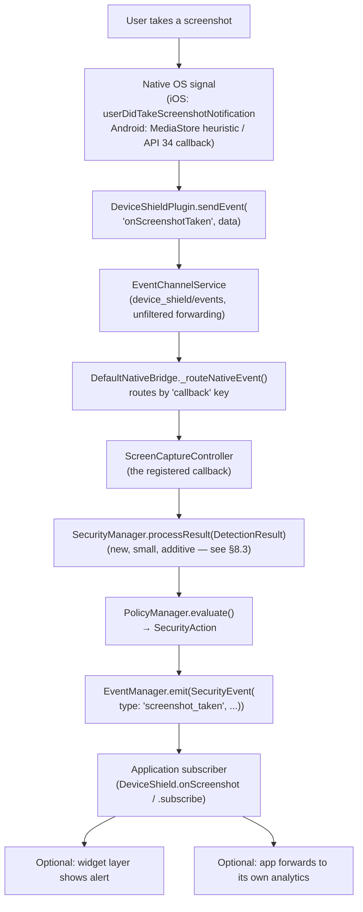
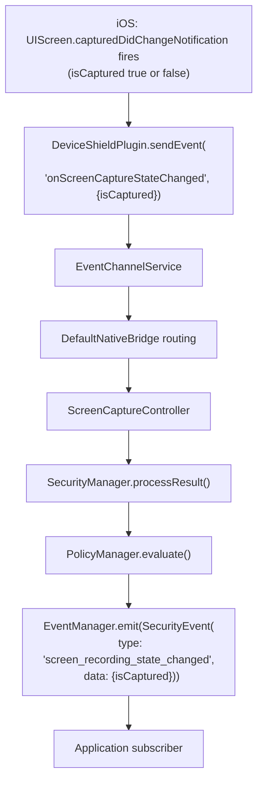
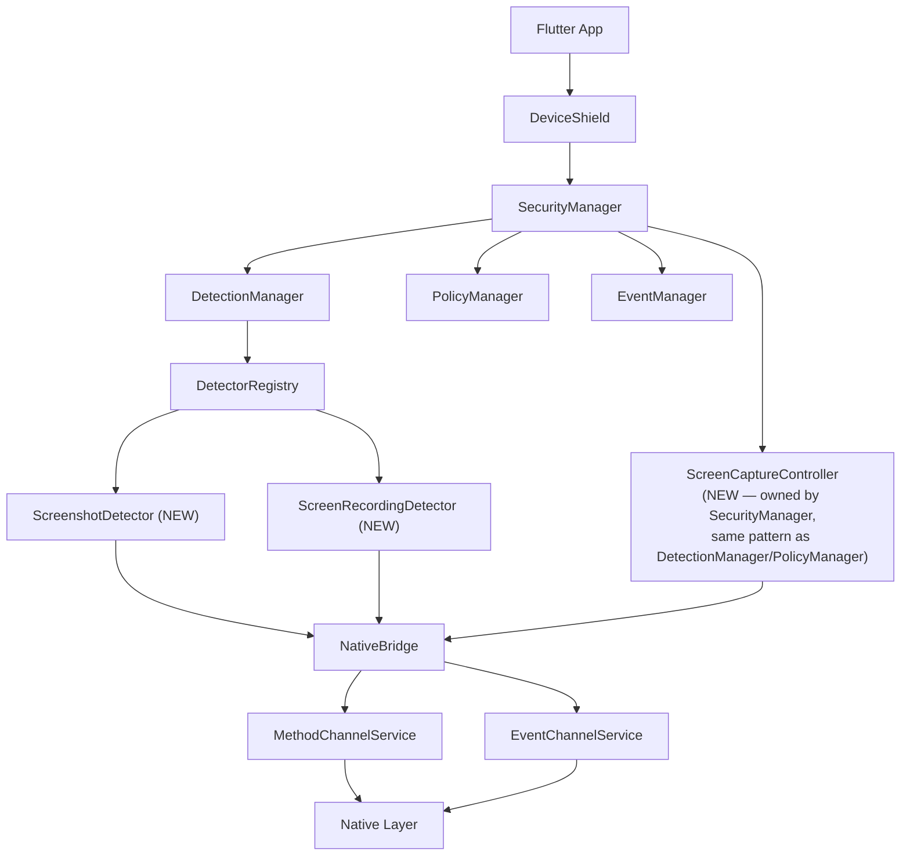
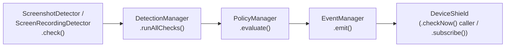
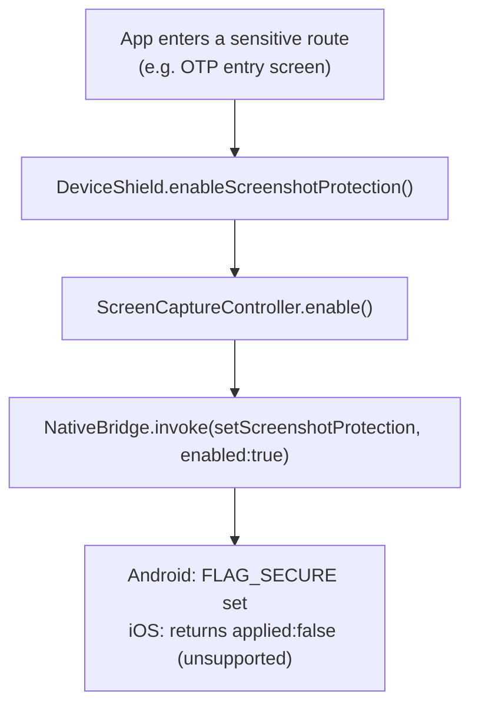
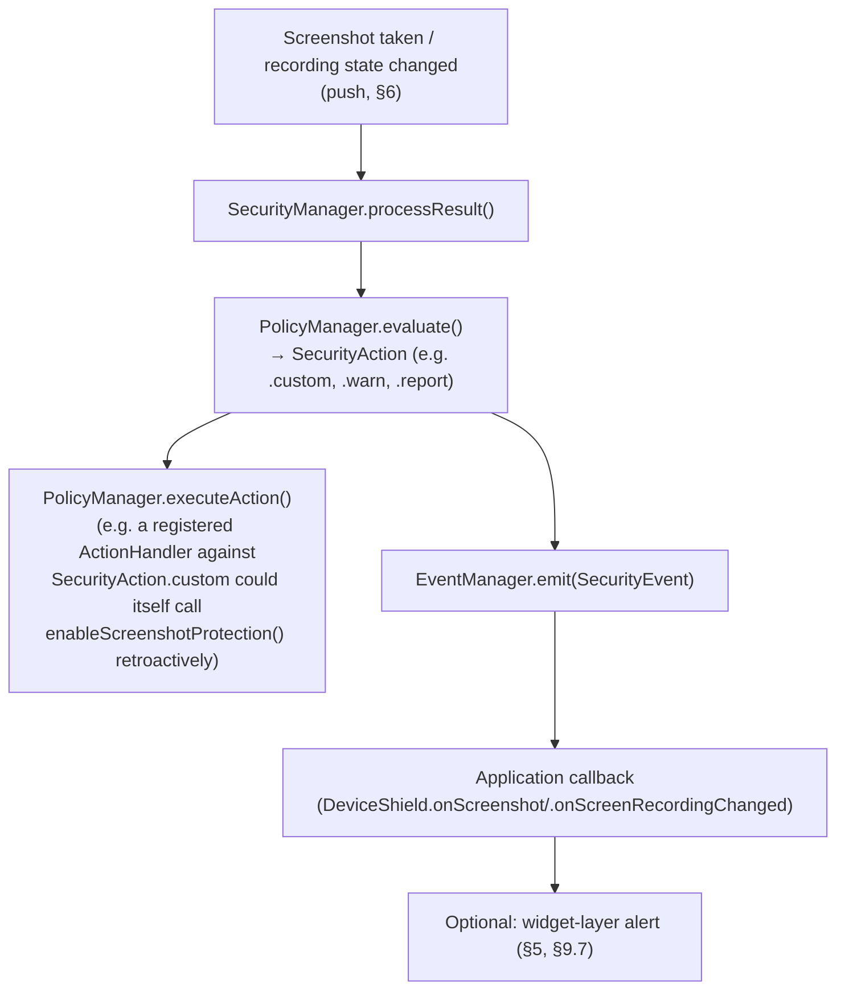

# Screenshot & Screen Recording Protection — Design Document

**Status:** Planning only. No implementation exists yet. This document was produced after reading the entire repository (`lib/`, `android/`, `ios/`, `test/`, and every architecture/roadmap doc) and is written to be consistent with what the codebase actually contains today, not with what the roadmap aspires to.

**Scope of this document:** design and API surface only. No Dart/Kotlin/Swift implementation code is included anywhere below, per the task's own instruction.

---

## 0. What this document builds on (repository facts, verified by reading source)

Before designing anything new, here is the part of the existing architecture this feature must fit into — verified directly against source, not against `ARCHITECTURE.md`'s aspirational text:

- The SDK has exactly two working detectors today: `EmulatorDetector` and `DebuggerDetector` ([lib/src/detectors/](../../lib/src/detectors/)). Both are **poll-based**: `Detector.check()` is called, native answers once, done. There is no precedent anywhere in this codebase for a detector that needs to push a result to Dart *asynchronously, without being asked*.
- `NativeBridge` already has exactly the transport this feature needs for that asynchronous push, and it has been sitting unused since Phase 7: `registerCallback(name, callback)` / `unregisterCallback(name)` ([lib/src/bridge/native_bridge.dart](../../lib/src/bridge/native_bridge.dart:35)), backed by a real `EventChannel` (`device_shield/events`) and native `sendEvent(callback, data)` methods that already exist in both `DeviceShieldPlugin.kt` and `DeviceShieldPlugin.swift`, with doc comments in both files stating almost verbatim: *"a future detector/protection calls this with its own callback name and payload."* This feature is that future detector/protection.
- `DetectionResult.type` and `SecurityEvent.type` are both deliberately open `String` values, not closed enums, specifically so a new feature never requires a framework change ([detection_result.dart:3](../../lib/src/models/detection_result.dart:3), [security_event.dart:9](../../lib/src/models/security_event.dart:9)). This feature needs **zero new model classes** — a direct, confirmed reuse win.
- `SecurityManager` is the sole orchestrator ("one orchestrator, one bridge" — [ARCHITECTURE.md](../../ARCHITECTURE.md) §Governing Rules) and is the *only* thing holding both `PolicyManager` and `EventManager`. `DefaultSecurityManager`'s own doc comment states it "deliberately holds no `NativeBridge` reference... nothing here has any legitimate use for one" ([default_security_manager.dart:18](../../lib/src/managers/default_security_manager.dart:18)). This feature is the **first genuine, legitimate reason** that rule needs revisiting — see §8.3.
- `SecurityProfile`/`ProtectionConfig` already model "per-protection enablement, generic across every protection type" ([security_profile.dart](../../lib/src/models/security_profile.dart)) — but by the model's own doc comment, `SecurityProfile` is "not yet threaded through any frozen method signature." It is not usable by this feature yet without a larger, separate piece of work. See §4.4 for how this document routes around that gap honestly, without pretending to solve it.
- `DeviceShieldConfig` *is* the thing actually wired through `DeviceShield.initialize()` today, validated by `DeviceShieldConfigValidator` before reaching `ConfigurationManager`. This is the real, load-bearing config surface this feature must extend.
- No `lib/src/protections/` or `lib/src/widgets/` directory exists yet. `DeviceShieldWidget` and `SecurityAlertDialog`, both named in `ARCHITECTURE.md`'s component table, do not exist anywhere in `lib/`. This confirms the widget/UI layer is fully greenfield for this feature.

---

## 1. Overview

### 1.1 Why screenshot detection is needed
A screenshot is the simplest possible data-exfiltration vector for a mobile app: no jailbreak, no root, no tooling — any user, at any moment, can capture whatever is on screen and share it. For a banking/payment app, the screens most likely to be screenshotted are exactly the ones that must never leave the device unmanaged: account numbers, balances, OTP codes, UPI PINs, card numbers, KYC documents mid-capture, and QR codes used for payment authorization. Detecting a screenshot lets the app react — log it for fraud/compliance review, warn the user, or escalate to the policy engine — even though (as §1.6 makes clear) the screenshot itself frequently cannot be *prevented*.

### 1.2 Why screen recording detection is needed
Screen recording (or live screen mirroring) is the vector behind one of the most common real-world banking fraud patterns today: **remote-support scams**, where a victim is socially engineered into starting a screen-share (via a legitimate remote-support tool, AirPlay, or a malicious app) while a scammer watches live as OTPs, balances, or credentials appear on screen. Unlike a screenshot, this is a *continuous* exposure — every frame rendered while recording/mirroring is active is visible to whoever is on the other end. Detecting that the screen is currently being captured lets the app react immediately (block sensitive content, force logout, alert the user) rather than after the fact.

### 1.3 Security risks
- Exfiltration of static sensitive data (account numbers, balances, personal information) via a single screenshot.
- Continuous exfiltration of dynamic sensitive data (OTPs, live balances, transaction confirmations) via recording/mirroring.
- Social-engineering fraud: victim coerced into enabling a legitimate OS-level recording/mirroring feature, which no OS treats as inherently malicious (because it isn't, in the general case) — this is precisely why detection, not just "is this app malicious," matters.
- Screenshot-scraping malware/automation that periodically screenshots the foreground app to build a data-exfiltration pipeline without any user action at all.
- Compliance exposure: several card-network and regulator mobile-app security baselines (referenced generically across the industry, not a specific citation this document will assert) expect a "screen capture protection" control to exist at all, independent of whether it can be made airtight on every platform.

### 1.4 Real-world banking/payment use cases
- OTP/PIN entry screen: proactively block screenshots (Android) and alert immediately if recording/mirroring is detected (both platforms), since a live-captured OTP is directly usable by an attacker within its validity window.
- Card details / account number screen: block screenshots proactively; log (not necessarily block) recording detection for fraud review, since blocking every screen unconditionally on every recording signal (which includes legitimate AirPlay use, see §1.6) risks blocking legitimate users.
- QR-code payment/UPI screen: screenshot of a QR code is itself a valid, everyday use case for some flows (e.g., sharing a receive-QR) — this is a concrete example of why "block everywhere always" is the wrong default, and why configuration must be granular and app-controlled, not an SDK-wide switch (see §4).
- Customer-support remote screen-share: a *legitimate* one, from the bank's own support tooling — recording detection alone cannot distinguish "our own support session" from "an attacker's session"; this must be surfaced as an event the app can reason about (e.g., check an app-level "support session active" flag before treating a recording event as a threat), not a blanket automatic block.
- KYC/document-capture screen: block screenshots and warn on recording, since these frames may contain a live capture of a government ID.

### 1.5 What is actually possible (by platform — see §7 for full detail)

| Capability | Android | iOS |
|---|---|---|
| **Block screenshots proactively** | Yes — `FLAG_SECURE`, reliable, available since Android 1.0 | **No *supported* API exists** — this remains true (see §1.6). **Update, §18.5**: implemented anyway via an undocumented `UITextField` secure-layer technique, by explicit host-app decision accepting that risk — **but live Simulator verification this session showed the capture-exclusion effect did NOT occur**; unconfirmed on real hardware. Do not treat as working until physical-device-tested. |
| **Detect a screenshot was taken** | Best-effort only pre-Android 14 (MediaStore heuristic, permission-gated, unreliable); official, reliable callback from Android 14 (API 34) onward | Yes — reliable, official, available since iOS 7.0 |
| **Block screen recording/mirroring** | Yes, as a *side effect* of `FLAG_SECURE` (same flag blocks both) | Same status as screenshot blocking above — the §18.5 mechanism also excludes the protected view from recording/mirroring capture, not just screenshots (it's the same OS-level capture-exclusion, not two separate effects). |
| **Detect active recording/mirroring** | **No reliable discrete signal.** `FLAG_SECURE` blocks the *content*, but Android gives no "recording started" event a third-party app can depend on. | Yes — `UIScreen.isCaptured` + `capturedDidChangeNotification`, reliable, available since iOS 11, but see §1.6 for its false-positive limitation. |
| **Redact the App Switcher / Recents thumbnail** | Yes, automatically, as a side effect of `FLAG_SECURE` | **Implemented, §18.1** — a blur overlay shown just before the OS captures the app-switcher snapshot. Unlike §18.5, this one *is* built entirely from public, documented, stable UIKit API. |

### 1.6 What is impossible *through any Apple-documented, supported mechanism* — stated honestly, not softened

**This section's original conclusions are still factually correct and are preserved as written below — no sentence here has been quietly edited.** What changed is a separate, later decision (§18.5) to implement a real black-screenshot effect anyway, through means Apple does not document or support, with that risk explicitly accepted by the host app. Read §1.6 as "impossible without accepting undocumented-internals risk," not as "no longer true" — it remains true that Apple offers no supported API for this, on any iOS version, ever.

- **iOS can never block a screenshot through any Apple-supported mechanism.** This is a deliberate, permanent Apple platform decision, not a version-specific limitation and not something any third-party SDK — including real banking apps' own custom code — can work around *using documented APIs*. Any vendor or document claiming a *supported* iOS screenshot-blocking API is wrong; §18.5's mechanism is the honest alternative some production apps actually use, and it is not a supported API either.
- **Android cannot reliably tell you a recording *started* as a discrete event**, only that content is currently blocked from being captured (via `FLAG_SECURE`), which is a side effect, not a signal.
- **`UIScreen.isCaptured` cannot distinguish a malicious recording from an innocent AirPlay/external-display/CarPlay mirroring session.** It is one blunt boolean covering every form of "something is capturing this screen." This must be documented as a named false-positive source, not silently treated as "recording detected = threat."
- **A physical photograph or camera pointed at the device screen is undetectable by any software on any platform, ever.** No amount of native API surface changes this. Any design (including this one) that implies "recording detection" is complete protection is misleading; it is real, useful risk-reduction against *software*-based capture only.
- **Pre-Android-14 screenshot detection is inherently unreliable** — dependent on storage permissions the app may not hold, on the screenshot file actually landing in the expected `MediaStore` location (not guaranteed across OEM skins/launchers), and on `FLAG_SECURE` not already having blocked the screenshot from being saved at all (if blocking is on, there is no file to observe — which is fine for prevention, but means the two mechanisms are not simultaneously "detect and get a file" — see §7.1).
- **A jailbroken/rooted device can bypass all of this** via low-level frame-buffer capture that never goes through the OS APIs this design observes. This is a bypass limitation, not a bug — discussed formally in §14.1.

---

## 2. Feature Goals

What this SDK should support, stated precisely (✓ = in scope for this design; ✗ = explicitly out of scope, with reason):

- ✓ Detect screenshot (iOS: reliable, official. Android: best-effort pre-14, official from API 34)
- ✓ Detect screen recording / mirroring (iOS: reliable, via `isCaptured`. Android: **not supported** — see §1.6; the SDK will surface this honestly as "unsupported on this platform" rather than silently no-op)
- ✓ Block screenshots (Android `FLAG_SECURE` only; iOS returns an explicit "not supported" result, never a silent no-op that looks like success)
- ✓ Notify Flutter (via the existing `NativeBridge.registerCallback`/`EventChannel` transport)
- ✓ Notify application (via the existing `EventManager`/`DeviceShield.subscribe` surface, plus two thin convenience methods, §3)
- ✓ Allow application to show an alert (via an **optional**, separate widget-layer component — not core SDK logic; see §5, §9.7)
- ✓ Allow application to customize the alert entirely, or suppress it and use only the event callback (§5)
- ✓ Enable/disable feature at `initialize()` time, via config (§4)
- ✓ Enable/disable at runtime, imperatively, independent of the detection pipeline (§3, §11.1)
- ✓ Configuration-driven defaults, all off by default (§4.5)
- ✗ Block screen recording on Android as a *distinct* action from screenshot blocking — not distinct; `FLAG_SECURE` is one flag that affects both simultaneously. Presented as one toggle, not two, to avoid implying a control that doesn't exist (§4.1).
- ✗ Block screenshot/recording on iOS in any form — impossible; not a gap, a platform fact (§1.6).
- ✗ Distinguishing "malicious recording" from "AirPlay/CarPlay mirroring" on iOS automatically — not solvable at the OS-signal level; the SDK surfaces the raw signal and lets the app apply its own business logic (§14.3).

---

## 3. Public SDK API Design

Every method below is **pure delegation** — consistent with `DeviceShield`'s existing, established rule that it "owns no logic of its own" ([device_shield.dart:20](../../lib/src/api/device_shield.dart:20)). None of these are final signatures; they illustrate the shape and are explained individually.

```dart
// --- Configuration (see §4) ---
DeviceShieldConfig(
  enableScreenshotDetection: false,
  enableScreenRecordingDetection: false,
  enableScreenshotProtection: false,
);

// --- Runtime, imperative control — independent of detection/policy ---
Future<bool> DeviceShield.enableScreenshotProtection();
Future<bool> DeviceShield.disableScreenshotProtection();
Future<bool> get DeviceShield.isScreenshotProtectionSupported; // false on iOS, always
bool get DeviceShield.isScreenshotProtectionEnabled;           // last-known local state

// --- Convenience event subscriptions — pure sugar over DeviceShield.subscribe ---
StreamSubscription<SecurityEvent> DeviceShield.onScreenshot(
  void Function(SecurityEvent event) handler,
);
StreamSubscription<SecurityEvent> DeviceShield.onScreenRecordingChanged(
  void Function(SecurityEvent event) handler,
);
```

### Explanation of every API

- **`DeviceShieldConfig.enableScreenshotDetection`** — opts the `ScreenshotDetector` into existence at boot. Does not, by itself, register the detector with `DetectionManager` for the periodic-poll path (see §10) — it only enables the push-listener half. This split exists because "was a screenshot taken" has no meaningful periodic-poll answer; see §7 for why.
- **`DeviceShieldConfig.enableScreenRecordingDetection`** — opts `ScreenRecordingDetector` into existence. Enables both its poll path (`Detector.check()`, useful for `DeviceShield.checkNow()`/risk-scoring consistency with every other detector) and its push path (`isCaptured` change notifications). On Android, this field is accepted but the resulting detector always reports `DetectionStatus.failed` with an explicit "not supported on this platform" evidence field — see §7.1 — rather than silently doing nothing.
- **`DeviceShieldConfig.enableScreenshotProtection`** — whether `FLAG_SECURE` (Android) is applied automatically at boot. Deliberately **off by default** (see §4.5) — forcing every screen of every host app to block screenshots by default would be a surprising, breaking, opinionated default inconsistent with every other field in `DeviceShieldConfig` today, all of which default to the least-invasive option.
- **`DeviceShield.enableScreenshotProtection()` / `disableScreenshotProtection()`** — the *imperative* on/off switch, for the common real case: a host app wants protection on for one specific sensitive screen (e.g., the OTP entry route) and off elsewhere. Returns `Future<bool>` — the actual applied state as confirmed by native, not an optimistic guess — because on iOS this call is a legitimate no-op (see next bullet) and the caller deserves a truthful answer, not silence. This is a deliberate, explained design choice: an app that doesn't check the return value and assumes success on iOS is exactly the failure mode this signature is designed to prevent.
- **`DeviceShield.isScreenshotProtectionSupported`** — always resolves `false` on iOS, always `true` on Android. Exists so an app can decide, ahead of time, whether to show a platform-specific fallback (e.g., a warning banner on iOS instead of relying on blocking that doesn't exist there).
- **`DeviceShield.isScreenshotProtectionEnabled`** — a synchronous, locally-cached read of last-known state (not a fresh native round-trip) — matches the existing pattern of `DeviceShield.status` being a synchronous, always-answerable read. Trade-off stated explicitly: this can theoretically drift from native truth if something outside the SDK toggles the underlying window flag directly; accepted because re-querying natively on every read would be needless overhead for a value that only this SDK is expected to mutate.
- **`DeviceShield.onScreenshot(handler)` / `onScreenRecordingChanged(handler)`** — 100% equivalent to `DeviceShield.subscribe(handler, filter: (e) => e.type == 'screenshot_taken')` / `'screen_recording_state_changed'`. Added purely as documented, discoverable sugar — a developer scanning `DeviceShield`'s public surface should be able to find "screenshot" without already knowing the exact event-type string to filter on. They introduce no new capability and no new logic, matching the facade's existing rule.

---

## 4. Configuration

### 4.1 Options and what each one controls

| Option | Type | Controls |
|---|---|---|
| `enableScreenshotDetection` | `bool` | Whether `ScreenshotDetector`'s native push listener (`onScreenshotTaken`) is registered at boot. |
| `enableScreenRecordingDetection` | `bool` | Whether `ScreenRecordingDetector` (poll + push) is registered at boot. Accepted on Android but always reports "unsupported" (§7.1) rather than silently doing nothing. |
| `enableScreenshotProtection` | `bool` | Whether `FLAG_SECURE` is applied automatically, SDK-wide, at boot. This is intentionally a single toggle covering *both* screenshot and recording/mirroring blocking on Android — see §1.6/§2 for why a separate "block recording" flag would be misleading (one native flag governs both). |
| `screenshotRecordingRiskScoreWeight` | `double`, default `1.0` | Passed through to `DetectionResult.confidence` for events from this feature, so `PolicyManager.calculateRiskScore()` weighs them consistently with other detectors, per the existing generic risk-scoring contract. |
| `allowRecordingDetectionInDebug` | `bool`, default `true` | Whether recording-state events fire during a debug build. Off by default would be surprising during local development/QA of this exact feature; on by default matches every other detector's behavior today (none of them special-case debug builds).|

### 4.2 Defaults — and why they are conservative

All three boolean toggles above default to `false`. This matches `DeviceShieldConfig`'s existing, established philosophy: every field in the current model (`debugLogging`, `runOnUIThread`, etc.) defaults to the least-invasive option, and no existing detector is auto-registered at boot without the host app opting in (`DeviceShield.registerDetector()` must be called explicitly today, even for `EmulatorDetector`/`DebuggerDetector`). This feature does not introduce a new precedent — it follows the one already set.

### 4.3 Widget-layer configuration (separate from the above — see §5, §9.7)
These are **not** part of `DeviceShieldConfig` and do not touch `ConfigurationManager` at all — they belong entirely to the optional, separate UI-layer component:

| Option | Controls |
|---|---|
| `showAlert` | Whether the optional alert widget renders anything at all in response to an event, vs. the app relying purely on `onScreenshot`/`onScreenRecordingChanged` callbacks. |
| `alertTitle` / `alertMessage` | Default copy for the built-in alert, if used unmodified. |
| `customDialogBuilder` | A `Widget Function(BuildContext, SecurityEvent)` the app supplies to fully replace the built-in alert's content while still using the built-in show/dismiss plumbing. |
| `customEventHandler` | A raw callback bypassing the widget entirely — functionally identical to calling `DeviceShield.onScreenshot`/`onScreenRecordingChanged` directly; exists as a discoverable named option on the widget for apps that start from the widget and later want more control. |

### 4.4 Why this isn't built on `SecurityProfile`/`ProtectionConfig` yet
`SecurityProfile.protectionConfigs` (a `List<ProtectionConfig>`, each with an open `type: String` and `enabled: bool`) is *already* a generically-correct model for exactly this kind of toggle — in principle, `ProtectionConfig(type: 'screenshot', enabled: true)` is a perfect fit. But per that model's own doc comment, `SecurityProfile` is not yet threaded through any frozen method signature — no version of `DeviceShield.initialize()` accepts one today, and wiring that up is a separate, larger, not-yet-scoped piece of infrastructure work with its own cross-cutting implications (it's documented as a dependency of `PermissionManager`, `DetectionManager`, *and* `PolicyManager` simultaneously). Building this feature's config on top of a mechanism that doesn't exist yet would silently make this design depend on unscoped future work. Instead, this document adds the three fields directly to `DeviceShieldConfig` (the surface that is actually wired today), and explicitly records the intended migration: **once `SecurityProfile` is threaded through `initialize()`, these three fields should move to `ProtectionConfig` entries for consistency with every other protection**, at which point the `DeviceShieldConfig` fields become deprecated aliases, not a second parallel system.

### 4.5 Configuration-driven, not hardcoded
All three core toggles are read from `ConfigurationManager.current` (the existing single owner of live config — "no manager caches its own copy," per its own contract) at the point `ScreenCaptureController`/the two detectors are constructed during boot, exactly matching how `DefaultDetectionManager`'s `detectorTimeout` is already read once from `ConfigurationManager.current.checkTimeout` at construction time in `PluginInitializer`. No new configuration-access pattern is introduced.

---

## 5. User Customization

Every customization point below lives in the **optional widget layer** (§9.7), never in core SDK logic — this is a deliberate architectural boundary (see §8.4), matching the fact that `DeviceShield`/`SecurityManager`/`EventManager` today import no Flutter widget code at all, only `LifecycleManager` does (for `WidgetsBindingObserver`, a platform-integration necessity, not a UI concern).

| Customization | Mechanism | Optional? |
|---|---|---|
| Custom Alert copy | `alertTitle`/`alertMessage` params | Yes — has a default |
| Custom Widget / Custom Dialog / Custom BottomSheet | `customDialogBuilder: Widget Function(BuildContext, SecurityEvent)` — the widget decides *whether* to present it as a dialog, bottom sheet, banner, or anything else; the SDK does not dictate presentation shape | Yes |
| Disable Alert entirely | `showAlert: false`, or simply never mount the optional widget at all and use `DeviceShield.onScreenshot`/`onScreenRecordingChanged` directly | Yes — this is the "only event callback" mode, and is expected to be the common case for apps with their own design system |
| Custom Localization | Not the SDK's concern to solve generically — `alertTitle`/`alertMessage`/`customDialogBuilder` all accept whatever the host app's own localization pipeline produces; the SDK does not ship its own i18n strings or opinionated locale logic |
| Custom Theme | Not special-cased — `customDialogBuilder` receives `BuildContext`, so it inherits the host app's `Theme`/`MaterialApp` ambient styling automatically, same as any other widget the app builds |
| Custom Button Text | Part of `customDialogBuilder`'s returned widget tree — not a separate parameter, since the SDK does not dictate how many buttons exist or what they do |
| Custom Animation | Same — `customDialogBuilder` returns a widget; how it animates in/out is the returned widget's own concern (e.g. wrapped in the app's own `AnimatedSwitcher`/route transition), not a parameter the SDK exposes |

**Design principle stated explicitly:** every single row above is optional, and the "no customization at all" path (ignore the widget layer completely, subscribe to events directly) is a first-class, fully-supported usage mode — not a fallback. This mirrors `EventManager.subscribe()`'s own existing, unopinionated design.

---

## 6. Event Flow

### 6.1 End-to-end: user takes a screenshot



### 6.2 End-to-end: screen recording/mirroring state changes (iOS)



Both diagrams share the same spine from `NativeBridge` onward — the only thing that differs between "screenshot" and "recording" is the native signal source and the event's `type`/`data` shape. This is intentional reuse, not two parallel pipelines.

---

## 7. Native Implementation

### 7.1 Android

**`FLAG_SECURE` (protection, not detection):**
- Set via the hosting `Activity`'s `Window`: `window.setFlags(FLAG_SECURE, FLAG_SECURE)` to enable, `window.clearFlags(FLAG_SECURE)` to disable.
- Reliable back to Android 1.0 — no version gating needed.
- Side effects beyond blocking screenshots/recording: the app's content is also hidden from the Recent Apps / App Switcher thumbnail automatically (a real, free bonus — see §17), and blocked from being cast/mirrored (Miracast/Chromecast) for the same reason (`FLAG_SECURE` operates at the `SurfaceFlinger` compositing level, not per-gesture).
- **Scope limitation that must be documented, not hidden:** a Flutter app is normally a single `Activity` hosting the entire Flutter view hierarchy. `FLAG_SECURE` is a whole-`Activity`/`Window` flag — it is **not** per-route/per-widget. "Protect only the OTP screen" therefore requires the host app to call `enableScreenshotProtection()`/`disableScreenshotProtection()` at the right navigation moments (e.g. `onEnter`/`onExit` of that specific route), and there is an inherent small race window around the toggle itself where a screenshot taken in the exact instant of a route transition could theoretically slip through. This is a genuine platform-shape limitation of single-Activity Flutter apps, not a bug in this design.
- **MediaProjection** is Android's screen-recording/casting API — relevant here only as background: it is what *other* apps use to record the screen. This SDK does not use `MediaProjection` itself for anything; it is mentioned because roadmap docs elsewhere in this repo reference it, and this document clarifies it is not part of this feature's mechanism.
- **Screenshot detection (a separate concern from blocking):**
  - **Android 14 (API 34)+:** `Activity.registerScreenCaptureCallback()` — official, reliable, fires precisely when a screenshot of that Activity is taken. This is the only *reliable* Android screenshot-detection mechanism that exists.
  - **Pre-Android-14:** no official callback exists. The only available heuristic is a `ContentObserver` watching the `MediaStore.Images` external content URI for new rows whose path suggests a screenshot (commonly under a `Screenshots` folder). This requires `READ_MEDIA_IMAGES` (API 33+) or `READ_EXTERNAL_STORAGE` (below it) — a runtime permission the host app must have granted, and one many banking apps will be reluctant to request just for this feature. It is also unreliable: some OEM launchers/skins save screenshots to non-standard paths, and — critically — if `FLAG_SECURE` is already blocking screenshots (protection enabled), no file is ever written, so there is nothing for this heuristic to observe in the first place (see next bullet).
  - **Interaction between blocking and detection:** if `enableScreenshotProtection` is on, Android screenshots are simply blocked (a black/empty capture) and, on pre-14 devices, the `MediaStore` heuristic will not fire at all (no file was written). On API 34+, the official callback still fires regardless of whether the capture succeeded, since it observes the *attempt*, not the resulting file. This asymmetry must be documented for whoever configures this feature, since "protection on + detection on" behaves differently depending on the Android version installed.
- **Recording detection:** no reliable discrete "recording started" signal exists for a third-party app on modern Android (package-visibility restrictions since Android 11 already block the older `ActivityManager.getRunningServices()`-based heuristics some SDKs historically relied on). `ScreenRecordingDetector` on Android will always report an explicit "not supported on this platform" result (`DetectionStatus.failed` with a documented evidence reason) rather than a false, unearned "not recording" answer.
- **Foreground/background:** `FLAG_SECURE` state persists across a backgrounded `Activity` without extra work; nothing native-side needs to react to lifecycle changes for the blocking half. The Dart-side `LifecycleManager` is not involved in this feature at all, by the same reasoning `ARCHITECTURE_CONTRACTS.md` already applies elsewhere: it forwards `WidgetsBinding` state, nothing more, and this feature has no need to hook that path.
- **Performance:** `FLAG_SECURE` toggling is a single, cheap `Window` flag operation — negligible cost. The pre-14 `ContentObserver` heuristic has a small, continuous background cost for as long as it's registered (one observer on one content URI) — acceptable, but worth noting as the one piece of this feature with any ongoing native-side overhead at all.

### 7.2 iOS

**`UIScreen.main.isCaptured` / `capturedDidChangeNotification`:**
- `isCaptured` (a `Bool` property on `UIScreen`, available iOS 11.0+) is `true` whenever the screen's contents are being captured by *any* mechanism the system considers "capture" — Control Center screen recording, AirPlay mirroring, an external/CarPlay display mirroring the screen, or a connected recording accessory. It is a single blunt boolean; iOS gives no way to distinguish which of these is true.
- `NotificationCenter` posts `UIScreen.capturedDidChangeNotification` whenever this value changes — this is the event this design subscribes to natively, rather than polling.
- **`userDidTakeScreenshotNotification`** (available since iOS 7.0) fires *after* a screenshot has already been taken and saved to Photos. It is purely informational — there is no way to intercept or cancel the screenshot, and no way to know what was in it beyond the fact that the notification fired while your app was foregrounded.
- **ReplayKit — explicitly not the mechanism used here, and a correction worth stating plainly:** ReplayKit (`RPScreenRecorder`) is Apple's framework for an app to record **its own** screen and broadcast/share that recording — it is designed for building in-app "record my gameplay" features, not for detecting that some *other* process (Control Center, AirPlay, a different app) is capturing the screen. Some of this repository's own planning documents (`SDK_MILESTONE_PLAN.md`, `ROADMAP.md`) describe iOS recording detection as "ReplayKit monitoring" — this is imprecise. The correct, actually-existing mechanism for detecting *external* capture is `UIScreen.isCaptured`, not ReplayKit. This document corrects that terminology going forward.
- **Screenshot/recording blocking through a *supported* mechanism: does not exist.** There is no public API, private-API workaround considered acceptable for App Store distribution, or documented Apple-sanctioned mechanism to prevent a screenshot or a recording session on iOS. This remains true. **§18.5 update**: this SDK now implements a real black-screenshot/recording effect anyway, via `ScreenCaptureProtection.swift`'s `UITextField.isSecureTextEntry` layer re-parenting technique — the same category of "commonly: overlaying a blur/warning after detection" claim this bullet used to dismiss does *not* apply to that specific technique (it genuinely excludes content from the capture itself, not a post-hoc overlay) — but it is still not a documented Apple contract, and the fragility warning in that file's own header comment is the load-bearing caveat, not this paragraph's older, now-superseded blanket dismissal.
- **Version compatibility:** both APIs used here (`isCaptured`/`capturedDidChangeNotification` since iOS 11, `userDidTakeScreenshotNotification` since iOS 7) are trivially available at this plugin's current Swift Package Manager floor of iOS 18.0 (set in [ios/device_shield/Package.swift](../../ios/device_shield/Package.swift:8)). That floor exists for unrelated SPM tooling reasons (confirmed earlier in this project's history), not because this feature needs a recent iOS version — worth stating so no one assumes this feature is why the floor is high.

---

## 8. Architecture

### 8.1 Existing components this feature reuses, and each one's responsibility here

| Component | Responsibility in this feature |
|---|---|
| `NativeBridge` | Sole transport. `invoke()` for the imperative `setScreenshotProtection`/`isScreenCaptureActive` commands; `registerCallback()`/native `sendEvent()` for the push events. No new transport mechanism of any kind. |
| `MethodChannelService` / `EventChannelService` | Unchanged, reused exactly as-is — this feature adds new method/callback *names*, not new channels. |
| `EventManager` | Unchanged. Receives `SecurityEvent`s exactly like every other feature; has no knowledge this feature exists. |
| `PolicyManager` | Unchanged. `evaluate()`/`executeAction()` treat this feature's `DetectionResult`s exactly like any other detector's — no special-casing, per the existing "Rule doesn't know what any specific condition is" design. |
| `ConfigurationManager` | Unchanged contract. Supplies the three new `DeviceShieldConfig` fields (§4) at the point `SecurityManager`/its collaborators are constructed, same pattern as `checkTimeout` today. |
| `LifecycleManager` | **Not used by this feature at all.** Considered and rejected — see §8.5. |
| `ServiceContainer` | Unchanged. No new `Manager`-lifecycle singleton is registered for this feature (see §8.4) — this is a deliberate minimalism decision, directly satisfying "do not introduce unnecessary managers." |
| `DetectorFactory` / `DetectorRegistry` | Reused for the poll-path halves of `ScreenshotDetector`/`ScreenRecordingDetector` — registered exactly like `EmulatorDetector`/`DebuggerDetector` are today, via the existing extension mechanism. |
| `PluginInitializer` | Unchanged contract shape. Gains no new boot step — the new push-listener wiring happens inside `SecurityManager.initialize()`, which `PluginInitializer` already calls at its existing step 7 ("Managers"). |
| `DeviceShield` | Gains the new methods listed in §3 — pure delegation, no new logic, matching its existing rule. |

### 8.2 Dependency diagram



Note the two independent paths into `NativeBridge` from this feature: the poll path (`ScreenshotDetector`/`ScreenRecordingDetector`, exactly like every existing detector) and the push/command path (`ScreenCaptureController`, new). Both share the same `NativeBridge` instance — there is still exactly one bridge, per the frozen rule; multiple things already hold references to it today (every existing detector does), so this is not a new pattern.

### 8.3 The one architecture change this feature genuinely requires — stated explicitly, not silently

`DefaultSecurityManager.checkNow()` already contains the exact per-result pipeline this feature needs (`policyManager.evaluate(result)` → `policyManager.executeAction(...)` → `eventManager.emit(...)`), but only as a private loop body over a *batch* of poll results. This feature needs that same three-step sequence runnable for **one ad-hoc result, the instant it arrives via push**, not gated behind the next periodic `Timer` tick (which defaults to 30 seconds — unacceptable latency for "the user just took a screenshot").

**Decision:** extract that per-result body into a new, small, additive method on the `SecurityManager` contract — `Future<void> processResult(DetectionResult result)` — called both by `checkNow()`'s existing loop (one call per batch item, no behavior change) and by the new `ScreenCaptureController` on every native push. This is a pure refactor-plus-one-new-public-entry-point, not a redesign: `checkNow()`'s observable behavior is unchanged, and the new method is additive to the contract, not a breaking change to it.

**Decision:** `ScreenCaptureController` does **not** hold a concrete `SecurityManager` reference to call `processResult()`. Doing so would create a two-node cycle (`SecurityManager` owns `ScreenCaptureController`; `ScreenCaptureController` calls back into `SecurityManager`) — exactly the shape this codebase already solved once, for `LifecycleManager`/`SecurityManager`, via the narrow `SecurityLifecycleHandler` callback contract ([lifecycle.dart:49](../../lib/src/state/lifecycle.dart:49)). This design reuses that exact precedent: `ScreenCaptureController` is constructed with a plain callback (`Future<void> Function(DetectionResult) onResult`), and `SecurityManager` passes its own `processResult` method as that callback — the same shape as `SecurityManager` implementing `SecurityLifecycleHandler` and passing itself to `LifecycleManager.attach()` today. No new abstract contract type is introduced; a plain function type is sufficient here since there is exactly one callback, not four.

**Decision:** `SecurityManager`'s existing "deliberately holds no `NativeBridge`" rule is revisited, narrowly, for this feature only. `ScreenCaptureController` (owned/constructed by `SecurityManager`, exactly like `DetectionManager`/`PolicyManager` are today) holds `NativeBridge` directly — using the *same* pattern every leaf `Detector` already uses, not a new one. `SecurityManager` itself still never touches `NativeBridge` directly; it only owns a small collaborator that does, exactly as it already owns `DetectionManager` (which, transitively through its detectors, also reaches `NativeBridge`). The prior rule's stated reasoning — "nothing here has any legitimate use for one" — is exactly the premise this feature invalidates: proactive screenshot-protection enable/disable is an imperative native command with no natural home in `DetectionManager` (which is detection-only, read-only, by its own contract) or in an individual `Detector` (whose contract has no "enable/disable" concept at all, deliberately, since it's read-only by shape). `ScreenCaptureController` is the minimal new surface that carries exactly this one new responsibility, owned by the one component ("one orchestrator") whose job is coordinating everything else.

### 8.4 Why this doesn't need a new `Manager` / `ServiceContainer` registration
`ScreenCaptureController` is **not** registered in `ServiceContainer` and does **not** implement the `Manager` lifecycle interface (`initialize()`/`dispose()` as a standalone boot step). It is a small, constructor-injected collaborator **owned by `SecurityManager`**, exactly matching how `DetectionManager` and `PolicyManager` are owned today (constructed inside `PluginInitializer._resolveOrRegisterSecurityManager()`, passed into `DefaultSecurityManager`'s constructor, never independently resolved from the container by anything else). Its `initialize()`/`dispose()` (plain methods, not a `Manager` implementation) are called from within `SecurityManager.initialize()`/`dispose()`, the same way `SecurityManager.initialize()` today calls `detectionManager.initialize()` and `policyManager.initialize()` as ordinary method calls, not container resolutions. This avoids adding a tenth boot step to `PluginInitializer`'s already-numbered sequence for something that is, architecturally, a private implementation detail of `SecurityManager`, not a new peer service.

### 8.5 Why `LifecycleManager` is deliberately not used
It was considered — "pause protection while backgrounded" sounds superficially like a lifecycle concern. Rejected because: (a) `FLAG_SECURE` does not need lifecycle-driven toggling at all — it persists correctly across background/foreground transitions with zero extra code; (b) `LifecycleManager`'s contract is explicitly, deliberately forbidden from constructing or emitting a `SecurityEvent` or referencing `EventManager` in any way ([lifecycle.dart:62](../../lib/src/state/lifecycle.dart:62)), and this feature's entire push path is built on exactly the emit path `LifecycleManager` is walled off from. Routing through it would either violate that existing, explicit rule or add an indirection with no benefit.

---

## 9. New Components Required

### 9.1 `ScreenshotDetector`
- **File:** `lib/src/detectors/screenshot_detector.dart`
- **Purpose:** the poll-path half of screenshot detection — implements the standard `Detector` contract so it participates in `DetectionManager.runAllChecks()`/`DeviceShield.checkNow()` exactly like `EmulatorDetector`/`DebuggerDetector`, for consistency with the rest of the SDK's detector model and so risk-scoring (`PolicyManager.calculateRiskScore()`) treats it uniformly.
- **Dependencies:** `NativeBridge` only (constructor-injected, same shape as every existing detector).
- **Responsibilities:** on `check()`, ask native "was a screenshot observed since the last check" (a simple internal counter/flag reset on each call) and return a `DetectionResult(type: 'screenshot', ...)`. This is a secondary, consistency-only path — the primary, real-time path is the push mechanism (§9.3), not this one. This asymmetry (poll path exists mostly for API-shape consistency, not as the main mechanism) is stated explicitly, not hidden.
- **Public methods:** the standard `Detector` contract only (`type`, `priority`, `initialize()`, `check()`, `dispose()`) — no additional public surface, to keep it a drop-in-compatible `Detector` like every other one.

### 9.2 `ScreenRecordingDetector`
- **File:** `lib/src/detectors/screen_recording_detector.dart`
- **Purpose:** the poll-path half of recording/mirroring detection — answers "is the screen currently captured" as of this exact call (`UIScreen.isCaptured` snapshot on iOS).
- **Dependencies:** `NativeBridge` only.
- **Responsibilities:** on `check()`, returns `DetectionResult(type: 'screen_recording', detected: <isCaptured>, ...)` on iOS. On Android, always returns `DetectionStatus.failed` with an explicit "unsupported on this platform" evidence entry (§7.1) — never a false, confident "not recording."
- **Public methods:** standard `Detector` contract only.

### 9.3 `ScreenCaptureController`
- **File:** `lib/src/managers/screen_capture_controller.dart` (sits alongside `SecurityManager`'s other private collaborators, not in a new top-level directory, since it is not a peer `Manager`)
- **Purpose:** the feature's actual real-time mechanism — owns the native push-listener registration and the imperative protection-toggle commands. The component that makes §6's diagrams real.
- **Dependencies:** `NativeBridge` (direct, per §8.3's reasoning); a plain `Future<void> Function(DetectionResult) onResult` callback (supplied by `SecurityManager` at construction, per §8.3's cycle-avoidance decision) — no dependency on `PolicyManager`/`EventManager` directly, and no dependency on `SecurityManager` as a concrete type.
- **Responsibilities:** in `initialize()`, calls `nativeBridge.registerCallback('onScreenshotTaken', ...)` and `registerCallback('onScreenCaptureStateChanged', ...)`, translating each raw push into a `DetectionResult` and invoking the `onResult` callback. Exposes `enable()`/`disable()` (Android: `invoke(MethodCodes.setScreenshotProtection, {'enabled': ...})`; iOS: returns `false` immediately without a native round-trip, since the answer is always "unsupported" and a real network/channel call would be pure overhead for a knowable-in-advance result). In `dispose()`, calls `unregisterCallback` for both names.
- **Public methods:** `Future<void> initialize()`, `Future<void> dispose()`, `Future<bool> enable()`, `Future<bool> disable()`, `bool get isEnabled`, `bool get isSupported`.

### 9.4 New `MethodCodes` constants (additive to the existing file, not a new file)
- `setScreenshotProtection` — Dart→native command, `{'enabled': bool}` argument, returns `{'applied': bool}`.
- `isScreenCaptureActive` — Dart→native poll, no arguments, returns `{'isCaptured': bool}` (iOS) or an explicit unsupported marker (Android).

### 9.5 New native classes — Android
- `android/.../detection/ScreenshotDetector.kt` — the pre-14 `ContentObserver` heuristic plus the API-34 `registerScreenCaptureCallback()` path, selected at runtime by SDK version check.
- `android/.../detection/ScreenRecordingDetector.kt` — exists only to return the honest "unsupported" answer consistently; kept as its own file (matching the one-file-per-detector convention `EmulatorDetector.kt`/`DebuggerDetector.kt` already establish) rather than special-cased inline elsewhere.
- `android/.../protection/ScreenCaptureProtection.kt` — the `FLAG_SECURE` set/clear logic. Deliberately a **separate file/package (`protection/`, not `detection/`)** from the two detectors above — mirrors the Dart-side separation between "detecting" and "blocking," which are different concerns triggered differently (§11).

### 9.6 New native classes — iOS
- `ios/.../Detection/ScreenshotDetector.swift` — wraps `userDidTakeScreenshotNotification`.
- `ios/.../Detection/ScreenRecordingDetector.swift` — wraps `UIScreen.isCaptured`/`capturedDidChangeNotification`.
- `ios/.../Protection/ScreenCaptureProtection.swift` — **added in §18.5**, superseding the line that used to read here. `UITextField.isSecureTextEntry` layer re-parenting; not a supported Apple API — see that file's own top-of-file warning before modifying it. `DeviceShieldPlugin.swift`'s handler for `setScreenshotProtection` now genuinely applies protection on iOS rather than returning `{'applied': false}` unconditionally.
- `ios/.../Protection/AppSwitcherProtection.swift` — **added in §18.1**, a real, fully-supported mechanism (public UIKit only) for the app-switcher-snapshot case specifically.

### 9.7 New optional widget-layer components (not core SDK — see §8.4/§5)
- `lib/src/widgets/screenshot_protection_widget.dart` — the not-yet-built `ScreenshotProtection` widget named in `ARCHITECTURE.md`'s component table and `ROADMAP.md`'s M11/M12 entries; this document confirms it as the right home for the alert/customization surface in §5, and confirms it still does not exist anywhere in `lib/` today.
- `lib/src/widgets/security_alert_dialog.dart` — likewise the not-yet-built `SecurityAlertDialog`; a reusable default alert presentation the screenshot widget (and, per `ARCHITECTURE.md`, other future protections) can share.
- Both are explicitly **out of scope for this feature's core implementation milestone** and belong to the pre-existing, planned M12 UI-layer work — mentioned here only so their relationship to §5's customization design is traceable, not to expand this feature's own scope.

---

## 10. Detector Flow (poll path — unchanged pipeline)



This is the **existing, unmodified** pipeline every current detector already uses — `DeviceShield.checkNow()`, the periodic timer, `calculateRiskScore()`, all continue to work for this feature's poll path with zero changes. It exists primarily so this feature behaves consistently with the rest of the SDK's detector model (a host app that already polls all detectors uniformly gets these two "for free," in the same shape), while the real-time reaction described in §6/§11 comes from the separate push path.

---

## 11. Protection Flow

There are genuinely **two independent flows** here, and conflating them would be a design mistake: one is *reactive* (something was detected, now what?), the other is *proactive* (lock this down unconditionally, regardless of whether anything has been detected yet).

### 11.1 Proactive protection (app-initiated, independent of detection)



This flow **never touches `DetectionManager`, `PolicyManager`, or `EventManager` at all** — it is a direct command, by design. An OTP screen should be protected unconditionally the moment it's shown, not conditionally on first detecting a threat. This is exactly why `enableScreenshotProtection()` exists as its own imperative API (§3) rather than being expressed as a `Rule`/`SecurityAction` that only fires after a detection.

### 11.2 Reactive protection (detection-triggered)



Note this reuses `ARCHITECTURE.md`'s own already-stated rule verbatim: "action execution and event emission are parallel outputs of the same decision, not one triggering the other" — a slow/blocking `ActionHandler` must never delay the app's event callback, and this feature does not change that rule.

---

## 12. User Experience

| Scenario | Behavior |
|---|---|
| Screenshot blocked (Android, protection on) | User sees a black/empty image in their gallery; app receives no "screenshot taken" event on pre-14 devices (nothing to observe — §7.1), but *does* receive one on API 34+ (the attempt itself is observed regardless of outcome). |
| Screenshot detected (protection off, or iOS) | App receives a `screenshot_taken` `SecurityEvent` shortly after the OS-level capture; optional alert/log fires. The image itself is not, and cannot be, inspected or retrieved by this SDK — only the fact that a capture happened. |
| Recording started | iOS: `screen_recording_state_changed` event with `isCaptured: true` fires promptly. Android: no event fires — ever — and this must be documented in-app, not discovered by an app team mid-incident. |
| Recording stopped | iOS: same event, `isCaptured: false`. |
| App backgrounded | No behavior change from this feature specifically — `FLAG_SECURE` (if enabled) persists automatically; iOS `isCaptured` naturally reflects reality (e.g., stays `true` if AirPlay mirroring continues into the background). |
| App foregrounded | Same — no special re-check needed; native state was never stale, since these are push/state signals, not something that goes out of sync while backgrounded. |
| Multiple pages / navigation | Screenshot/recording detection is app-wide by nature (a single native signal per event) — it is the *protection* toggle (`FLAG_SECURE`) that is route-scoped by the app's own navigation logic calling enable/disable at the right times (§7.1's scope-limitation note), not the detection signal itself. |
| Widgets | The optional alert widget (§9.7) can be mounted anywhere in the tree; it does not need to wrap a specific route to receive events, since it subscribes to the same app-wide `EventManager` stream everything else does. |

---

## 13. Edge Cases

| Edge case | Handling / honest limitation |
|---|---|
| Multiple screenshots in rapid succession | Each is a distinct native event; no deduplication is applied by this feature specifically (the existing `EventManager` pipeline itself has no dedup window either — see the Architecture Trace's note that dispatch is unconditional FIFO). If burst-suppression is wanted, it belongs in an `EventProcessor` registered via `EventManager.addProcessor()` — an existing, general extension point, not a new one this feature needs to invent. |
| Recording detected before SDK initialized | Cannot fire — there is no listener registered yet. `isCaptured`'s *state*, however, can still be read by the poll path (§9.2) the first time `checkNow()`/a manual `check()` runs after boot, so a currently-active recording is not invisible forever, only not caught at the exact moment it started if that moment preceded `initialize()`. |
| Recording continues after `dispose()` | The native listener is unregistered in `ScreenCaptureController.dispose()`; no further events reach Dart. This is correct, intended behavior — a disposed SDK should not still be doing work — but worth being explicit that a still-active recording session does not get a final "we stopped watching" event. |
| Split screen (Android) | `FLAG_SECURE` still applies to this app's own window region correctly; the other app in split-screen is unaffected (each window has its own flag). No special handling needed. |
| External display | Exactly the ambiguity named in §1.6/§14.3 — iOS `isCaptured` becomes `true` for a legitimate external-display connection exactly as it would for a malicious recording. This design does not attempt to disambiguate; it is a named, permanent limitation the app's own policy layer must account for. |
| Picture-in-picture | Not evaluated as materially different from normal foreground rendering for either platform's signal — `isCaptured`/`FLAG_SECURE` behavior is unaffected by PiP mode specifically; not a case this design treats specially. |
| Screen mirroring (Android, e.g. Miracast/Chromecast) | Blocked automatically by `FLAG_SECURE` if protection is on, same mechanism as recording — but, matching §7.1, there is still no discrete "mirroring started" event Android can offer. |
| ADB screenshots (`adb shell screencap`) | On Android, `FLAG_SECURE` blocks these too (they go through the same compositor path) — this was verified behavior in this SDK's own prior session work testing on a real Android emulator. Pre-14 `MediaStore`-heuristic detection will not observe an ADB screencap at all (it doesn't write to the gallery); this is a real, named gap in the pre-14 detection heuristic specifically, not in the blocking mechanism. |
| Emulator / simulator | Both this SDK's existing `EmulatorDetector` and this feature are independent — an emulator screenshot/recording behaves identically to the equivalent real-device APIs from the OS's perspective; no special interaction exists between the two detectors, and this was directly confirmed for the debugger/emulator detectors in this project's own prior live-device testing this session. |
| Accessibility services (Android) | Some accessibility services can perform their own screen-capture-adjacent operations independent of the standard screenshot gesture; these are not observable by either the `FLAG_SECURE` mechanism or the `MediaStore` heuristic in any special way this design adds handling for — a genuine, named gap, consistent with §14.1's broader bypass discussion. |

---

## 14. Security Considerations

### 14.1 Bypass possibilities — stated plainly
- A jailbroken (iOS) or rooted (Android) device can capture the framebuffer below the OS APIs this design observes, bypassing detection entirely. This is inherent to what "root/jailbreak" means and is not fixable by this feature; it is exactly why root/jailbreak detection (a separate, currently-unimplemented feature per the earlier codebase review) is a meaningful complementary control, not a redundant one.
- A second physical device (or camera) photographing the screen is undetectable by any software, on any platform, permanently. No design change addresses this; it is a fundamental limit of screen-content protection as a category, not specific to this SDK.
- Pre-Android-14 screenshot detection can be evaded simply by the screenshot not landing in the expected `MediaStore` path (some OEM camera/gallery apps, some custom ROMs) — a known, accepted heuristic limitation, not a claimed guarantee.
- `UIScreen.isCaptured`'s reliance on the OS's own definition of "capture" means any future non-standard capture mechanism Apple has not classified as "capture" would not be observed — this is a forward-looking limitation, not a currently-known bypass.

### 14.2 Performance
- Push-path overhead is effectively zero at rest — it is a registered native observer/notification handler, not a polling loop.
- The Android pre-14 `MediaStore` `ContentObserver` is the one piece of this feature with genuine continuous background cost, though minor (one observer on one URI) — called out explicitly in §7.1, not hidden.
- The poll path (§9.1/§9.2) costs exactly what any other detector's `check()` already costs — one bounded, timeout-protected native round-trip via the existing `ConcurrencyController`, no different from `EmulatorDetector`/`DebuggerDetector` today.

### 14.3 False positives
- The single largest, most important named false-positive source in this entire design: **iOS `isCaptured` cannot distinguish AirPlay/CarPlay/external-display mirroring from a malicious recording session.** Any policy or UX built on top of this signal (§1.4's remote-support-fraud use case included) must treat "capture detected" as "something is capturing the screen," not "the user is being attacked," and design its response (alert copy, whether to force-logout, etc.) accordingly. This document does not attempt to solve this ambiguity — it is an OS-level signal limitation, and the honest design choice is surfacing it clearly rather than papering over it with confident-sounding language.
- Android's pre-14 heuristic can under-report (screenshot taken but not observed, per §7.1/§13) but essentially cannot over-report — it only fires on an actual, matching `MediaStore` row.

### 14.4 Privacy
- This feature never reads, retrieves, or inspects the *content* of a screenshot or recording — only that the OS-level event occurred (screenshot) or that capture is active (recording). No image data crosses `NativeBridge` at any point in this design.
- The pre-14 Android heuristic requires a photo-library-adjacent runtime permission (`READ_MEDIA_IMAGES`/`READ_EXTERNAL_STORAGE`) purely to observe *that a new row was added*, not to read its contents — but requesting this permission at all is a real privacy/UX cost worth weighing against the heuristic's own unreliability (§7.1); a host app may reasonably choose to enable this feature only on API 34+ and skip the pre-14 heuristic entirely rather than request a broad media permission for an unreliable signal.

### 14.5 Battery impact
- Negligible for the push-driven mechanisms (native notification/observer patterns, not polling).
- The pre-14 Android `ContentObserver`, again, is the one component with any continuous cost, and it is small (a registered content-URI observer, not a timer-driven poll).

### 14.6 Memory impact
- Effectively none beyond the fixed cost of two additional `Detector` instances and one additional small controller object — no buffering of screenshot/recording *content* occurs anywhere in this design (§14.4).

---

## 15. Testing Plan

| Layer | What's tested |
|---|---|
| **Dart unit tests** | `ScreenshotDetector`/`ScreenRecordingDetector`'s `check()` shaping logic against a fake `NativeBridge` (mirroring `test/detectors/emulator_detector_test.dart`'s existing pattern exactly); `ScreenCaptureController`'s push-routing logic (raw callback payload → correctly-shaped `DetectionResult` → `onResult` invoked) against a fake `NativeBridge`, with no real platform channel involved. |
| **Dart integration tests** | The full push path using a fake `EventChannel`/`MethodChannel` pair (mirroring `test/detectors/debugger_detector_integration_test.dart`'s existing pattern), asserting an emitted `SecurityEvent` reaches a `DeviceShield.subscribe()`/`onScreenshot()` listener end-to-end within the Dart layer, without a real device. |
| **Android unit tests** | `ScreenshotDetector.kt`'s pure decision logic (mirroring `EmulatorDetectorTest.kt`/`DebuggerDetectorTest.kt`'s existing separation of pure-logic-from-platform-calls pattern) against synthetic inputs; `ScreenCaptureProtection.kt`'s flag-set/clear logic against a mocked `Window`. |
| **iOS unit tests** | Equivalent Swift-side tests for the notification-wrapping logic, mirroring `DebuggerDetectorTests.swift`'s existing pattern. |
| **Flutter widget tests** | The optional alert widget (§9.7), once built: verifies `customDialogBuilder` overrides the default correctly, `showAlert: false` renders nothing, and the widget correctly subscribes/unsubscribes across its own lifecycle. |
| **Real device tests — non-negotiable, not satisfiable by mocks** | Real screenshot taken on a real/emulated Android device and a real iOS Simulator/device, confirming `FLAG_SECURE` genuinely blocks capture (this exact verification pattern — build the real APK, install it, trigger the real action, screenshot the real result — was already used successfully in this project's own prior session work for `EmulatorDetector`/`DebuggerDetector`, and is the template to repeat here); a real AirPlay/mirroring session on a real iOS device to confirm `isCaptured` fires and to directly observe the false-positive behavior named in §14.3 rather than only assuming it from documentation. |
| **Edge cases (§13) requiring explicit test coverage** | Pre-14 vs API-34+ Android behavior (needs two distinct real/emulated OS versions, not just one); protection-on + detection-on interaction (§7.1's asymmetry); split-screen; recording continuing past `dispose()`. |

---

## 16. Demo Plan

1. **Show screenshots being blocked** — Android device/emulator, protection enabled on a sample "OTP screen," attempt a screenshot live, show the resulting blank/black image in the gallery.
2. **Show screenshot detection** — same device with protection *off*, take a screenshot, show the `screenshot_taken` event arriving in an on-screen log within the demo app (matching the exact "recent security events" live-feed pattern already built and demonstrated for `EmulatorDetector`/`DebuggerDetector` in this project's example app).
3. **Show recording detection (iOS)** — start a Control Center screen recording live on a real iOS device, show the `screen_recording_state_changed` event fire with `isCaptured: true` in real time; stop recording, show it flip back to `false`.
4. **Show the honest Android recording gap** — deliberately demonstrate that starting a screen recording on the Android device produces *no* event, with the demo narrating why (§7.1) — turning a limitation into a credibility-building moment rather than hiding it.
5. **Show callbacks** — `DeviceShield.onScreenshot`/`onScreenRecordingChanged` wired to a simple `print`/on-screen log, demonstrating the pure-callback usage mode with zero UI dependency.
6. **Show the alert** — mount the optional widget-layer alert (§9.7) and trigger a screenshot, showing the default alert appear.
7. **Show customization** — swap in a `customDialogBuilder` returning a completely different-looking widget (e.g. a bottom sheet instead of a dialog) live, to demonstrate the "everything optional" design principle (§5) concretely rather than only asserting it.
8. **Show the proactive vs reactive distinction (§11)** — call `enableScreenshotProtection()` explicitly before entering a "sensitive screen" in the demo, then show it has no bearing on whether a *recording* event fires elsewhere in the app, making the two-flows design tangible rather than abstract.

---

## 17. Future Improvements

- ~~**App Switcher / Recents snapshot redaction**~~ — **implemented**, see §18.1. Was: a closely related, much cheaper follow-on; Android gets this automatically as a `FLAG_SECURE` side effect already; iOS needed a small, separate mechanism.
- **`SecurityProfile`/`ProtectionConfig` migration** — once `SecurityProfile` is threaded through `DeviceShield.initialize()` (separate, larger, unscoped work), migrate this feature's three `DeviceShieldConfig` fields to `ProtectionConfig(type: 'screenshot', ...)` / `ProtectionConfig(type: 'screen_recording', ...)` entries, per §4.4's stated migration path.
- **Per-route protection helper** — a small, optional Flutter `NavigatorObserver` or route-wrapper widget that calls `enableScreenshotProtection()`/`disableScreenshotProtection()` automatically on enter/exit of a marked route, removing the manual call-site burden §7.1 currently places on the host app, and narrowing (though not eliminating) the transition race window named there. **Still not implemented** — audited in §18.3, remains the host app's own responsibility.
- **Android 14+-only mode** — an explicit config knob to skip the pre-14 `MediaStore` heuristic entirely (avoiding the permission request named in §14.4) for host apps willing to trade "no screenshot detection on older Android" for "no extra runtime permission, ever."
- **Burst/dedup `EventProcessor`** — a ready-made `EventProcessor` (registered via the existing `EventManager.addProcessor()`) that collapses a rapid burst of screenshot events into one, for apps that don't want per-screenshot noise — built as a reusable processor, not special-cased into this feature's own emit path (§13).
- **Recording-source disambiguation research (iOS)** — track whether any future iOS release exposes a more granular capture-source signal than the current single `isCaptured` boolean; revisit §14.3's limitation if so.

---

## 18. Production-Readiness Audit Addendum (post-implementation)

This section records a follow-up audit performed after §1–17 were implemented, per a request to (a) fix any configuration that was validated but never consumed, (b) implement every technically-possible protection improvement rather than stopping at "it's a limitation," and (c) investigate — not just assert — whether iOS full-screenshot blocking is truly impossible.

### 18.1 App-switcher / background-snapshot redaction — implemented

`ios/.../Protection/AppSwitcherProtection.swift` (new file, mirroring Android's `protection/` package). Mechanism: a dedicated top-level `UIWindow` (not a subview of Flutter's own key window — touches no Flutter view/hit-test state at all) holding a `UIVisualEffectView` blur, shown on `UIApplication.willResignActiveNotification` (fires *before* the OS captures the app-switcher snapshot) and removed on `didBecomeActiveNotification`. Built entirely from public, documented UIKit API — no private selectors, no undocumented internals, no App Store risk.

Exposed as `DeviceShield.enableAppSwitcherProtection()` / `.disableAppSwitcherProtection()` / `.isAppSwitcherProtectionEnabled`, plus `DeviceShieldConfig.enableAppSwitcherProtection` for boot-time auto-enable. On Android, this is a **documented alias** for `enableScreenshotProtection()` — both set the same `FLAG_SECURE` flag, because Recents redaction there is genuinely the same mechanism, not a second one; inventing an independent Android control would misrepresent the platform (§2's own "no control that doesn't exist" principle). On iOS this is the **first protection call in this SDK that can honestly report `applied: true`.**

### 18.2 Configuration-driven behavior — fixed (was dead code)

`enableScreenshotDetection`, `enableScreenRecordingDetection`, `enableScreenshotProtection`, and the new `enableAppSwitcherProtection` were previously validated by `DeviceShieldConfigValidator` and stored by `ConfigurationManager`, but **no runtime code ever read them** — `ScreenCaptureController.initialize()` registered both native push listeners unconditionally regardless of config, and protection was never auto-applied at boot no matter what a host app configured. This was a genuine SDK implementation gap, not a platform limitation, and has been fixed: `DefaultSecurityManager.initialize()` now passes `ConfigurationManager.current` into `ScreenCaptureController.initialize(config)`, which gates each of the four flags independently and is idempotent (a second `initialize()` call double-registers nothing). See `screen_capture_controller_test.dart`'s "config-gated initialize" group and `default_security_manager_test.dart`'s "config-driven boot" group for regression coverage.

### 18.3 iOS full-screenshot blocking — investigated, initially rejected (see §18.5 for the reversal)

Investigated specifically: the "secure text entry" technique some third-party SDKs and blog posts describe, where a `UITextField` with `isSecureTextEntry = true` has its system-managed secure rendering `CALayer` (accessed via `textField.layer.sublayers.last`) stripped of its sublayers and given the app's own content layer instead — because iOS excludes that specific layer's rendering from screenshots/recordings (the same mechanism that hides password dots from a screen recording), whatever renders through it is excluded too.

**Initial recommendation at first-pass audit time: do not implement.** Reasons, still valid and still the load-bearing risk disclosure for §18.5's mechanism:
- **It calls only public API, but relies on undocumented internal behavior.** `UITextField`'s internal layer structure (specifically, that `sublayers.last` is the secure-rendering layer) is not part of any documented Apple contract. It is an implementation detail Apple has changed across iOS releases before, silently breaking every SDK relying on this trick with no compile-time or runtime warning — the app would believe it is protected when it silently is not. For a payment app, a security control that can silently stop working is worse than no control, because it produces false confidence instead of an honest gap.
- **It does not compose cleanly with Flutter's rendering model.** A pure-UIKit app can scope this trick to one native subview. This SDK's sensitive content is rendered by Flutter's own engine into a single `FlutterView` surface (Skia/Impeller), not as individual native UIKit views per widget — there is no "just this one widget" native layer to redirect through a secure text field's internals. §18.5's implementation therefore protects the **entire Flutter root view** whenever enabled (matching Android `FLAG_SECURE`'s own whole-`Window` scope), not a single widget — an app-wide toggle around a sensitive route, not a per-widget mask.
- **This is exactly the "quietly stop working" risk category** that is materially worse than the *documented, permanent, always-honest* platform limitation stated in §1.6.

**Original conclusion (now superseded by §18.5, kept here verbatim for the audit trail, not deleted):** *"there is no Apple-documented, stable, public mechanism to make an iOS screenshot come back black or blank, on any iOS version, full stop."* That sentence is still literally true — no *documented* mechanism exists. What changed is a subsequent, explicit host-app decision (§18.5) to accept the undocumented-internals risk anyway, in exchange for iOS feature parity with production payment apps that already ship this same technique.

### 18.4 Per-route auto-protection `NavigatorObserver` — still not implemented, confirmed real gap

Remains exactly as §17 described it: no automatic `enable()`/`disable()` on route enter/exit exists. A host app must call `DeviceShield.enableScreenshotProtection()`/`disableScreenshotProtection()` itself at the right navigation moments. This is a real, currently-unimplemented convenience gap (not a platform limitation) — deliberately out of this audit's scope because it is Flutter-widget/navigation-layer work (a `NavigatorObserver` or route wrapper), a different architectural layer from the native protection/detection mechanisms this audit focused on, and §8.4's "core SDK stays UI/navigation-independent" principle means it belongs in the optional widget layer (§9.7), not core. Flagged explicitly here rather than silently left off the list.

### 18.5 iOS full-screenshot blocking — implemented by explicit approval; **live verification result was negative on Simulator, real cause unconfirmed**

After §18.3's investigation was presented — including the risk that this can silently regress on a future iOS release — the decision to implement it anyway was made explicitly by the host app, for iOS parity with real production payment apps (Google Pay, PhonePe, and others are reported to ship exactly this technique, sometimes via the published Flutter plugin `screen_protector`, which uses the same mechanism). This is a deliberate risk-acceptance decision recorded here, not an SDK default silently switched on — `enableScreenshotProtection`/`DeviceShieldConfig.enableScreenshotProtection` default to `false`, unchanged.

**Mechanism** (`ios/.../Protection/ScreenCaptureProtection.swift`, new file):
1. A `UITextField` is created with `isSecureTextEntry = true` and kept as a **permanent** (invisible, non-interactive, no border/background) subview of the protected view for as long as protection is enabled — critically, never added-then-immediately-removed, since `UIView.removeFromSuperview()` also detaches whatever `CALayer` currently parents the view, which would immediately undo the re-parenting below if called too early. This exact ordering bug was caught and fixed during this session's own implementation, before any device testing — see the file's own doc comment.
2. The protected view's `CALayer` is re-parented from its original superlayer into the text field's own secure-rendering sublayer (`field.layer.sublayers.last`) — the same internal layer iOS uses to hide password-entry glyphs from any capture mechanism, in theory excluding whatever renders through it from screenshots, recordings, AirPlay, and CarPlay mirroring alike.
3. `disable()` reverses the re-parenting exactly and removes the text field, restoring normal rendering and normal capture behavior.

**Scope**: the *entire Flutter root view* (`ScreenCaptureProtection.currentRootView()` — the key window's `rootViewController.view`), matching Android `FLAG_SECURE`'s whole-`Window` scope.

**Wired into**: `DeviceShieldPlugin.swift`'s `setScreenshotProtection` handler, which previously returned `{"applied": false}` unconditionally on iOS and now calls this mechanism, returning an honest `applied: false` only if no window/root view exists yet.

**⚠️ Live-tested this session on a real booted Simulator (iPhone 17 Pro Max, iOS 26.4.1) — result: the capture-exclusion effect did NOT occur.** `enableScreenshotProtection()` returned `applied: true`, and the re-parenting demonstrably changed the live view hierarchy (the app's own responsive layout visibly switched from a drawer to a permanent nav rail immediately after enabling — clear evidence the `CALayer` surgery genuinely executed, not a silent no-op). But a ground-truth screenshot taken via `xcrun simctl io screenshot` (the same underlying mechanism as Simulator's Cmd+S — not a debug/API-level capture) with protection enabled showed the **full, real screen content. Not black.**

**Root cause not confirmed.** The leading hypothesis, not verified: this specific capture-exclusion is very plausibly enforced by the real device's WindowServer/backboardd compositing pipeline, and the **iOS Simulator's rendering/compositing stack may not honor that exclusion the same way** — a known category of Simulator-vs-real-device parity gap for other protected-content mechanisms (e.g. FairPlay-DRM video). It is equally possible the implementation has a real bug — e.g. re-parenting a layer that isn't actually the ancestor of Flutter's true Skia/Impeller rendering surface — that happens to produce the observed layout side effect without producing the capture exclusion. **Both explanations remain open; this was not tested on physical hardware, which was not available in this environment.**

**What this means in practice**: `ScreenCaptureProtection.enable`/`.disable`'s layer re-parenting logic itself is unit-tested (9 XCTests, `ScreenCaptureProtectionTests.swift`) and confirmed to execute and reverse correctly at the object-graph level. **What is not confirmed, at all, is that it produces a black screenshot on any real device.** Do not treat `applied: true` as proof of a black-screenshot effect — it only proves the re-parenting call executed. Treat this feature as **implemented but unverified** until tested on physical iOS hardware, and prioritize that test before relying on it for any real payment flow.
