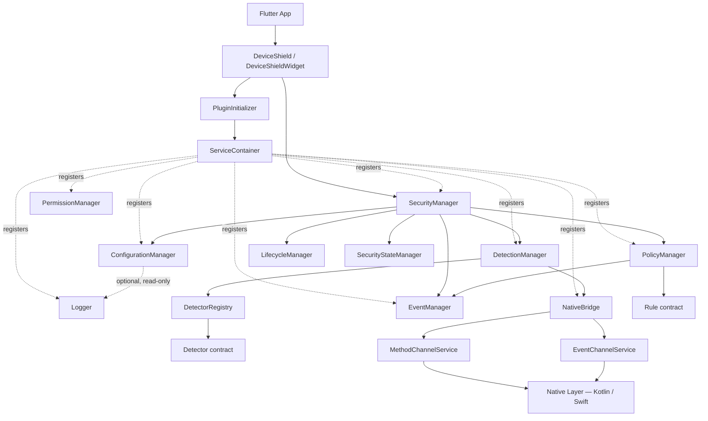
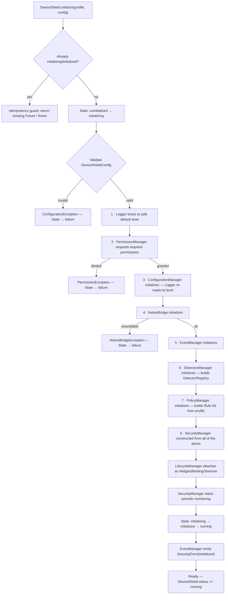
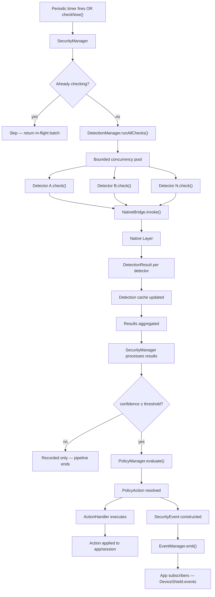
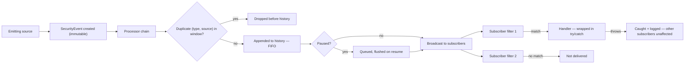
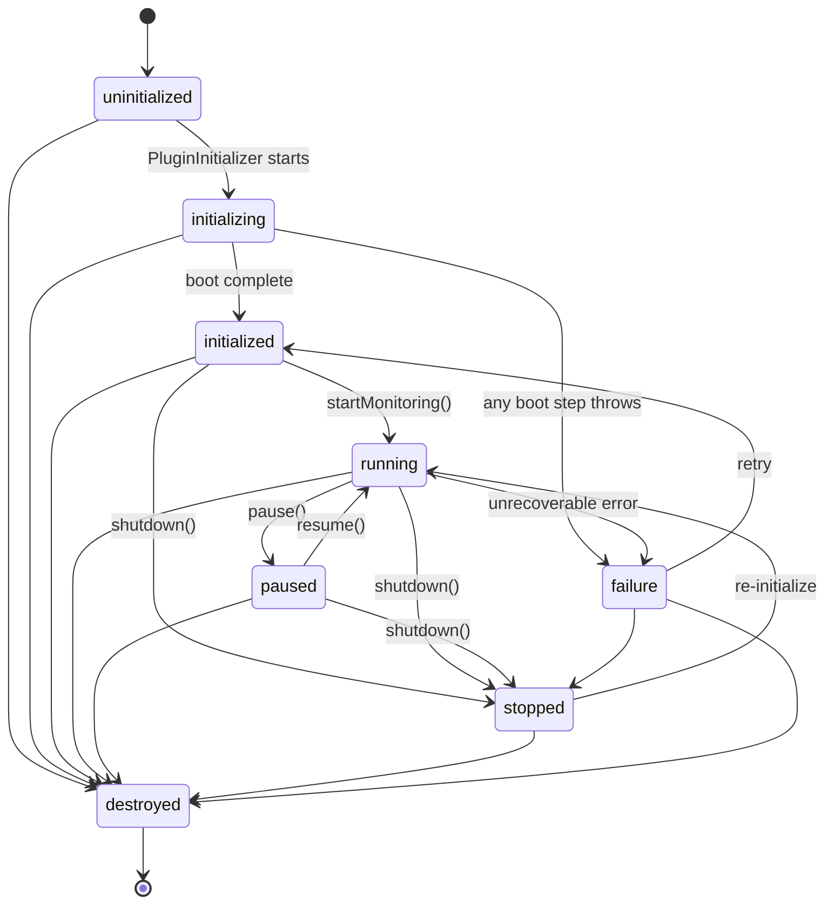
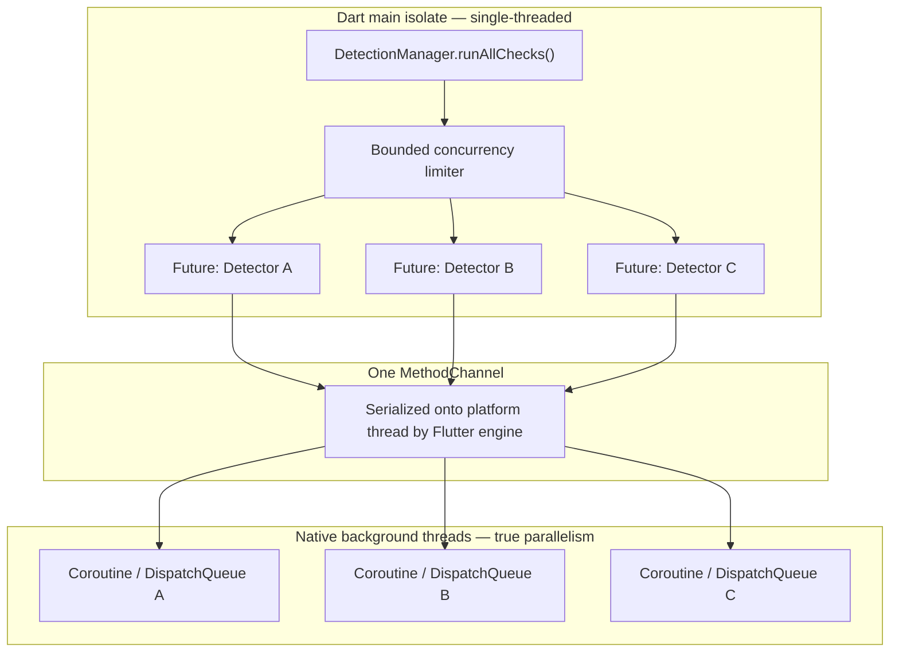

# DeviceShield — SDK Architecture

> **Archived: describes the pre-0.1 architecture.** The Dart layer it
> describes (managers, registries, policy engine, DI container) was removed in
> 0.1.0, so links into `app/lib/src/` point at files that no longer exist.
> See the git history before `release/0.1.0` for that code, and
> [HANDOVER.md](../HANDOVER.md) for the current design.

This is the design we've settled on for the internal architecture — the components, their connections, and the flows between them. It's the blueprint implementation should follow. No feature/detector-specific logic is included here on purpose; this only covers the framework every feature will sit on top of.

---

## 1. Components

18 components total. 16 are **services** — constructed, owned, and disposed within the SDK's lifecycle. 2 are **contracts** (`Detector`, `Rule`) — interfaces with no lifecycle of their own; every concrete implementation behind them is feature-level.

| Component | Role | Owned by | Visibility |
|---|---|---|---|
| `DeviceShield` | Public API facade — every host-app call goes through this | — (static) | Public |
| `DeviceShieldWidget` | Declarative init/dispose wrapper | Flutter widget tree | Public |
| `PluginInitializer` | Runs the fixed boot sequence once | — (transient) | Internal |
| `ServiceContainer` | Type-keyed DI lookup | Application infrastructure — independent lifecycle, not owned by `PluginInitializer` | Internal |
| `Logger` | The SDK's only output path | ServiceContainer | Internal |
| `PermissionManager` | Requests/tracks OS permissions | ServiceContainer | Internal |
| `ConfigurationManager` | Stores/exposes/updates the active config — performs no validation | ServiceContainer | Internal |
| `SecurityManager` | Top-level runtime orchestrator | ServiceContainer | Internal |
| `DetectionManager` | Runs registered detectors, aggregates results | SecurityManager | Internal |
| `PolicyManager` | Turns a result into a decision | SecurityManager | Internal |
| `EventManager` | The one event bus everything emits into | ServiceContainer | Internal (public read via `.events`) |
| `DetectorRegistry` | Detector registration + ordering | DetectionManager | Internal |
| `Detector` *(contract)* | Interface every detection module implements | — | Public |
| `Rule` *(contract)* | Interface every policy rule implements | — | Public |
| `NativeBridge` | Sole Dart → native path | ServiceContainer | Internal |
| `MethodChannelService` | Request/response native calls | NativeBridge | Internal |
| `EventChannelService` | Native-originated pushes | NativeBridge | Internal |
| `PlatformAdapter` *(legacy — see Phase 7 correction below)* | Backs only the original `getPlatformVersion()` call; no longer in the Bridge dependency chain | Package static | Public |
| `SecurityStateManager` | Single source of truth for SDK status | SecurityManager | Internal (public read) |
| `LifecycleManager` | Maps Flutter app lifecycle → SDK calls | ServiceContainer | Internal |

> **Correction (contract verification pass):** `LifecycleManager` does not hold a direct reference to `SecurityManager`. It depends on a narrow `SecurityLifecycleHandler` callback contract that `SecurityManager` implements and passes at construction — the same shape `LifecycleManager` already uses on its `WidgetsBinding` side. A direct reference would create a real two-node cycle (`SecurityManager` owns `LifecycleManager`; `LifecycleManager` calls back into it). See `ARCHITECTURE_CONTRACTS.md` §Circular Dependency Verification for the full analysis.

> **Correction (M6 completion pass):** the sentence above describes the *behavioral* relationship correctly (no direct reference, narrow callback contract, no cycle) but the "Owned by" column previously said `SecurityManager`, describing who *constructs* `LifecycleManager` — that was never accurate once `PluginInitializer` took over constructing every boot-step service (Phase 4's "the only code path that constructs and wires every other service" scope, confirmed exercised for `LifecycleManager` specifically as of this pass). `LifecycleManager` is resolved-or-defaulted by `PluginInitializer` at boot step 9, registered into `ServiceContainer` exactly like `Logger`/`NativeBridge`/`EventManager`/every other boot-step service — `SecurityManager` never holds a reference to it, in either direction, at any point. The table above is corrected to `ServiceContainer` accordingly, matching `DetectionManager`'s/`PolicyManager`'s "SecurityManager" entries by contrast: those two *are* accurately "owned by" `SecurityManager`, since it holds them as constructor-injected fields — `LifecycleManager` was never analogous to them, even though earlier drafts of this table treated it as such.

> **Correction (Phase 4 architecture correction pass) — 3 changes:**
> 1. **`ServiceContainer` ownership:** not created or owned by `PluginInitializer`. It's application infrastructure with its own independent lifecycle — `PluginInitializer` requires one to be passed in and only *uses* its operations (register/resolve/reset), never owns its construction or destruction.
> 2. **`ConfigurationManager` validation:** removed entirely. A dedicated `DeviceShieldConfigValidator` now validates a config *before* it reaches `ConfigurationManager`. Flow: `DeviceShield.initialize(config)` → `DeviceShieldConfigValidator` → `ConfigurationManager` (store). `ConfigurationManager` now only stores/exposes/updates.
> 3. **`LifecycleManager` event emission:** explicitly forbidden in the contract's documentation (was already true in practice — nothing implemented it any other way). `LifecycleManager` must never construct or emit a `SecurityEvent`, or reference `EventManager` at all; only the attached `SecurityLifecycleHandler` implementer (`SecurityManager`) may do so, since it already owns `EventManager`.

---

## 2. Dependency Graph

Rule that keeps this acyclic: **a component may depend on anything below it, never anything above it.**

**Why each edge exists:**
- `App → API → PluginInitializer / SecurityManager` — the app never sees anything below the public API.
- `PluginInitializer → ServiceContainer → every service` — this is the only place construction order is enforced.
- `SecurityManager → the four managers + Configuration + Lifecycle + State` — it holds references to all of them; nothing else does.
- `DetectionManager → DetectorRegistry → Detector contract` — the manager never references a concrete detector type, only the interface. This is the whole reason custom detectors can be added later without touching manager code.
- `PolicyManager → Rule contract` — same reasoning, for custom rules.
- `DetectionManager → NativeBridge`, never a detector → a raw channel — keeps native-communication concerns out of every detector implementation.
- `NativeBridge → {MethodChannelService, EventChannelService} → Native Layer` — the only path any Dart code takes to reach Kotlin/Swift. Both channel services construct their Flutter channels directly (no `PlatformAdapter` in between — see the Phase 7 correction note below).
- `ConfigurationManager ⇢ Logger` (dotted) — the one edge that could look cyclic. It isn't: Logger has no hard dependency on Configuration; it boots with a safe default and does a one-time, one-directional read from Configuration once that's available.

> **Correction (Phase 7 post-review) — `PlatformAdapter` removed from this graph.** `PlatformAdapter`'s job was to let `NativeBridge` be built against a swappable federated-plugin surface. But `NativeBridge` is itself already a contract, swappable via `ServiceContainer` (Phase 4) — a hypothetical future platform (e.g. web, using JS interop instead of channels) registers a *different `NativeBridge` implementation*, not a different `PlatformAdapter`. Dependency injection already subsumed the job the federated-plugin pattern was doing, and the SRS's own scope (Android + iOS only) never called for separate platform packages in the first place. `PlatformAdapter` (`DeviceShieldPlatform`/`MethodChannelDeviceShield`) still exists in the codebase, unchanged — it backs the original, unrelated `getPlatformVersion()` call from Phase 1 — but it is no longer part of this dependency graph, and "new platform" is now `NativeBridge`'s extension point, not `PlatformAdapter`'s. See `ARCHITECTURE_CONTRACTS.md`'s matching correction for the full component-level detail.

---

## 3. Initialization Sequence

From `DeviceShield.initialize()` to `Ready`.

Every registered service goes into `ServiceContainer` as its step completes. A failure at any step tears back down to `failure` state rather than leaving a half-populated container.

---

## 4. Runtime Execution Flow

One full round trip for a security check — trigger to delivered event.

Two things to build carefully: the **confidence gate runs before policy evaluation** (a low-confidence detection is cached but never reaches Policy/Event), and **action execution and event emission are parallel outputs** of the same decision, not one triggering the other — so a slow action handler never delays event delivery.

---

## 5. Event Pipeline

Severity is a **filter/routing** signal, never a reordering signal — dispatch order is always FIFO arrival order, so causal ordering between events is never broken.

---

## 6. SDK Lifecycle (State Machine)

`SecurityStateManager.transitionTo()` is the only writer in the whole SDK.

`stopped` = resumable. `destroyed` = terminal, resources released, no way back.

---

## 7. Concurrency Model

The fix for the one scaling risk the architecture review flagged: sequential detector execution won't hold at 20+ modules.

- **Dart side:** single isolate, async/await — sufficient because the work is I/O-bound (waiting on native), not CPU-bound.
- **Native side:** real parallelism — background thread pool per platform (coroutines / DispatchQueue), never blocking the platform thread.
- **Detectors run in parallel, bounded** (fixed pool size); **policy evaluation and per-subscriber event dispatch stay sequential** — both are fast, in-memory, and order-sensitive.

---

## 8. Extension Points

Every extension follows the same shape: **a small interface + a registry a manager looks up by key — never a type switch.**

| Extension | Mechanism |
|---|---|
| New detector | Implement `Detector`, register via `DeviceShield.registerDetector()` → `DetectorRegistry` |
| New policy | Implement `Rule`, register via `addRule()` |
| New platform | Implement `NativeBridge`, register via `ServiceContainer` *(corrected post-Phase-7 — supersedes `PlatformAdapter`, see the dependency-graph correction note in §2)* |
| New event type | Reuses existing type + `SecurityEvent.data` free-form payload (enum itself isn't open) |
| New log sink | Register a `LogSink` with `Logger` |
| New action | Register an `ActionHandler` against the reserved `PolicyAction.custom` slot |
| New integrity provider | Just another `Detector` implementation — no new mechanism needed |

---

## Governing Rules

1. **One orchestrator, one bridge** — `SecurityManager` is the only thing every public call reaches; `NativeBridge` is the only thing that ever touches a platform channel.
2. **Managers depend on interfaces, never concrete implementations.**
3. **Configuration has exactly one owner** — `ConfigurationManager`; nothing else caches its own copy.
4. **State has exactly one writer** — `SecurityStateManager`.
5. **Detector execution is parallel and bounded; everything downstream of a single result is sequential.**
6. **A subscriber's failure never reaches the pipeline that produced the event.**
